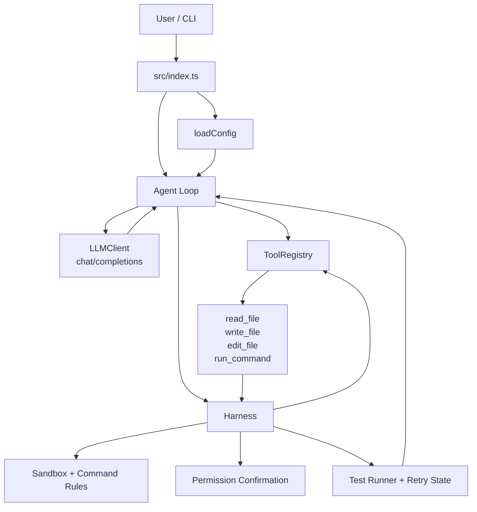

# coding-agent

一个用 TypeScript 从零实现的极简 Coding Agent。项目目标不是复刻完整 IDE Agent，而是把最核心的 agentic loop 跑通：CLI 接收用户任务，调用 OpenAI-compatible `chat/completions`，解析模型返回的 `tool_calls`，通过工具注册表执行读写、编辑和命令工具，再把结果回传给模型继续决策。

当前实现面向学习、验证和架构拆解：代码量小，模块边界清楚，测试覆盖核心协议和安全边界。它已经可以完成基础文件读写、精确替换、命令执行、写前确认和编辑后的测试验证；还没有实现 grep/glob 检索、TodoWrite、消息历史压缩、可观测 hooks 或持续 eval 平台。

## 当前能力

- CLI 支持单次任务和交互式 REPL。
- LLM 客户端使用原生 `fetch` 调用 OpenAI-compatible Chat Completions API，默认适配火山引擎方舟 Ark。
- Agent Loop 支持多轮 `tool_calls`：模型请求工具、工具执行、结果以 `role: "tool"` 回传、模型继续回答或继续调用工具。
- 默认工具包括 `read_file`、`write_file`、`edit_file`、`run_command`。
- 工具注册表只把 OpenAI-compatible JSON Schema 暴露给模型，不暴露 `execute`、`category` 等运行时字段。
- 写入和命令工具默认需要终端确认；`--auto-approve` 可显式跳过人工确认。
- 文件工具限制在工作目录内，拒绝绝对路径和逃逸工作目录的路径。
- 命令工具有 30 秒超时，并在执行前拦截一组基础危险命令模式。
- 配置 `--test-command` 或 `TEST_COMMAND` 后，`write_file` / `edit_file` 成功执行后会自动运行测试，并把测试摘要回喂给模型。
- 提供首版 eval runner 和 5 个 P2 基准任务；真实基线需要配置 `ARK_API_KEY` 和 `ARK_MODEL` 后运行。

## 快速开始

### 环境要求

- Node.js >= 20
- npm
- 一个兼容 OpenAI Chat Completions 的模型服务

### 安装

```bash
npm install
```

### 配置

创建 `.env`，至少填写 `ARK_API_KEY` 和 `ARK_MODEL`：

```bash
ARK_API_KEY=your_api_key
ARK_MODEL=your_model_id
BASE_URL=https://ark.cn-beijing.volces.com/api/v3
MAX_TURNS=20
```

`ARK_API_KEY` 和 `ARK_MODEL` 是必填项。项目不会提供静默默认模型，避免请求被发送到错误的模型或服务。

### 构建和运行

```bash
npm run build
node dist/index.js "阅读 package.json 并总结这个项目"
```

不传任务时会进入 REPL：

```bash
node dist/index.js
```

在 REPL 中输入 `.exit` 退出。

## 使用示例

### 读取并解释文件

```bash
node dist/index.js "读取 package.json，说明这个项目如何运行测试"
```

模型通常会调用 `read_file` 获取文件内容，再给出总结。

### 修改文件并自动批准

```bash
node dist/index.js --auto-approve "在 docs 目录下创建一个 notes.md，写入本项目的运行方式"
```

`--auto-approve` 只跳过人工确认。路径检查、命令安全规则、工具参数校验和工具错误回传仍然会执行。

### 编辑后运行测试

```bash
node dist/index.js --test-command "npm test" "修复当前测试失败"
```

当模型成功调用 `write_file` 或 `edit_file` 后，Agent 会运行指定测试命令，把测试结果摘要加入对话，让模型决定是否继续修复。默认最大重试次数为 3，可通过 `--max-retries` 或 `MAX_RETRIES` 调整。

## 配置参考

### 环境变量

| 名称 | 必填 | 默认值 | 说明 |
| --- | --- | --- | --- |
| `ARK_API_KEY` | 是 | 无 | OpenAI-compatible API key。 |
| `ARK_MODEL` | 是 | 无 | 模型 ID。 |
| `BASE_URL` | 否 | `https://ark.cn-beijing.volces.com/api/v3` | Chat Completions API base URL。 |
| `MAX_TURNS` | 否 | `20` | Agent Loop 最大轮数，必须是正整数。 |
| `TEST_COMMAND` | 否 | 无 | 编辑成功后自动运行的测试命令。 |
| `MAX_RETRIES` | 否 | `3` | 自动验证失败后的最大重试次数，必须是正整数。 |
| `VERBOSE` | 否 | `false` | 设置为 `1` 或 `true` 时输出更详细日志。 |

### CLI 参数

| 参数 | 说明 |
| --- | --- |
| `--auto-approve`, `-y` | 自动批准写入和命令工具的权限确认。 |
| `--test-command <command>` | 指定编辑后自动运行的测试命令，优先级高于 `TEST_COMMAND`。 |
| `--max-retries <number>` | 指定自动验证最大重试次数，必须是正整数。 |
| `--verbose`, `-v` | 输出详细运行日志。 |

CLI 参数会从用户任务中剥离，不会作为 prompt 内容传给模型。

## 架构



核心边界：

- `src/types.ts` 只表达 LLM API 消息协议和 OpenAI-compatible 工具 schema。
- `src/tools/types.ts` 表达运行时工具协议，包括 `execute(input)` 和可选 `category`。
- `ToolRegistry.getToolDefinitions()` 只导出模型可见的 `{ type: "function", function: { name, description, parameters } }`。
- `src/harness.ts` 负责工具执行前后的控制流：沙箱检查、命令规则、权限确认、编辑后验证。
- `src/agent-loop.ts` 负责消息链路和停止条件，不硬编码具体工具行为。

## 默认工具

| 工具 | 类别 | 行为 |
| --- | --- | --- |
| `read_file` | read | 读取工作目录内 UTF-8 文本文件，拒绝二进制文件。 |
| `write_file` | write | 写入 UTF-8 文本；父目录不存在时创建；会覆盖已有文件。 |
| `edit_file` | write | 在文件中把唯一匹配的 `old_string` 精确替换为 `new_string`。 |
| `run_command` | command | 在工作目录执行 shell 命令，返回 stdout/stderr，默认 30 秒超时。 |

文件工具当前只接受非空相对路径，并拒绝绝对路径和工作目录逃逸。`write_file` 是覆盖写入，不是合并写入；需要更小改动时优先使用 `edit_file`。

## 安全边界

这个项目已经有基础安全控制，但还不是完整沙箱或成熟 Harness。

- 写入和命令工具默认需要用户确认。
- `--auto-approve` 适合自动化和测试场景，但会降低人工把关强度。
- 文件路径会经过工作目录边界检查。
- `run_command` 会拦截基础危险模式，包括递归删除、外部 URL `curl`/`wget`、强制推送、系统路径写入、`sudo` 和 `chmod 777`。
- 命令仍通过 shell 执行；不要把当前规则理解为完整命令安全策略。
- 工具执行异常会转成 tool 消息回传给模型，避免单个工具失败直接中断整个循环。

## 开发

常用命令：

```bash
npm run build
npm test
npm run ci
npm run eval -- --all
```

项目使用 TypeScript ES Modules。源码导入本项目 TS 模块时使用 `.js` 扩展名，这是 NodeNext/ESM 输出路径所需的约束。

测试重点覆盖：

- 配置加载和必填项校验
- OpenAI-compatible 请求与响应解析
- Tool Registry 的运行时字段隔离
- 默认工具的成功路径和错误路径
- Agent Loop 的停止条件、多工具调用、工具错误和 `maxTurns`
- 权限确认、命令规则、工作目录边界
- 编辑后验证、测试结果格式化和重试状态

## Eval Results

当前已实现 P2 eval 任务格式、5 个基准任务和 runner：

```bash
npm run eval -- --task 01-create-file
npm run eval -- --all
```

runner 会先构建项目，再用真实 Agent Loop 执行任务，并把结果写入 `evals/results/{timestamp}.json`。真实 eval 需要有效的 `ARK_API_KEY` 和 `ARK_MODEL`；没有密钥时只能运行 schema 和 runner 单测，不能生成正式 P2 baseline。

截至 `2026-06-14 11:50`，本次改动已通过 mock runner 级别的 eval 单测，尚未记录真实 P2 baseline。

GitHub Actions 当前在 push 和 pull request 上运行 Node 20、安装依赖并执行 `npm run ci`。

## Roadmap

已实现：

- P1 Agent Loop + tool calls 最小闭环
- 默认文件和命令工具
- CLI 单次任务和 REPL
- 权限确认、基础命令拦截、工作目录边界
- 编辑后测试验证和失败重试状态
- Harness 统一执行控制层
- P2 eval 任务格式和 runner
- 基础 CI

规划中：

- `grep` / `glob` 检索工具
- 消息历史管理、上下文压缩和上下文预算
- TodoWrite 式任务规划
- 可观测事件、hooks、trace 和 HTTP feedback
- 持续 eval baseline、趋势报告和退化门禁
- npm bin 入口、发布清理、LICENSE 文件、CONTRIBUTING 和 GitHub 模板

更完整的阶段计划见 `docs/detailed-execution-plan.md` 和 `docs/plan/`。

## 贡献

提交改动前请至少运行：

```bash
npm run build
npm test
```

修改配置、LLM 协议、Agent Loop、工具、权限安全或 CLI 输入处理时，需要同步补充对应测试。文档必须区分“当前已实现”和“规划中”，不要把路线图能力写成已经存在的功能。

## License

`package.json` 声明为 MIT。仓库当前还没有独立 `LICENSE` 文件，发布前会补齐。
