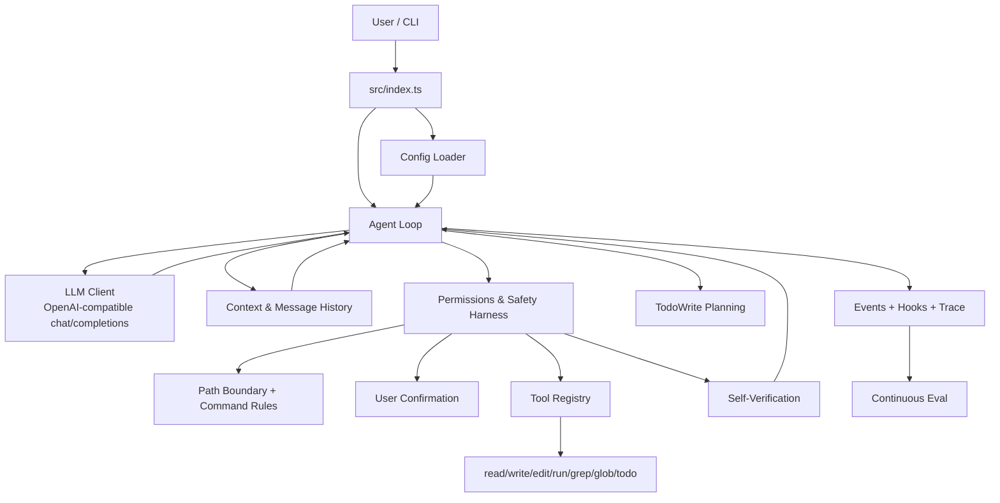

# coding-agent

一个用 TypeScript 从零实现的极简 Coding Agent。项目目标不是复刻完整 IDE Agent，而是把最核心的 agentic loop 跑通：CLI 接收用户任务，调用 OpenAI-compatible `chat/completions`，解析模型返回的 `tool_calls`，通过 Harness 统一处理权限、安全规则、工具执行和编辑后验证，再把工具结果回传给模型继续决策。

当前实现适合学习、验证和架构拆解：代码量小，模块边界清楚，测试覆盖核心协议和安全边界。它已经覆盖 P1-P4 主链路，包括基础文件读写、精确替换、命令执行、写前确认、编辑后的测试验证、多文件检索、上下文压缩、TodoWrite 式任务规划、可观测 hooks/trace，以及基于 trace 的持续 eval 报告和退化门禁。

## Quick Start

环境要求：

- Node.js >= 20
- npm
- 一个兼容 OpenAI Chat Completions 的模型服务

安装依赖并构建：

```bash
npm install
npm run build
```

创建 `.env`，至少填写：

```bash
ARK_API_KEY=your_api_key
ARK_MODEL=your_model_id
BASE_URL=https://ark.cn-beijing.volces.com/api/v3
MAX_TURNS=20
```

`ARK_API_KEY` 和 `ARK_MODEL` 是必填项。项目不会提供静默默认模型，避免请求被发送到错误的服务或模型。

运行一次性任务：

```bash
npm start -- "阅读 package.json 并总结这个项目如何运行测试"
```

不传任务时进入 REPL：

```bash
npm start
```

退出 REPL：输入 `.exit`。

## Install As A Local CLI

本仓库已经配置 npm bin 入口。构建后可在本机链接：

```bash
npm run build
npm link
coding-agent "阅读 README.md 并总结当前能力"
```

也可以检查本地 npm 包内容：

```bash
npm pack --dry-run
```

当前发布目标是本地可打包、可链接、可演示；不会自动执行 `npm publish`。

## Examples

### 读取并解释文件

```bash
npm start -- "读取 package.json，说明这个项目有哪些 npm scripts"
```

模型通常会调用 `read_file` 获取文件内容，再给出总结。

### 多文件检索和编辑

```bash
npm start -- --auto-approve "把 src 中提到 retry 的实现位置找出来，并总结每个模块的职责"
```

模型可以使用 `grep` / `glob` 定位文件，再用 `read_file` 分段读取上下文。`--auto-approve` 只跳过人工确认，不绕过路径边界、命令规则、参数校验或工具错误回传。

### 编辑后自动验证

```bash
npm start -- --test-command "npm test" "修复当前测试失败"
```

当模型成功调用 `write_file` 或 `edit_file` 后，Agent 会运行指定测试命令，把测试结果摘要加入对话，让模型决定是否继续修复。默认最大重试次数为 3，可通过 `--max-retries` 或 `MAX_RETRIES` 调整。

## Demo

脚本化 asciinema demo 位于 `docs/demo.cast`，展示了 TODO 规划、权限确认、编辑和测试验证的完整路径：

```bash
asciinema play docs/demo.cast
```

这个 demo 是可复现演示产物，不代表真实模型每次输出都完全一致。真实模型 eval 需要有效的 `ARK_API_KEY` 和 `ARK_MODEL`。

## Configuration Reference

### Environment Variables

| 名称 | 必填 | 默认值 | 说明 |
| --- | --- | --- | --- |
| `ARK_API_KEY` | 是 | 无 | OpenAI-compatible API key。 |
| `ARK_MODEL` | 是 | 无 | 模型 ID。 |
| `BASE_URL` | 否 | `https://ark.cn-beijing.volces.com/api/v3` | Chat Completions API base URL。 |
| `MAX_TURNS` | 否 | `20` | Agent Loop 最大轮数，必须是正整数。 |
| `TEST_COMMAND` | 否 | 无 | 编辑成功后自动运行的测试命令。 |
| `MAX_RETRIES` | 否 | `3` | 自动验证失败后的最大重试次数，必须是正整数。 |
| `VERBOSE` | 否 | `false` | 设置为 `1` 或 `true` 时输出更详细日志。 |
| `HOOKS_CONFIG` | 否 | `agent-hooks.json` | hook 配置文件路径；CLI `--hooks-config` 优先级更高。 |
| `OBSERVABILITY_DIR` | 否 | `.coding-agent/observability` | CLI trace JSONL 输出目录。 |
| `OBSERVABILITY_FEEDBACK_URL` | 否 | 无 | 配置后启用 HTTP feedback sink。 |
| `OBSERVABILITY_FEEDBACK_TIMEOUT_MS` | 否 | `3000` | HTTP feedback 单次请求超时，必须是正整数。 |
| `OBSERVABILITY_FEEDBACK_BATCH_SIZE` | 否 | `20` | HTTP feedback 批量发送条数，必须是正整数。 |

### CLI Flags

| 参数 | 说明 |
| --- | --- |
| `--auto-approve`, `-y` | 自动批准写入和命令工具的权限确认。 |
| `--test-command <command>` | 指定编辑后自动运行的测试命令，优先级高于 `TEST_COMMAND`。 |
| `--max-retries <number>` | 指定自动验证最大重试次数，必须是正整数。 |
| `--verbose`, `-v` | 输出详细运行日志。 |
| `--hooks-config <path>` | 读取 hook 配置 JSON，按事件类型执行 command/http hook。 |

CLI 参数会从用户任务中剥离，不会作为 prompt 内容传给模型。

## Architecture



核心边界：

- `src/types.ts` 只表达 LLM API 消息协议和 OpenAI-compatible 工具 schema。
- `src/tools/types.ts` 表达运行时工具协议，包括 `execute(input)` 和可选 `category`。
- `ToolRegistry.getToolDefinitions()` 只导出模型可见的 `{ type: "function", function: { name, description, parameters } }`。
- `src/harness.ts` 负责工具执行前后的控制流：沙箱检查、命令规则、权限确认、编辑后验证。
- `src/agent-loop.ts` 负责消息链路和停止条件，不硬编码具体工具行为。

## Default Tools

| 工具 | 类别 | 行为 |
| --- | --- | --- |
| `read_file` | read | 读取工作目录内 UTF-8 文本文件，拒绝二进制文件。 |
| `write_file` | write | 写入 UTF-8 文本；父目录不存在时创建；会覆盖已有文件。 |
| `edit_file` | write | 在文件中把唯一匹配的 `old_string` 精确替换为 `new_string`。 |
| `run_command` | command | 在工作目录执行 shell 命令，返回 stdout/stderr，默认 30 秒超时。 |
| `grep` | read | 用 JavaScript 正则搜索工作目录内 UTF-8 文本文件，默认忽略 `node_modules`、`.git`、`dist`。 |
| `glob` | read | 用 glob pattern 查找工作目录内文件，默认忽略 `node_modules`、`.git`、`dist`。 |
| `todo_write` | read | 替换当前结构化 TODO 列表，用于让模型维护任务计划和进度展示。 |

文件和检索工具当前只接受工作目录内的相对路径，并拒绝绝对路径和工作目录逃逸。`read_file` 超过 500 行时默认返回前 100 行和后 50 行，可用 `offset` / `limit` 分段读取。`write_file` 是覆盖写入，不是合并写入；需要更小改动时优先使用 `edit_file`。

## Safety Boundary

这个项目已经有基础 Harness 控制层，但还不是完整 OS 沙箱或成熟命令安全系统。

- 写入和命令工具默认需要用户确认。
- `--auto-approve` 适合自动化和测试场景，但会降低人工把关强度。
- 文件路径会经过工作目录边界检查。
- `run_command` 会拦截基础危险模式，包括递归删除、外部 URL `curl`/`wget`、强制推送、系统路径写入、`sudo` 和 `chmod 777`。
- 命令仍通过 shell 执行；不要把当前规则理解为完整命令安全策略。
- 工具执行异常会转成 tool 消息回传给模型，避免单个工具失败直接中断整个循环。
- observability event 会对 payload 做摘要和敏感字段脱敏；hook 和 HTTP feedback 只应接收脱敏后的事件数据。

## Design Decisions

- **OpenAI-compatible wire protocol stays isolated.** `src/types.ts` 只描述模型 API 消息和工具 schema，运行时工具协议放在 `src/tools/types.ts`，避免把 `execute`、`category` 等字段暴露给模型。
- **Harness owns execution control.** Agent Loop 只负责消息链路，真实工具执行必须经过 Harness，让权限确认、命令规则、路径边界和编辑后验证集中在一处。
- **Tool errors go back to the model.** 单个工具失败会变成 `role: "tool"` 消息，而不是直接中断循环，除非遇到协议级不可恢复错误。
- **Configuration is explicit.** `ARK_API_KEY` 和 `ARK_MODEL` 保持必填，不提供静默默认模型。
- **Eval is evidence, not marketing.** mock eval 验证 runner 和报告链路；真实模型 eval 结果会受模型输出波动影响，需要记录具体 run artifact。

## Development

常用命令：

```bash
npm run build
npm test
npm run ci
npm run eval -- --all
npm run eval:mock
```

项目使用 TypeScript ES Modules。源码导入本项目 TS 模块时使用 `.js` 扩展名，这是 NodeNext/ESM 输出路径所需的约束。

测试重点覆盖：

- 配置加载和必填项校验
- OpenAI-compatible 请求与响应解析
- Tool Registry 的运行时字段隔离
- 默认工具的成功路径和错误路径
- Agent Loop 的停止条件、多工具调用、工具错误和 `maxTurns`
- 权限确认、命令规则、工作目录边界
- 编辑后验证、测试结果格式化和重试状态
- 上下文压缩、消息历史、TodoWrite 规划状态
- observability events、hooks、trace、eval runner、baseline gate 和 report

更多贡献说明见 `CONTRIBUTING.md`。

## Eval Results

当前已实现 eval 任务格式、5 个 P2 基准任务、5 个 P3 多文件任务、suite/repeat、trace 汇总、Markdown 报告、dashboard 数据和 baseline check：

```bash
npm run eval -- --task 01-create-file
npm run eval -- --suite smoke
npm run eval -- --all
npm run eval -- --suite regression --repeat 3
npm run eval -- --all --baseline evals/baselines/p4-continuous.json --check
npm run eval:mock
```

runner 会先构建项目，再用真实 Agent Loop 执行任务，并把结果写入 `evals/results/{runId}.json`。每个 eval attempt 会生成 trace JSONL，默认位于 `evals/results/traces/{runId}/`；摘要报告写入 `evals/results/latest-summary.md`，dashboard 数据写入 `evals/dashboard/data.json`。

真实 eval 需要有效的 `ARK_API_KEY` 和 `ARK_MODEL`；`npm run eval:mock` 不需要密钥，只验证 runner、trace、report 和 CI 链路，不代表模型能力。

### Baseline Comparison

| Run | Model | Tasks | Passed | Avg Turns | Avg Retries | Result |
| --- | --- | --- | --- | --- | --- | --- |
| P2 baseline | `deepseek-v4-flash-260425` | 5 | 5/5 | 3.8 | 0.0 | `evals/results/2026-06-14T03-51-17-197Z.json` |
| P3 result | `deepseek-v4-flash-260425` | 10 | 9/10 | 4.6 | 0.4 | `evals/results/2026-06-14-p3.json` |

P4 持续 eval 支持 `--repeat` 识别 flaky task，并通过 `--baseline ... --check` 在 pass rate、平均 turns、平均 tool calls、flaky rate 和 feedback health 退化时失败。更新正式 baseline 时，应先运行真实 eval，再显式保存 `evals/baselines/p4-continuous.json`。

GitHub Actions 当前在 push 和 pull request 上运行 Node 20、安装依赖并执行 `npm run ci`。额外的 eval workflow 目前只在 pull request 上运行 `npm run eval:mock` 并上传 eval artifact；真实 regression eval 暂不接入 CI，需要本地或后续受控 workflow 显式运行。

## Roadmap

已实现：

- P1 Agent Loop + tool calls 最小闭环
- 默认文件、检索、规划和命令工具
- CLI 单次任务、REPL 和本地 npm bin 入口
- 权限确认、基础命令拦截、工作目录边界
- 编辑后测试验证和失败重试状态
- Harness 统一执行控制层
- grep/glob 检索、消息历史管理、上下文压缩和上下文预算
- TodoWrite 式任务规划
- P2/P3 eval 任务格式、runner 和基线记录
- 可观测事件、hooks、trace 和 HTTP feedback
- 持续 eval suite/repeat、trace 汇总、报告和退化门禁
- 基础 CI、LICENSE、CONTRIBUTING、Issue/PR 模板和脚本化 demo

规划中：

- 真实 P4 continuous baseline 快照和长期趋势记录
- W15 技术文章和项目复盘
- 发布前人工 npm registry 元数据审查

更完整的阶段计划见 `docs/detailed-execution-plan.md` 和 `docs/plan/`。

## License

MIT. See `LICENSE`.
