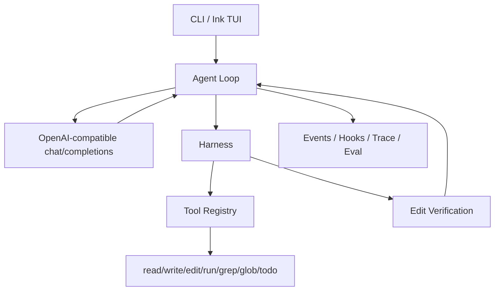

# coding-agent

一个用 TypeScript 从零实现的极简 Coding Agent，跑通 CLI/TUI、OpenAI-compatible `tool_calls`、Harness 工具执行、编辑后验证和结果回传的核心闭环。

当前实现适合学习、验证和架构拆解；不是完整 IDE Agent，不提供 GUI、插件市场、完整 OS 级沙箱、多模型适配层或真正的检索增强 RAG。

## Quick Start

- Node.js >= 20
- npm
- 一个兼容 OpenAI Chat Completions 的模型服务

```bash
npm install
npm run build
```

创建 `.env`，至少填写：

```bash
ARK_API_KEY=your_api_key
ARK_MODEL=your_model_id
BASE_URL=https://ark.cn-beijing.volces.com/api/v3
MAX_TURNS=20
```

`ARK_API_KEY` 和 `ARK_MODEL` 是必填项。项目不会提供静默默认模型，避免请求被发送到错误的服务或模型。

```bash
npm start -- "阅读 package.json 并总结这个项目如何运行测试"
```

不传任务时会进入基础 Ink TUI，支持单行输入、运行状态、消息流、工具摘要、TODO 展示和内联 `y/n` 权限确认。退出 TUI：输入 `.exit` 或按 Ctrl+C。当前 TUI 不是完整 IDE 界面，也不提供流式输出或 GUI diff。

```bash
npm start
```

本仓库也配置了 npm bin 入口，构建后可在本机链接：

```bash
npm link
coding-agent "阅读 README.md 并总结当前能力"
npm pack --dry-run
```

当前发布目标是本地可打包、可链接、可演示；不会自动执行 `npm publish`。

## Examples

```bash
npm start -- "读取 package.json，说明这个项目有哪些 npm scripts"
npm start -- --auto-approve "把 src 中提到 retry 的实现位置找出来，并总结每个模块的职责"
npm start -- --test-command "npm test" "修复当前测试失败"
```

模型可以用 `grep` / `glob` 定位文件，用 `read_file` 分段读取上下文。`--auto-approve` 只跳过人工确认，不绕过路径边界、命令规则、参数校验或工具错误回传。配置 `--test-command` 后，成功调用 `write_file` 或 `edit_file` 会触发编辑后验证，并把测试摘要回传给模型继续决策。

## Demo

脚本化 asciinema demo 位于 `docs/demo.cast`，展示了 TODO 规划、权限确认、编辑和测试验证的完整路径：

```bash
asciinema play docs/demo.cast
```

这个 demo 是可复现演示产物，不代表真实模型每次输出都完全一致。真实模型 eval 需要有效的 `ARK_API_KEY` 和 `ARK_MODEL`。

## Configuration

| 名称 | 必填 | 默认值 | 说明 |
| --- | --- | --- | --- |
| `ARK_API_KEY` | 是 | 无 | OpenAI-compatible API key。 |
| `ARK_MODEL` | 是 | 无 | 模型 ID。 |
| `BASE_URL` | 否 | `https://ark.cn-beijing.volces.com/api/v3` | Chat Completions API base URL。 |
| `MAX_TURNS` | 否 | `20` | Agent Loop 最大轮数，必须是正整数。 |
| `TEST_COMMAND` | 否 | 无 | 编辑成功后自动运行的测试命令。 |
| `MAX_RETRIES` | 否 | `3` | 自动验证失败后的最大重试次数，必须是正整数。 |
| `VERBOSE` | 否 | `false` | 设置为 `1` 或 `true` 时输出更详细日志。 |
| `HOOKS_CONFIG` | 否 | `agent-hooks.json` | hook 配置文件路径；CLI `--hooks-config` 优先级更高。 |
| `OBSERVABILITY_DIR` | 否 | `.coding-agent/observability` | CLI trace JSONL 输出目录。 |
| `OBSERVABILITY_FEEDBACK_URL` | 否 | 无 | 配置后启用 HTTP feedback sink。 |
| `OBSERVABILITY_FEEDBACK_TIMEOUT_MS` | 否 | `3000` | HTTP feedback 单次请求超时，必须是正整数。 |
| `OBSERVABILITY_FEEDBACK_BATCH_SIZE` | 否 | `20` | HTTP feedback 批量发送条数，必须是正整数。 |

| 参数 | 说明 |
| --- | --- |
| `--auto-approve`, `-y` | 自动批准写入和命令工具的权限确认。 |
| `--test-command <command>` | 指定编辑后自动运行的测试命令，优先级高于 `TEST_COMMAND`。 |
| `--max-retries <number>` | 指定自动验证最大重试次数，必须是正整数。 |
| `--verbose`, `-v` | 输出详细运行日志。 |
| `--hooks-config <path>` | 读取 hook 配置 JSON，按事件类型执行 command/http hook。 |

CLI 参数会从用户任务中剥离，不会作为 prompt 内容传给模型。

## Architecture Boundary



- `src/types.ts` 只表达 LLM API 消息协议和 OpenAI-compatible 工具 schema。
- `src/tools/types.ts` 表达运行时工具协议，包括 `execute(input)` 和可选 `category`。
- `ToolRegistry.getToolDefinitions()` 只导出模型可见的 `{ type: "function", function: { name, description, parameters } }`。
- `src/harness.ts` 负责工具执行前后的控制流：沙箱检查、命令规则、权限确认、编辑后验证。
- `src/agent-loop.ts` 负责消息链路和停止条件，不硬编码具体工具行为。

## Tools And Safety

| 工具 | 类别 | 行为 |
| --- | --- | --- |
| `read_file` | read | 读取工作目录内 UTF-8 文本文件，拒绝二进制文件。 |
| `write_file` | write | 写入 UTF-8 文本；父目录不存在时创建；会覆盖已有文件。 |
| `edit_file` | write | 在文件中把唯一匹配的 `old_string` 精确替换为 `new_string`。 |
| `run_command` | command | 在工作目录执行 shell 命令，返回 stdout/stderr，默认 30 秒超时。 |
| `grep` | read | 用 JavaScript 正则搜索工作目录内 UTF-8 文本文件，默认忽略 `node_modules`、`.git`、`dist`。 |
| `glob` | read | 用 glob pattern 查找工作目录内文件，默认忽略 `node_modules`、`.git`、`dist`。 |
| `todo_write` | read | 替换当前结构化 TODO 列表，用于让模型维护任务计划和进度展示。 |

文件和检索工具当前只接受工作目录内的相对路径，并拒绝绝对路径和 `..` 路径片段。`read_file` 超过 500 行时默认返回前 100 行和后 50 行，可用 `offset` / `limit` 分段读取。`write_file` 会覆盖已有文件，不是合并写入。

这个项目已有基础 Harness 控制层，但还不是完整 OS 沙箱或成熟命令安全系统。写入和命令工具默认需要用户确认；`--auto-approve` 会降低人工把关强度，但不会绕过路径边界、命令规则、参数校验或工具错误回传。`run_command` 会拦截递归删除、外部 URL `curl`/`wget`、强制推送、系统路径写入、`sudo`、`chmod 777` 等基础危险模式；命令仍通过 shell 执行，不应把当前规则理解为完整命令安全策略。

工具执行异常会转成 tool 消息回传给模型，除非遇到协议级不可恢复错误。Observability event 会对 payload 做摘要和敏感字段脱敏；hook 和 HTTP feedback 只应接收脱敏后的事件数据。

## Development

常用命令：

```bash
npm run build
npm test
npm run ci
npm run eval -- --all
npm run eval:mock
```

项目使用 TypeScript ES Modules。源码导入本项目 TS 模块时必须使用 `.js` 扩展名。更多贡献说明见 `CONTRIBUTING.md`。

## Eval

```bash
npm run eval -- --task 01-create-file
npm run eval -- --suite smoke
npm run eval -- --all
npm run eval -- --suite regression --repeat 3
npm run eval -- --all --baseline evals/baselines/p4-continuous.json --check
npm run eval:mock
```

Runner 会先构建项目，再用真实 Agent Loop 执行任务，并把结果写入 `evals/results/{runId}.json`。真实 eval 需要有效的 `ARK_API_KEY` 和 `ARK_MODEL`；`npm run eval:mock` 不需要密钥，只验证 runner、trace、report 和 CI 链路，不代表模型能力。完整阶段计划和复盘见 `docs/detailed-execution-plan.md`、`docs/plan/` 和 `docs/retrospective.md`。

## License

MIT. See `LICENSE`.
