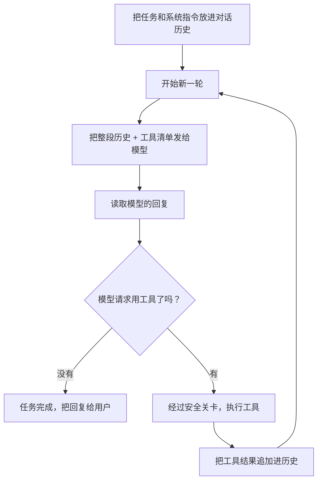

# 第 1 章　为什么一次对话不够

## 从一个让人困惑的现象说起

你有没有注意到，当你让 Claude Code 做一件稍微复杂的事时，它不是「想一下，然后给你一大段答案」，而是**肉眼可见地忙活起来**：先读个文件，停一下；再搜一个关键词，停一下；改一行代码，停一下；跑个测试，再停一下。它像一个真正的工程师那样，一步一步推进，而不是一口气背出标准答案。

这个「一步一步」的背后，藏着智能体最核心的一个机制：**循环**。理解了这个循环，你就理解了智能体和聊天机器人最本质的区别。

这一章回答三个问题：

- 为什么智能体需要一个循环，而不是问一次模型就结束？
- 它凭什么决定「该继续」还是「该停下」？
- 一个设计良好的循环，会在哪些地方格外小心？

## 一次对话为什么不够

先想清楚模型本身能做什么、不能做什么。

大语言模型是一个**纯粹的「文本预测器」**：给它一段文字，它接着往下写。它很会思考、很会写代码，但它有一个根本的局限——**它没有手，也没有眼睛**。它看不到你的文件，碰不到你的键盘，跑不了任何命令。它唯一能做的，就是「说话」。

所以,如果只问模型一次，它最多只能凭着你的描述，猜一段可能的答案。但「修登录页面的 bug」这种任务，必须先看到真实的代码才能动手。模型看不到，怎么办？

答案是：给它配一双手——也就是**工具**（下一章详谈）。模型可以说「我想读这个文件」，由智能体代劳去读，再把内容念给它听。但这样一来，一次对话就不够了：

1. 第一次：模型说「我想读登录页面的代码」。
2. 智能体读完，把代码送回去。
3. 第二次：模型看到代码，说「问题在这行，我要改它」。
4. 智能体改完，把结果送回去。
5. 第三次：模型说「改好了，跑个测试确认」。
6. ……

每一次模型「说话」，都可能引出一个动作；每个动作的结果，又需要再问一次模型。**这就是循环存在的根本原因**：任务的进展，是模型和现实世界来回交换信息一点点磨出来的，不可能一蹴而就。

## 循环长什么样

把这个过程画出来，就是智能体的「心跳」：

每一轮（业内叫一个 **turn**）的节奏是固定的：把目前为止的全部对话历史发给模型 → 模型回复 → 检查它有没有请求工具 → 有就执行、把结果加回历史、进入下一轮；没有就收工。

这里有个容易被忽略但极其重要的设计：**判断「该不该继续」，看的不是模型说了什么漂亮话，而是它有没有真的发出工具请求。**

为什么这点重要？因为模型很擅长说「好的，我现在就去修改文件」——但如果它只是嘴上这么说、并没有真的发出修改文件的请求，那任务其实没有任何进展。一个可靠的智能体不会被这种「嘴上功夫」骗到。它只认一个硬信号：**有没有工具请求**。有，就继续；没有，就认为模型已经把想说的都说完了，任务到此为止。

## 什么时候停下来

「停止」这件事，比想象中需要更多考量。一个智能体至少要处理这几种结局：

- **自然完成**：模型不再请求任何工具，直接给出最终答复。这是最理想的结局——它认为活儿干完了。
- **撞到上限**：万一模型陷入了某种循环，比如反复尝试同一个修不好的地方，就会没完没了地请求工具、烧掉时间和成本。所以必须有一道**硬性的轮次上限**：转够了规定的圈数还没结束，就强制停下，并告诉用户「我尽力了，但没在限定步数内完成」。
- **出错**：网络断了、模型返回的内容读不懂、或者别的意外。这类情况要么想办法恢复，要么明确地以失败收场。

这里藏着一个成熟产品和简易实现的分水岭。

一个简易的智能体，停止条件可以很干脆：要么「没有工具请求 = 成功」，要么「撞到轮次上限 = 失败」，两种结局，清清楚楚，也非常好测试。

而像 Claude Code 这样的成熟产品，停止条件要丰富得多（基于公开行为推断）：它会区分很多种不同的「结束原因」——是正常完成？是上下文太长被迫中断？是模型输出被截断？是某个检查环节喊了停？不同的原因，界面上要给用户不同的提示，背后也要走不同的处理逻辑。

更微妙的是，有些**「看起来该停」的情况，其实不该真停**。比如「对话历史太长了，模型塞不下」——这不是任务失败，而是需要先把历史压缩一下，再接着干。成熟的循环会识别出这类可恢复的状况，悄悄处理掉，然后继续，而不是直接报错退出。

## 一个反复出现的隐患：别把「半句话」留给模型

整本书会多次强调一个协议层面的细节，这里第一次遇到它，值得讲清楚。

模型和智能体之间的对话，是有严格格式的。当模型说「我要调用工具 A」时，这条消息和「工具 A 的执行结果」必须**成对出现**在对话历史里。就像一问一答：有「请帮我读文件」，就必须跟一条「这是文件内容」。如果只有问、没有答，对话历史就「不合法」了，下一次把它发给模型时就会出错。

这个配对关系，在很多地方都可能被不小心破坏：比如压缩历史时，把「问」留下了却删掉了「答」；比如执行工具的过程中途被打断，「答」还没生成。一个健壮的循环必须时刻守护这个配对——**宁可补一个「执行被中断」的占位答复，也不能留下一个孤零零的提问。**

## 简单的好，还是复杂的好

读到这里，你可能会觉得：那当然是 Claude Code 那种考虑周全的循环更好。

不一定。这是本书想反复传递的一个判断：**复杂的设计不等于更好的设计，它只是在回应更复杂的需求。**

Claude Code 的循环之所以复杂，是因为它要同时服务很多场景：交互式终端、被脚本调用、被编辑器驱动、协调子任务、对接各种外部能力……每多服务一个场景，循环里就要多一层状态、多一种结束原因、多一组要测试的情况。这套复杂度对它是值得的，因为它是一个面向千万用户的成熟产品。

但如果你只是想理解或构建一个核心的智能体，那么「问、做、再问，没有工具请求就停，撞上限就停」这套极简循环反而更优秀——因为它的每一步都看得清、测得明、改得动。把复杂度留到真正需要的那天再加，是一种成熟的克制。

| 维度 | 极简循环 | 成熟产品循环 |
| --- | --- | --- |
| 结束原因 | 两种：完成 / 撞上限 | 多种：完成、超长、截断、被叫停…… |
| 出错处理 | 直接失败 | 区分可恢复与不可恢复，尽量续跑 |
| 服务对象 | 单一终端 | 终端、脚本、编辑器、子任务…… |
| 好处 | 清晰、好测、好改 | 稳定、能扛复杂长任务 |
| 代价 | 扛不住复杂场景 | 状态多、测试矩阵大、难审计 |

## 本章小结

- 智能体需要循环，根本原因是：模型没有手脚，任务的进展必须靠模型和现实世界来回交换信息一点点磨出来。
- 判断「继续还是停止」的可靠信号，是模型有没有真的发出工具请求，而不是它嘴上说了什么。
- 停止条件的丰富程度，是简易实现和成熟产品的分水岭；但更丰富不等于更好，复杂度应该匹配真实需求。
- 「提问」和「答复」必须成对，是贯穿全书的一条协议底线。

下一章，我们就来看看模型那双「手」——工具，究竟是怎么设计出来，又是怎么在保证安全的前提下交到模型手上的。
