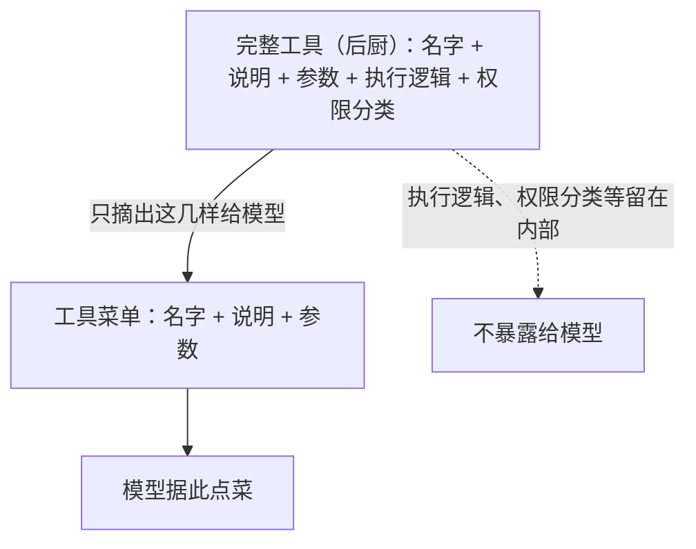
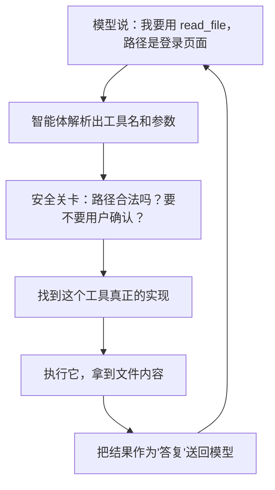

# 第 2 章　工具：让模型动手的协议

## 模型的「手」是怎么长出来的

上一章我们反复说，模型没有手——它看不到文件，跑不了命令，只会「说话」。那它到底是怎么读到你的代码、改动你的文件的？

秘密在于一种巧妙的约定：**模型不直接动手，它只是「说出」自己想做什么，由智能体代为执行。**

想象一个不能离开座位的指挥官，面前坐着一位助手。指挥官不能亲自去前线，但他可以对助手说：「去把三号阵地的情况报回来。」助手跑去办，回来汇报。指挥官根据汇报，再下一道命令。模型就是这位指挥官，智能体就是这位助手，而**工具**，就是助手能执行的那些命令。

这一章回答三个问题：

- 模型「看到」的工具，和真正执行的工具，为什么必须是两样东西？
- 一个工具请求，从模型嘴里说出，到结果送回，要经过哪些关卡？
- 这套设计里，哪些是必须守住的底线，哪些是成熟产品才需要的奢侈品？

## 两份清单：给模型看的，和真正干活的

这是工具设计里最关键、也最容易被忽略的一点：关于同一个工具，系统里其实存着**两份不同的描述**。

第一份是**给模型看的「说明书」**。它只包含模型需要知道的信息：这个工具叫什么名字、是干什么用的、需要哪些参数。比如一个读文件的工具，说明书上写着：「名字叫 `read_file`，用来读取文件内容，需要你提供一个文件路径。」就这么多。

第二份是**真正干活的「实现」**。它除了上面那些信息，还藏着模型**不该看到**的东西：真正执行读取操作的那段程序逻辑、这个工具属于哪一类（是只读的，还是会改动东西的，这关系到要不要找用户确认）等等。

为什么非要分成两份？打个比方：你去餐厅，看的是**菜单**——菜名、简介、价格。你不会、也不需要看到**后厨**——食材怎么处理、火候怎么控制、谁在掌勺。菜单是给顾客的接口，后厨是餐厅的实现。把两者混为一谈，既会让顾客无所适从，也会暴露本该隐藏的细节。

模型也一样。它只需要「菜单」就能点菜（发出工具请求）。如果你把「后厨」也端到它面前——让它看到工具的内部实现逻辑、权限分类——不但帮不上忙，反而可能让它产生误解，甚至带来安全隐患。所以一条铁律是：**导出给模型的工具清单，绝不能泄露任何内部实现细节。**

## 一个工具请求的完整旅程

现在跟着一个具体的请求走一遍，看看从模型「点菜」到「上菜」的全过程。

1. **模型点菜**：模型在回复里附上一个工具请求——「请运行 `read_file`，参数是某个文件路径」。每个请求还带着一个独一无二的编号，这个编号待会儿有大用。
2. **智能体解析**：智能体从模型的回复里把工具名和参数提取出来。这里有个值得一提的细节——如果参数的格式有问题（比如本该是一段规整的数据，结果残缺不全），智能体应该**明确报错**，而不是悄悄塞个空值蒙混过去。因为一个错误的参数如果被默默放过，后面可能引发更难排查的问题。诚实地报错，比假装没事更安全。
3. **安全关卡**：请求被送进安全检查（第 4 章详谈）。路径有没有越界？是不是危险命令？要不要先问用户同不同意？
4. **找到实现**：关卡放行后，智能体根据工具名，找到那份「真正干活」的实现。
5. **执行**：跑起来，拿到结果——文件内容、命令输出，或者一个错误信息。
6. **送回**：结果被包装成一条「答复」，追加进对话历史，送回给模型。

第 6 步里有个呼应上一章的细节：这条「答复」必须**用模型当初那个请求的编号**来标记，表明「这是对那个请求的回应」。一问一答，凭编号配对。绝不能用工具自己内部的某个固定编号来冒充——否则配对就乱了，对话历史就坏了。

## 关键场景：当工具出错时

工具不总是顺利执行。文件可能不存在，命令可能失败，参数可能非法。这时候怎么办？

一个很自然但**错误**的做法是：让整个任务崩溃退出。这显然太脆弱了——工程师写代码时跑测试失败是家常便饭，难道每次失败都要重启一切？

正确的做法是：**把错误也当成一种「答复」送回给模型。** 工具失败了，就告诉模型「这个工具执行失败了，原因是 XXX」。模型收到这个消息，完全可以调整策略——换个文件路径、修正命令、或者尝试别的办法。错误信息变成了模型继续解决问题的线索，而不是终结一切的句号。

这正是上一章那个循环的威力：只要把失败包装成一条普通的「答复」喂回循环，模型就有机会自我纠正。

## 简单工具，还是全能工具

和上一章一样，这里也有一个「简单 vs 复杂」的权衡。

在 Claude Code 这样的成熟产品里，一个工具往往是个「全能选手」（基于公开行为推断）：它不只负责执行，还可能管着自己在界面上怎么显示、结果怎么渲染成好看的样式、要不要并发、危险等级多高、是不是来自某个外部扩展……一个工具对象背负了大量产品级的职责。

而一个核心实现里的工具，可以非常清爽：一份给模型的菜单，一份干活的实现，仅此而已。权限交给统一的安全关卡管，界面显示交给界面层管，工具自己只专注于「把这件事做好」。

哪种更好？取决于你的处境。全能工具适合需要丰富交互、丰富来源的成熟产品；清爽工具适合追求清晰和可靠的核心实现。但无论简单还是复杂，有几条底线是共通的，不该妥协：

- **菜单和实现始终分开**，模型永远只看菜单。
- **工具不自己管安全**，所有危险动作都走统一的安全关卡，而不是各个工具各搞一套。
- **错误变成答复**，而不是让任务崩溃。

## 本章小结

- 模型靠「说出想做什么」来间接动手，工具就是它能调用的那些命令。
- 同一个工具存在两份描述：给模型的「菜单」（只有名字、说明、参数）和真正干活的「实现」（还含执行逻辑和权限分类）；模型永远只该看到菜单。
- 一个工具请求要走完「解析 → 安全关卡 → 找到实现 → 执行 → 送回」的旅程，结果靠请求编号和模型的提问配对。
- 工具出错时，应把错误当成答复送回模型，让它有机会自我纠正，而不是让整个任务崩溃。

模型已经有了手。但有手就意味着能闯祸——它可能想删掉重要文件，可能想跑一条危险命令。谁来拦住它？这是后面第 4 章「权限与安全」的主题。在那之前，下一章我们先解决另一个问题：随着任务推进，对话越来越长，智能体的「记忆」该怎么管理。

> 想深入到实现细节，见姊妹篇《Claude Code 内核解剖》第 2 章。
