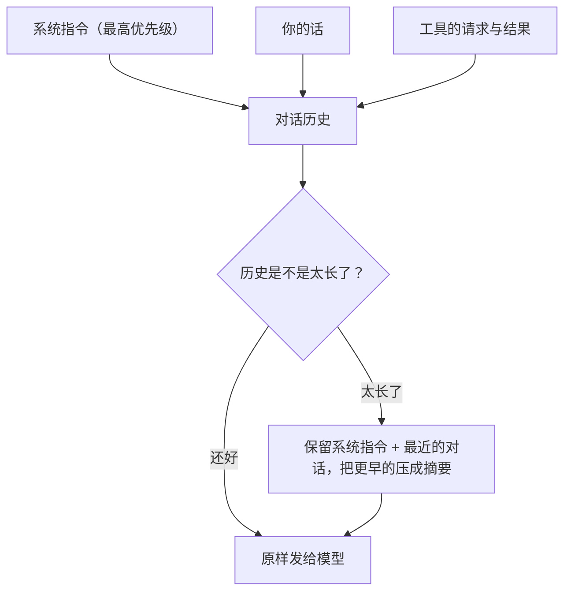

# 第 3 章　上下文与记忆：让智能体记住与忘记

## 金鱼的记忆问题

大语言模型有一个反直觉的特点：**它没有记忆。**

每次你问它问题，它其实都是「第一次」见到你。它之所以显得能记住前面的对话，是因为智能体每一轮都把**到目前为止的全部对话历史**重新发给它一遍。模型不是记住了，而是每次都把整本对话从头读了一遍。

这就带来一个麻烦。还记得第 1 章那个循环吗？任务每推进一步，对话历史就长一截——读了一个文件，历史里多一大段；跑了一个命令，又多一段输出。一个稍微复杂的任务下来，历史可能膨胀到惊人的程度。

但模型一次能「读」的文字是有上限的（这个上限叫**上下文窗口**）。历史太长，就塞不下了。这一章就是讲：智能体怎么管理这份不断膨胀的「记忆」，既让模型记住该记住的，又在必要时忘掉可以忘掉的。

三个问题：

- 智能体的「记忆」为什么不只是「把所有历史一股脑塞给模型」？
- 当历史太长必须删减时，怎么删才不会出乱子？
- 「记忆」和「真实发生过的事」之间，该怎么划清界限？

## 记忆里装的不只是聊天记录

先看看智能体的「记忆」里到底有些什么。它远不止你和模型的一来一往：

- **系统指令**：一段开场白，告诉模型它是谁、该怎么干活——「先用工具查清楚再动手」「危险操作要克制」「回答时直接说清楚做了什么、还剩什么、有什么风险」。这是优先级最高的内容，定下整个任务的基调。
- **项目背景**：当前在哪个目录、这个项目有什么特殊约定。
- **你的每一句话**和**模型的每一句回复**。
- **每一次工具的请求和结果**：读到的文件内容、命令的输出。
- 必要时，还有一份**压缩后的摘要**（待会儿讲）。

这些内容来源不同、重要性也不同。系统指令和安全规则是「定海神针」，任何时候都不能丢；而很早之前读过、现在已经用不上的某个文件内容，则可以在腾空间时优先牺牲。**管理记忆的第一要义，就是分清轻重缓急。**

## 当记忆装不下：压缩的艺术

历史超过某个阈值时，智能体就要「瘦身」了。这个过程业内叫**压缩**（compact）。

最朴素的想法是「砍掉最老的对话」。但简单粗暴地砍，会出大问题。所以成熟的做法是有讲究的：

1. **系统指令永远留着**——它是基调，丢了模型就「失忆」了。
2. **最近的若干轮对话留着**——当前正在做的事，上下文必须完整，否则模型会忘了自己刚才干到哪了。
3. **中间那些更早的内容**，不是直接删，而是**请模型自己生成一份摘要**：哪些文件读过改过、做过哪些关键决定、当前任务进行到哪一步、有没有失败或待办。用一小段摘要，替代一大段原始历史。

这样既腾出了空间，又保住了任务的连续性。就像一个长会议，你不会记住每个人说的每句话，但你会记住「结论是什么、还有哪些待办」。

但这里藏着两个陷阱，值得专门讲。

**陷阱一：把「半句话」留下了。** 还记得第 1、2 章那条底线吗——「提问」和「答复」必须成对。压缩时如果不小心，把模型「我要读文件」这条请求留下了，却把「这是文件内容」那条答复当成「老旧内容」删掉了，配对就断了。下一次再把历史发给模型，就会因为格式不合法而出错。所以任何压缩策略，都必须**守护这个配对关系**——这也是这类功能必须反复测试的重点。

**陷阱二：摘要是模型写的，可能「编」。** 摘要由模型生成，而模型有时会「脑补」——把没做完的事写成做完了，把不存在的能力写成有。所以生成摘要时，必须反复叮嘱模型「不许编造完成的工作，不许虚构不存在的能力」。更重要的是一条原则：**摘要的可信度，永远低于真实发生过的事。**

## 记忆 ≠ 事实：一条重要的界线

上面那条原则值得展开，因为它关系到智能体「会不会骗你」。

智能体的记忆里，有两类东西，地位完全不同：

- **真实发生过的事**：某个工具真的执行了，真的返回了这个结果。这是**铁证**。
- **关于记忆的加工**：一段摘要、一条待办清单、一份所谓的「长期记忆」。这些是**二手转述**，可能失真。

一个负责任的智能体，必须让铁证的地位高于二手转述。比如「待办清单」可以提醒模型「接下来该干这几件事」，但它绝不能取代「某个工具真的返回了什么」这一事实。如果待办清单说「测试已通过」，但工具结果显示测试其实失败了，该信谁？当然信工具结果。

具体到实现上，这条界线表现为：像待办清单这样的辅助信息，是作为**额外的提示**注入给模型的，它影响模型的下一步规划，但**不会冒充、也不会覆盖**真实的工具结果。真实历史归真实历史，辅助提示归辅助提示，泾渭分明。

## 关于「记忆」的一个常见误解

很多人以为，AI 工具有那种科幻般的「长期记忆」——记得你三个月前的偏好，跨越所有对话积累知识。

诚实地说，一个核心的智能体通常**没有**这种能力。它的「记忆」就是当前这一次任务的对话历史，任务结束就清空了。它也没有那种能从海量资料里自动检索相关内容再喂给模型的高级机制（业内叫**检索增强**）。

成熟产品确实在往这个方向探索——把用户偏好、项目知识持久地存下来，下次接着用。但这是一套复杂的系统，牵扯到这些信息存在哪、怎么更新、怎么删除、可信度如何、会不会污染当前任务的判断。在没有把这些问题想清楚之前，硬上长期记忆，反而会让智能体变得不可靠。所以「克制」在这里同样适用：**先把当前任务的记忆管好，再谈跨任务的记忆。**

## 本章小结

- 模型本身没有记忆，它每轮都靠智能体重发全部历史来「假装」记得；而历史会随任务推进不断膨胀，迟早塞不下。
- 管理记忆的核心是分清优先级：系统指令和最近对话必须保留，更早的内容可以压缩成摘要。
- 压缩有两个陷阱：别破坏「提问—答复」的配对，别让模型在摘要里编造；摘要的可信度永远低于真实发生过的事。
- 要分清「真实发生的事」（铁证）和「对记忆的加工」（二手转述），前者的地位永远更高——这是智能体不自欺、不欺人的基础。

到这里，第一部分「核心运行闭环」就讲完了：循环是心跳，工具是手脚，记忆是大脑里那块不断整理的白板。但我们一直在回避一个问题——模型有了手，万一它想干坏事怎么办？下一部分，我们正面回答这个问题。

> 想深入到实现细节，见姊妹篇《Claude Code 内核解剖》第 3 章。
