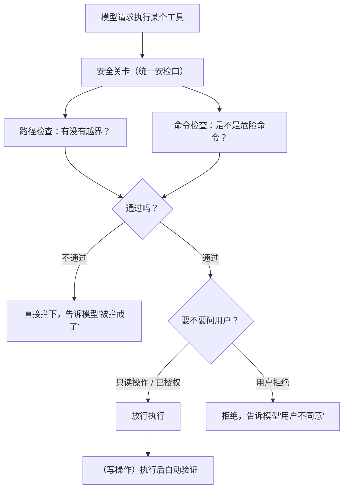

# 第 4 章　权限、沙箱与安全护栏

## 把一把刀交给一个聪明但冲动的助手

前面三章，我们一步步给智能体配齐了能力：会循环推进任务，有手能动，还会管理记忆。但能力越大，风险越大。一个能读写文件、能执行命令的程序，理论上也能**删掉你辛苦写的代码、跑一条把系统搞坏的命令、把你的密钥发到外面去**。

模型很聪明，但它也会犯错、会误解、甚至可能被精心构造的输入诱导着做出格的事。把这样一个「聪明但偶尔冲动」的助手放进你的电脑，你需要的不是祈祷它别犯错，而是**一套实实在在的护栏**。

这一章是全书的核心之一，回答三个问题：

- 为什么安全检查必须写进代码，而不能只是在系统指令里叮嘱模型「别乱来」？
- 危险命令、越界路径、用户确认，分别防的是什么？
- 一个诚实的安全设计，应该怎么描述自己的能力边界？

## 为什么「叮嘱」不管用

一个看起来很省事的想法是：在系统指令里写一句「不要执行任何危险操作」，让模型自己约束自己。

这是**绝对靠不住**的。原因很简单：系统指令是「建议」，不是「围栏」。模型大部分时候会听话，但它本质上是个概率性的文本预测器——你没法保证它 100% 服从。万一它误解了任务、万一用户的某段输入巧妙地绕过了叮嘱、万一它单纯就是「想岔了」，那句温柔的提醒拦不住任何东西。

正确的思路是：**把关卡修在执行的必经之路上。** 不管模型出于什么原因想执行一个动作，这个动作在真正发生之前，**必须**经过一道代码写死的检查。检查不通过，动作就执行不了——这跟模型怎么想、说了什么漂亮话，毫无关系。

这就引出了一个重要的架构原则：**所有工具的执行，都必须穿过同一道安全关卡。** 不是每个工具自己检查自己（那样总有人会漏检或检得不一致），而是设一个统一的「安检口」，所有动作一律从这里过。在本书里，我们就叫它**安全关卡**。

## 三道护栏，各防一类风险

安全关卡不是一道笼统的检查，而是几道针对不同风险的防线。

### 护栏一：路径边界——别让它乱翻

文件操作最大的风险是**越界**：本来只该在你的项目目录里活动，结果它去读了系统的密码文件，或者往项目外的某个地方写东西。

防这个的办法是给文件操作划一个「活动范围」：所有读、写、改文件的操作，路径都必须落在当前项目目录内。具体来说，会**拒绝两类危险路径**：一类是直接指向项目外的「绝对路径」（相当于写死的完整地址），另一类是包含「往上一级」这种跳板符号的路径（可以一层层跳出项目目录）。只有规规矩矩待在项目内的相对路径，才放行。

搜索类工具（在项目里找文件、找关键词）也受同样约束：你可以指定在哪个子目录里搜，但那个目录同样不能越界。

### 护栏二：危险命令——有些命令碰都不能碰

执行命令是最危险的能力，因为命令几乎无所不能。所以在命令真正运行前，关卡会拿它和一份「危险清单」比对，命中就拦下。典型的危险命令包括：

- 递归强制删除（一不小心就抹掉一大片文件）。
- 往外网发请求、下载东西（可能泄露数据或引入风险）。
- 强制推送代码（可能覆盖掉别人的工作）。
- 往系统目录写东西、提权、把文件权限改得人人可改。

这里必须**诚实**：这样一份基于「危险清单」的检查，是一道**有用但有限**的护栏，绝不是密不透风的铁壁。命令的写法千变万化，清单不可能穷尽所有危险形态，也可能误伤一些其实无害的命令。所以本书后面会反复强调一句话：**不能把这种基础的命令检查，吹嘘成「完整的命令沙箱」或「任意命令都能安全执行」。** 真正的操作系统级隔离是另一回事，要复杂得多，也不是这道护栏能替代的。承认能力的边界，本身就是安全设计的一部分。

### 护栏三：用户确认——拿不准就问你

有些操作不该自动拦，但也不该悄悄就办了——比如写文件、跑命令。对这类操作，关卡的策略是**停下来问你**：「我要改这个文件 / 跑这条命令，同意吗？」你点头才继续，你拒绝就告诉模型「用户不同意」，让它另想办法。

而像「读文件」这种只读、无害的操作，则可以自动放行，不必每次都打扰你——否则你会被无穷无尽的确认弹窗烦死。

这里要特别澄清一个常见的误解。很多工具提供一个「自动批准」开关（让智能体无人值守地连续干活，不再逐个弹窗确认）。打开它，**只是免去了「问你」这一步**——它**绝不会**因此关掉路径边界检查、关掉危险命令检查、关掉参数校验。换句话说：**「不用问你」不等于「不用检查」。** 那些代码级的护栏，无论自动批准开没开，都照常生效。这个区分非常重要，因为它意味着即便在全自动模式下，最硬的那几道防线依然在岗。

## 写完之后，再自己检查一遍

安全不只是「执行前拦截」，还包括「执行后验证」。

有一个很巧妙的设计：当智能体**成功改动了文件之后**，如果你预先配置了「改完帮我跑一下测试」，它会自动运行测试，把结果——通过了还是失败了、失败在哪——作为新的信息送回给模型。

这有什么用？回到第 1 章的循环：如果测试失败了，这个失败结果会让模型在下一轮意识到「我改出问题了」，从而尝试修正。改 → 测 → 发现错 → 再改，自动形成一个修复闭环。安全护栏在这里不只是「防坏事」，还在「帮着把事做对」。

（这个验证只在**成功的写操作之后**触发——读个文件、跑个查询命令，是不需要验证的。）

## 一个诚实的安全设计该怎么说话

这一章想传递的，不只是「有哪些护栏」，更是一种**态度**：安全设计必须对自己的能力**诚实**。

夸大安全能力，比没有安全能力更危险——因为它会让人放下本该有的警惕。所以一个负责任的智能体，会这样描述自己：

- 「我有路径边界检查」——而不是「我有完整的文件系统隔离」。
- 「我有一份危险命令清单」——而不是「我能安全地执行任意命令」。
- 「写文件是覆盖式的，会冲掉原内容，请确认」——而不是「我会智能合并，绝对无风险」。

每多一道护栏，就该有对应的测试证明它真的拦得住危险输入，同时也证明它不会误伤正常操作。**没有测试背书的安全承诺，等于没有承诺。**

## 本章小结

- 安全检查必须写进代码、设在执行的必经之路上，而不能只靠系统指令叮嘱模型——因为叮嘱是建议，护栏才是围栏。
- 所有工具执行都穿过同一道统一的安全关卡，而不是各工具各自为政。
- 三道护栏各司其职：路径边界防越界、危险命令清单防灾难性操作、用户确认让有风险的动作经过你的同意。
- 「自动批准」只省去问你这一步，绝不绕过任何代码级检查——「不用问」不等于「不用查」。
- 诚实是安全设计的一部分：基础的命令检查不能被吹成完整沙箱，能力边界必须如实说明，每道护栏都要有测试背书。

到这里，一个能干活、又被关进笼子的智能体核心就完整了。接下来的第三部分，我们换个视角：当内置的能力不够用时，怎么给这个智能体扩展新本领——同时，让所有新本领依然乖乖走过这道安全关卡。
