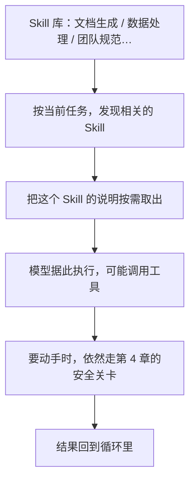

# 第 5 章　Skill：可发现的能力

## 系统指令塞不下了

到目前为止，我们的智能体靠几样内置工具干活：读文件、写文件、改文件、跑命令、搜索。它还有一段系统指令，告诉它该怎么行事。

但现实任务千变万化。今天你想让它「按公司规范生成一份接口文档」，明天想让它「按团队约定的格式写提交说明」，后天又想让它「用某个特定的流程处理数据」。每一种这样的「专门活儿」，都有一套自己的规矩、模板和步骤。

最笨的办法，是把所有这些规矩，全部塞进那段系统指令里。但你很快会发现两个问题：第一，系统指令会膨胀成一本厚厚的说明书，又臭又长；第二，模型每次干活都要读这一整本，哪怕这次的任务只用得上其中一页。这既浪费，又会稀释模型的注意力。

**Skill** 就是为解决这个问题而生的。这一章回答三个问题：

- Skill 和「往系统指令里多塞一段话」到底有什么本质区别？
- Skill 和工具、和后面要讲的插件、外部服务，边界在哪？
- 给智能体加这种「按需能力」时，必须守住哪些底线？

## Skill 是什么：一套「按需取用」的本领包

打个比方。一个全科医生不可能把所有专科的知识都时刻装在脑子里。但他的诊室里有一架子参考手册：需要处理皮肤问题时，抽出皮肤科那本翻一翻；遇到罕见病，查对应的专册。手册平时安静地待在架子上，**用到时才取，用完放回。**

Skill 就是智能体的这架参考手册。每个 Skill 是一个**自包含的本领包**，里面通常有：

- 一份说明书：这个本领是干什么的、什么时候该用、怎么用。
- 可能还有模板、脚本、示例等配套资源。

关键在那两个字：**按需**。这些 Skill 平时不占用模型的注意力，只有当任务确实需要时，智能体才把相关 Skill「发现」出来，把它的说明取出来用。这样，系统指令保持精简，而能力却可以无限扩展。

## Skill 不是「自由发挥的后门」

理解 Skill，最容易犯的错误是把它当成「绕过规矩的捷径」。必须澄清它和几样东西的边界。

**Skill 和工具的区别**：工具是模型能直接调用的「单个动作」，有明确的参数格式（第 2 章的「菜单」）。Skill 更像是「一套工作流的知识和资源」——它教模型**怎么更好地使用工具**，但它自己**不能越过工具去直接动手**。Skill 里如果带了脚本，这个脚本想读写文件、跑命令，照样得变成一个正常的工具调用，照样得过第 4 章那道安全关卡。**Skill 绝不是一个能让任意脚本随便执行的后门。** 这是底线中的底线。

**Skill 和插件的区别**（插件是第 7 章的主题）：Skill 偏向「任务知识和工作流」；插件偏向「安装、信任、扩展治理」这些更重的事。插件可以**携带** Skill，但 Skill 本身不等于一个插件市场。

**Skill 和外部服务的区别**（第 6 章）：外部服务是真正的「外部协议和服务器」；Skill 可以**包装**对外部服务的使用方式——比如写一份说明告诉模型「这个外部能力该怎么调用」——但最终真正干活的，还是底层的工具或服务。

一句话总结这些边界：**Skill 负责「教模型怎么做」，但「真正去做」永远要落回工具和安全关卡。**

## 关键场景：Skill 怎么用

几个具体例子，帮你建立体感：

- **文档生成 Skill**：内含公司的文档模板和生成脚本。当你说「给这个模块写份文档」，智能体发现这个 Skill，按模板和规范产出，而不是自由发挥。
- **项目约定 Skill**：某个代码仓库有自己的特殊约定，把它写成一个 Skill 放在项目里，智能体接手这个项目时就能「发现」并遵守。
- **包装外部能力的 Skill**：某个外部工具调用起来有点门道，写个 Skill 说明「这个工具该这么用」，模型就不容易用错。

注意每个例子里，Skill 都只是**提供知识和资源**；真正的执行（写文件、跑脚本）依然走正常的工具和安全通道。

## 加「按需能力」时的隐患

给智能体加这种可发现的能力，听起来很美，但有一串现实的坑，设计时必须正视：

- **说明书过期**：Skill 里的说明如果和实际情况脱节，模型会照着错误的流程执行。
- **触发太宽**：如果一个 Skill 动不动就被「发现」，会把无关的长篇说明塞进模型的注意力，反而帮倒忙。所以「什么时候该启用某个 Skill」必须是**可解释、可控**的，不能全凭模型瞎猜。
- **来源可信吗**：如果 Skill 可以来自外部、来自第三方，那它就和「装了一个别人写的插件」一样，带着信任风险——这正是第 7 章要重点处理的。
- **脚本越权**：再强调一次，Skill 里的任何脚本执行，都不能绕过安全关卡。

所以，要不要给智能体上一套完整的 Skill 系统，是个需要权衡的决定。它能让能力优雅地扩展，但也带来了「发现逻辑、来源信任、优先级冲突、脚本权限」等一连串新问题。一个稳妥的做法是：**先想清楚这些边界，再决定做到多复杂**——而不是为了「功能丰富」一股脑全上。

## 本章小结

- Skill 是一套「按需取用」的本领包，把专门的工作流知识从臃肿的系统指令里拆出来，用到时才加载，让能力可以无限扩展而不拖累注意力。
- Skill 教模型「怎么做」，但真正「去做」永远要落回工具，并通过第 4 章的安全关卡——它绝不是绕过规矩的后门。
- Skill、工具、插件、外部服务各有边界：Skill 偏知识与工作流，插件偏安装与治理，外部服务偏协议与连接。
- 加这种能力会引入说明过期、触发过宽、来源信任、脚本越权等隐患，必须先理清边界再决定复杂度。

Skill 解决的是「教模型用好已有的能力」。但如果智能体需要的能力，根本不在本机、而在某个外部的服务器上呢？下一章，我们看看智能体怎么连接外部世界。

> 想深入到实现细节，见姊妹篇《Claude Code 内核解剖》第 6 章。
