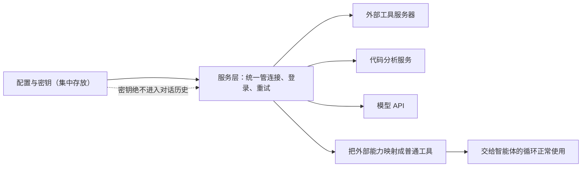

# 第 6 章　连接外部世界：MCP / LSP / API

## 智能体不是一座孤岛

前面的智能体，能力都局限在本机：读本地文件，跑本地命令。但真实的开发世界是联网的、协作的。你可能希望它：

- 查一下公司内部的某个数据库。
- 调用一个专门的代码分析服务，搞懂某个函数在哪定义、被谁引用。
- 接入某个第三方提供的专业工具。

这些能力都不在本机，而在**外部的服务器**上。智能体怎么把它们接进来？这就是「服务层」要解决的问题。

这一章会出现几个英文缩写——MCP、LSP、API、OAuth。别被它们吓到，我们逐个用大白话解释。本章回答三个问题：

- 为什么连接外部世界，要单独设一个「服务层」，而不是在工具里随手调用？
- 这几个缩写各自管什么？
- 接外部服务时，最该当心的是什么？

## 为什么外部连接要「专人专管」

先说一个直觉上的反例。假设智能体要调用某个外部服务，最省事的做法是在某个工具的代码里，直接写上「连到那台服务器、带上密码、发个请求」。

这看起来能用，但很快会变成噩梦。因为连接外部服务，远不是「发个请求」那么简单，它有一大堆**持续性的麻烦事**：

- **要登录**：很多服务需要认证——带着密钥或令牌，证明「我是有权限的」。
- **会断线**：网络不稳定，连接可能掉，要能重连。
- **会失败**：请求可能超时、可能被拒绝，要分清是「网络抖了一下，重试就好」还是「密码错了，重试也没用」。
- **有生命周期**：连接要建立、要维持、要在用完后干净地关掉。

如果把这些杂事散落在各个工具里，每个工具都要重写一遍登录、重连、重试逻辑——既重复又容易出错，而且最危险的是：**密钥这种敏感东西，会被抄写得到处都是。**

所以正确的做法是**专人专管**：设一个独立的「服务层」，统一处理所有外部连接的认证、重连、重试、生命周期。工具只管说「我要这个外部能力」，脏活累活由服务层在背后搞定。

## 几个缩写，一句话解释

- **API**：智能体和大模型本身的对话，就是通过模型的 **API**（一种标准的请求接口）进行的。这是最基础的一条外部连接——没有它，模型都问不到。服务层在这里负责发请求、处理重试和各种错误。
- **MCP**：可以理解成「外部工具服务器的通用插座」。某个外部服务器提供了一批工具，MCP 就是一套标准约定，让智能体能连上去、问它「你有哪些工具」、然后把这些外部工具**变成模型能调用的普通工具**。有了 MCP，智能体的工具箱就能即插即用地扩充。
- **LSP**：专门提供「代码语义」的服务。普通的搜索只能按文字找，而 LSP 懂代码的结构——它能告诉你「这个函数到底在哪定义」「谁调用了它」。它把这种专业的代码理解能力，包装成工具或上下文供模型使用。
- **OAuth**：一套「安全登录」的标准流程。当智能体需要代表你访问某个需要授权的服务时，OAuth 负责安全地拿到「通行令牌」，而不需要你把密码直接交出去。

这几样东西的共同点，前面已经说了：它们都有连接状态、认证状态、会失败、有生命周期。所以它们都属于「服务层」，都该专人专管。

## 一条不可逾越的红线：密钥不进对话

接外部服务，绕不开「认证材料」——密钥、令牌、密码。这些东西一旦泄露，后果严重。所以有一条贯穿全书的红线，在这里尤其关键：

**认证材料绝不能进入模型的对话历史，也绝不能出现在任何记录里。**

为什么？回想第 3 章——智能体每轮都把对话历史发给模型。如果密钥被混进了历史，它就会被一遍遍发出去，暴露面极大。同理，第 13 章会讲到的「运行记录」，也绝不能把密钥写进去。

正确的做法是：密钥只待在专门的配置/密钥层，由服务层在发请求时悄悄带上，**用完即走，不留痕迹**。模型从头到尾都不该「看到」密钥长什么样——它只需要知道「这个外部工具能用」，不需要知道「连上去的密码是什么」。

而且，外部服务返回的错误信息也要小心处理：要把有用的部分（「请求失败了，因为参数不对」）结构化地告诉模型，但绝不能把错误信息里可能夹带的凭证一起泄露出去。

## 关键场景与权衡

几个典型场景：

- **接入外部工具**：会话开始时连上某个 MCP 服务器，把它的工具拉过来，变成模型工具箱里的新成员。
- **理解代码**：模型想知道某个符号的定义，LSP 服务给出精确答案，而不是靠满项目搜文字去猜。
- **区分错误**：外部服务失败时，分清是「网络问题（重试）」「认证问题（别重试，去刷新令牌）」还是「协议问题（报错）」。

那么，要不要把这些外部连接能力都接上？这又回到本书反复出现的权衡。一个核心实现，可能只需要最基础的那条外部连接——和模型对话的 API，其余一概不接。这样它的连接路径简单清晰，没有一堆连接状态要管理。而成熟产品会把 MCP、LSP、OAuth 全套接上，因为它要服务的场景丰富得多。

但无论接多少，有两条原则不变：**外部服务带来的新工具，依然要走「菜单 / 实现分离」（第 2 章）和统一安全关卡（第 4 章）；密钥永远留在密钥层，不进对话、不进记录。** 接外部世界，扩的是能力，不该是漏洞。

## 本章小结

- 连接外部世界的杂事——登录、重连、重试、生命周期——又多又容易出错，所以要设一个独立的「服务层」专人专管，而不是散落在各个工具里。
- API 是和模型对话的基础接口；MCP 是外部工具的通用插座；LSP 提供代码语义理解；OAuth 是安全登录流程。它们的共性是都有连接与认证状态，都归服务层管。
- 一条红线：认证密钥绝不能进入对话历史或运行记录，只待在密钥层、用完即走。
- 外部能力变成的新工具，依然要走菜单/实现分离和统一安全关卡——扩能力，不开漏洞。

外部服务是「连接已有的能力」。但如果你想把一整套别人打包好的扩展——工具、命令、流程——一次性装进智能体呢？那就是插件。下一章，我们看看插件，以及它带来的一个全新挑战：信任。
