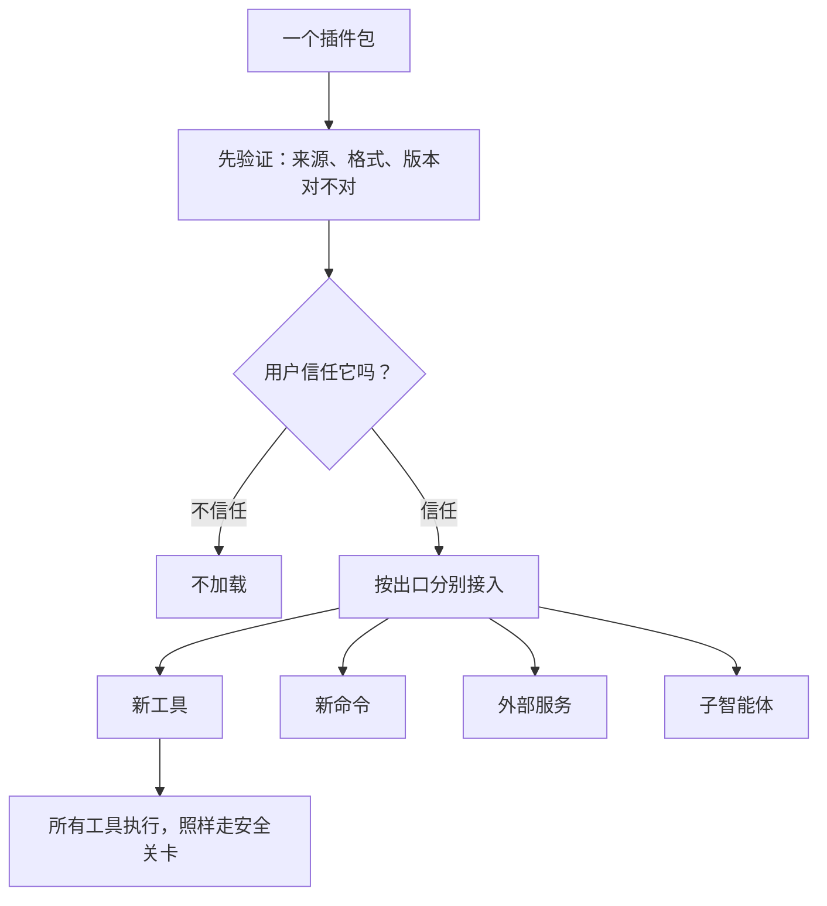

# 第 7 章　插件与扩展治理

## 从「自己加能力」到「装别人的能力」

前两章讲的扩展，有个共同点：那些能力要么是你自己定义的（Skill），要么是你主动去连接的（外部服务）。但还有一种更彻底的扩展方式——**安装别人打包好的扩展包**。

这就是**插件**。就像浏览器装插件、手机装 App，智能体也可以装插件，一次性获得一整套别人写好的能力：新工具、新命令、新流程、新的输出风格……

听起来很方便。但「装别人的东西」带来了一个前面所有章节都没正面遇到过的全新问题——**信任**。Skill 是你自己写的，外部服务是你自己选的连接，而插件，是**别人写的代码，要跑在你的机器上**。这中间的风险，是一道全新的坎。

这一章回答三个问题：

- 插件和前面讲的 Skill、外部服务、工具，是什么关系？
- 为什么说插件市场的核心问题是「治理」，而不只是「加载代码」？
- 一个谨慎的智能体，该怎么对待插件这件事？

## 插件：一个能接多个「插座」的扩展包

一个插件，往往不只提供一样东西。它可能同时插进系统的好几个地方（业内把这些地方叫「扩展出口」）：

- **新工具**：给模型的工具箱添新成员。
- **新命令**：给你这个用户添新的快捷指令。
- **外部服务**：自带一套 MCP 连接（第 6 章）。
- **子智能体角色**：提供专门的分身（第 8 章）。
- **输出风格**：改变回复的呈现方式。
- **Skill**：携带一批本领包（第 5 章）。

注意这张图最关键的一步：在「接入」之前，先有「验证」和「信任确认」两道门。**插件不是装上就直接跑，而是要先过这两关。** 这正是插件和前面扩展的根本区别。

## 治理，而不只是加载

很多人以为插件系统就是「找到一个插件文件，把它加载进来」。如果真这么简单，那它确实只是个加载器。但现实远不止于此。

想想一个成熟的插件市场要操心多少事（基于公开行为推断）：插件从哪个市场来？版本对不对、依赖齐不齐？格式合不合法？用户信不信任它？它能往系统的哪些出口插东西？更新了怎么办、要禁用怎么办？万一某个插件崩了，会不会把整个智能体拖垮？

这些问题，没有一个是「加载代码」能回答的。它们全都属于一个更大的范畴——**治理**：管理扩展的来源、信任、生命周期和影响范围。

为什么治理这么重要？因为**插件如果没有治理边界，会立刻变成绕过所有安全设计的后门**。你前面辛辛苦苦修了第 4 章那道安全关卡，结果一个插件大摇大摆地直接执行命令、直接改系统指令——那前面的努力就白费了。所以一条铁律是：**插件再受信任，它带来的工具该走的安全关卡一步都不能少，它也不能偷偷篡改核心的系统指令或工具清单。** 信任是「允许它接入」，不是「允许它为所欲为」。

## 信任的几道关卡

把插件的安全要点提炼成几道关卡，它们的顺序很重要——**验证和信任，必须发生在「赋予执行能力」之前**：

1. **格式验证**：插件的描述文件格式对不对？缺不缺关键信息？格式都不合法的，直接拒之门外。
2. **信任确认**：让用户清楚地知道「这个插件来自哪里、会获得哪些能力」，由用户决定信不信。没得到信任的，不加载。
3. **出口隔离**：插件插进不同出口（工具、命令、服务……），每个出口都有自己独立的边界和失败隔离。不能因为信任了一个插件，就允许它对系统为所欲为。
4. **失败隔离**：某个插件出了问题，应该被隔离，而不能让主流程跟着崩溃。

## 谨慎是一种美德

面对插件，本书想传递一个明确的态度：**谨慎**。

一个完整的插件市场——自动安装、自动更新、依赖解析、使用统计、供应链管理——是一项庞大的工程，背后是巨大的安全和治理责任。它适合一个有专门团队维护的成熟产品。

但对一个核心的智能体来说，贸然追求「插件市场」是危险的。更稳妥的路径是**从最小、最可控的一步开始**：比如只支持「从本地、可审计的描述文件，定义一个新工具」——这个新工具依然遵守菜单/实现分离，依然走安全关卡，依然记录在案。这一小步能复用前面所有章节建立的安全边界，风险可控；而「市场、自动更新、第三方供应链」这些重磅能力，则可以等真正有需要、也有能力承担其风险时再说。

换句话说：**别因为「插件听起来很强大」就急着把整个市场搬过来。** 把扩展能力关进和工具一样的笼子里，是这一章和第 4 章一脉相承的智慧。

## 本章小结

- 插件是「安装别人打包好的能力包」，能同时接入工具、命令、外部服务、子智能体等多个出口；它带来了前面章节没遇到的全新问题——信任。
- 插件系统的核心是「治理」（管理来源、信任、生命周期、影响范围），而不只是「加载代码」；没有治理边界的插件会变成绕过所有安全设计的后门。
- 验证和信任确认，必须发生在赋予执行能力之前；插件再受信任，它的工具也要走安全关卡，也不能篡改核心系统指令。
- 对核心实现而言，谨慎是美德：从最小可控的一步（如本地可审计的工具定义）开始，而不是贸然搬来整个插件市场。

到这里，我们已经从三个角度扩展了智能体的能力：教它用好工具（Skill）、连接外部世界（服务）、安装现成扩展（插件）。第三部分还剩最后一种扩展——不是扩展「能力」，而是扩展「人手」。下一章，我们看看怎么让智能体把自己「分身」成多个，分头干活。
