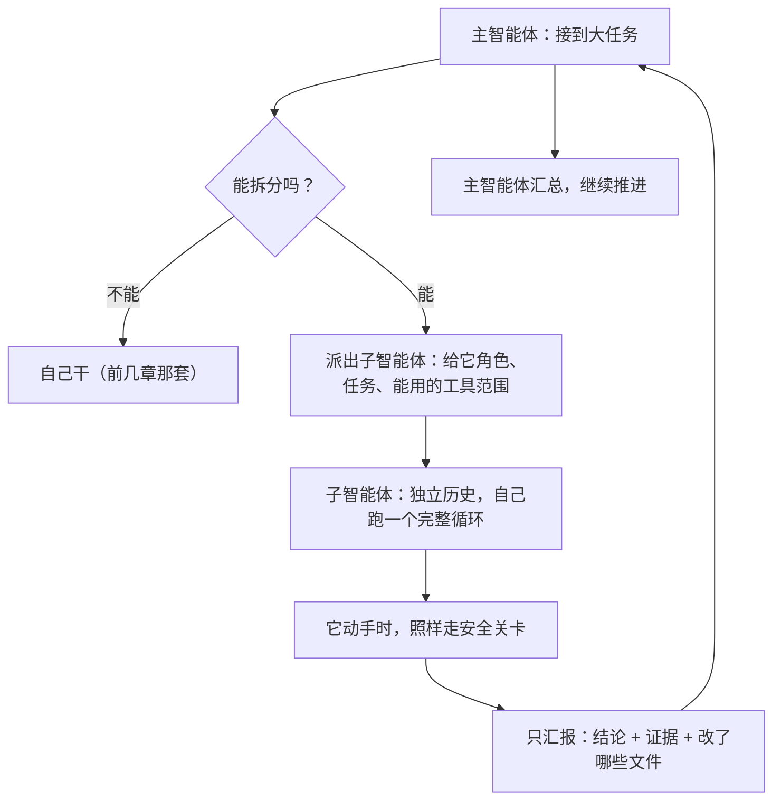

# 第 8 章　子智能体与任务编排

> 导读：如果你只想理解智能体的主体运行机制，可以先略读本章的编排细节、看小结即可。本章的核心只有一句话——当一个人忙不过来时，派出「分身」分头干、只汇报结论。

## 一个人忙不过来的时候

到目前为止，我们的智能体一直是「一个人」在干活：一个循环，一段对话历史，从头忙到尾。这对大多数任务都够用。但有些任务，一个人会忙不过来，或者忙得很别扭。

想象你接到一个大活儿：「调研这个项目里所有和支付相关的代码，总结一份报告。」这意味着要翻几十个文件、追很多条线索。如果一个智能体埋头一个个看，它的对话历史会迅速膨胀到第 3 章说的那种「装不下」的境地，而且全程它只能串行地做，慢。

更自然的做法，是像一个团队那样分工：派几个「分身」分头去查不同的模块，每个分身查完只把**结论**汇报上来，主智能体再把这些结论汇总成报告。

这就是**子智能体**（sub-agent）。这一章回答三个问题：

- 子智能体解决了哪些「一个人干」搞不定的问题？
- 它和普通的工具调用，本质区别在哪？
- 让多个分身一起干活，最大的坑是什么？

## 子智能体不是「调用一个函数」

这是最容易混淆的一点。你可能会想：派个分身去查东西，这不就跟「调用一个工具」差不多吗？

不一样，差别很大。回想第 2 章的工具：它接收一份参数，执行一次，返回一个结果，干脆利落，它自己没有「思考过程」，也没有多轮对话。

而子智能体，是一个**完整的、嵌套的智能体**。它有自己的目标、自己独立的对话历史、自己的循环。它内部会像第 1 章那样问模型、用工具、再问模型，转好多轮，才得出结论。

| 维度 | 普通工具调用 | 子智能体 |
| --- | --- | --- |
| 本质 | 执行一个动作 | 一个嵌套的小智能体 |
| 有没有自己的对话历史 | 没有 | 有，且独立 |
| 内部要不要多轮 | 不，一次就完 | 要，自己跑一个完整循环 |
| 返回什么 | 一个直接结果 | 一份提炼过的结论 |

所以更准确的比喻是：子智能体像是主智能体**雇来的一个临时同事**，而不是它顺手用的一件工具。

## 三个关键设计：独立、提炼、隔离

让「分身干活」这件事可靠，靠三个关键设计。

### 一、独立的对话历史

每个子智能体必须有**自己独立的对话历史**，和主智能体、和其他子智能体都不共享。

为什么？因为如果共享，那个分身查支付模块翻的几十个文件，会一股脑涌进主智能体的记忆里，瞬间把它淹没——第 3 章那个「装不下」的问题会成倍恶化。隔离开来，每个分身在自己的小天地里折腾，主智能体的记忆保持清爽。

### 二、只汇报提炼过的结论

子智能体干完活，**不该把它的全部中间过程都倒给主智能体**，而只该汇报一份提炼过的成果：结论是什么、关键证据有哪些、改动了哪些文件。

这又是第 3 章「摘要」思想的延伸。主智能体要的是「支付模块的调研结论」，不是「分身翻每个文件的流水账」。只传结论，主智能体才能在有限的记忆里，同时消化好几个分身的成果。

### 三、隔离与冲突防范

这是多分身干活最大的坑：**如果两个分身同时去改同一个文件，会互相覆盖，制造灾难。**

并行很诱人——几个分身同时跑，快。但并行也最危险。所以一个稳妥的设计会非常保守：**在放开并行之前，必须先想清楚怎么隔离。** 比如，明确规定每个分身只能改互不重叠的一片区域；或者干脆先让它们一个接一个地串行干，确认没问题了再谈并行。**「能并行」绝不等于「该并行」**——只有当任务能干净地切成互不干扰的几块时，并行才是安全的。

还有几个相关的隔离要点：子智能体能用的工具范围应该被明确限定（它只是来查支付模块的，没必要给它删文件的权限）；它干活时**照样要走第 4 章那道安全关卡**，不因为是「分身」就享有特权；它万一失败了，也应该规规矩矩地返回一个失败结论，而不能让主智能体跟着崩溃。这些要点背后是同一个意思：**分身可以多，但护栏一道都不能少。**

## 什么时候该用，什么时候不该

子智能体适合这些场景：

- **探索性任务**：一个分身在后台查找相关文件，主智能体同时做别的。
- **可切分的实现**：几个分身各改一块互不重叠的模块，最后主智能体集成。
- **压缩长任务**：分身干了大量琐碎的活，只把精华结论传回来。

但它**不适合**这些情况：

- **紧耦合的任务**：如果下一步严重依赖上一步的结果，硬拆成并行只会制造混乱。
- **不容验证就当真**：分身的汇报是「二手转述」，呼应第 3 章——它的结论不该被无条件当成事实，该验证的还得验证。

要不要给智能体加子智能体能力，是个典型的「按需」决定。它能让智能体处理更大的任务，但也带来了独立历史、结论提炼、冲突隔离、权限归属一整套新复杂度。在没有真正的大任务需求、也没想清楚隔离方案之前，**单个智能体那条清晰、可控、好验证的路径，往往才是更优的选择**。这又一次印证了全书的克制哲学。

## 本章小结

- 子智能体是为「一个人忙不过来」的大任务准备的：派出分身分头干，各自汇报结论。
- 它和普通工具调用有本质区别——它是一个有独立对话历史、会自己跑完整循环的「嵌套智能体」，更像雇来的临时同事而非一件工具。
- 三个关键设计：独立的对话历史（防记忆污染）、只汇报提炼的结论（防淹没主智能体）、隔离与冲突防范（防分身互相覆盖）。
- 「能并行」不等于「该并行」；紧耦合任务、未经验证的结论都是陷阱。没想清楚隔离前，单智能体的清晰路径往往更优。

第三部分到此结束。我们已经把智能体的「内核」和「能力扩展」都讲透了。接下来的第四部分，视角转向**人**——你是怎么和这个智能体打交道的：命令行、终端界面、各种输入输出，以及它怎么帮你处理代码提交。

> 想深入到实现细节，见姊妹篇《Claude Code 内核解剖》第 7 章。
