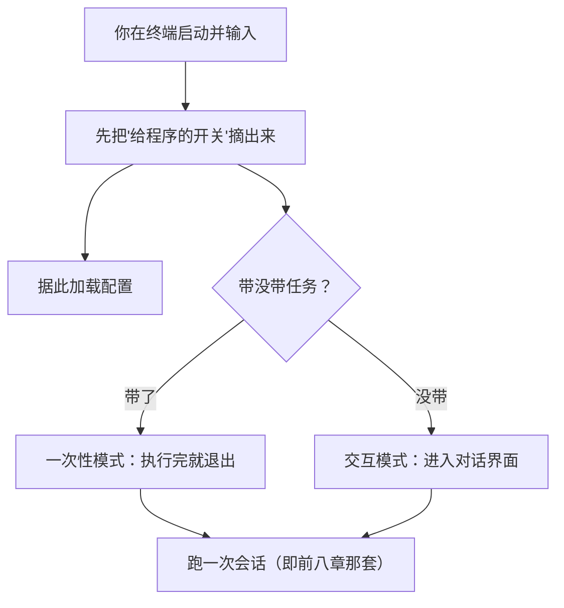
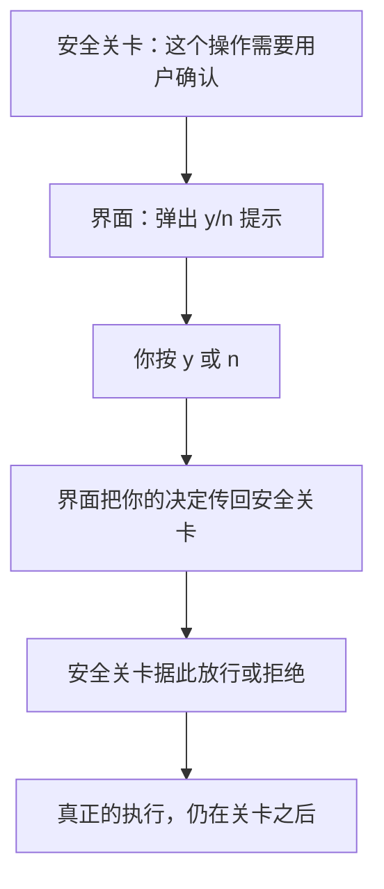

# 第 9 章　命令行、终端界面与会话

## 入口远不只是「读一句话」

前面八章，我们关心的都是智能体「内部」怎么运转。从这一章开始，第四部分把镜头转向**你**——一个活生生的用户，是怎么和它打交道的。

一切从「入口」开始。你启动 Claude Code，在终端里敲下任务，按回车。这个看似简单的动作，背后其实有不少讲究。最容易被低估的一点是：**入口不只是「把你说的话读进来」那么简单。** 它要分辨你说的到底是什么、决定该进入哪种工作模式、还要在恰当的时机停下来征求你的同意。

这一章回答三个问题：

- 一个智能体的入口，为什么不只是「读一段话」？
- 你输入的内容里，哪些是给模型的任务，哪些是给程序的指令，怎么区分？
- 终端界面在整个安全设计里，扮演什么角色（以及不该扮演什么角色）？

## 两种打开方式

智能体通常有两种用法，对应两种「打开方式」：

- **一次性模式**：你启动时直接把任务跟在后面，它执行完、输出结果、退出。适合写进脚本、批量处理。
- **交互模式**：你不带任务直接启动，它进入一个对话界面，你可以连续地、一轮轮地和它交谈。适合需要来回沟通的复杂任务。

不管哪种模式，最终都会进入一次「会话」——也就是前八章讲的那整套循环、工具、安全关卡。入口层的职责，是把你领到正确的模式，再把控制权交给内核。

## 把「给程序的开关」和「给模型的任务」分开

这是入口设计里一个很关键、却常被忽视的细节。

你启动智能体时输入的内容，往往**混着两类东西**：

- 一类是**给程序的开关**，比如「自动批准所有操作」「改完帮我跑这个测试命令」「话痨模式，把过程都打印出来」。这些是控制智能体行为的设置。
- 另一类才是**给模型的真正任务**，比如「修一下登录页面的 bug」。

入口必须把这两类**干净地剥离开**。那些「给程序的开关」要被解析出来、用于配置智能体；剩下的才是任务，交给模型。

为什么这点这么重要？设想如果不剥离会怎样：你输入「自动批准 修一下登录 bug」，结果「自动批准」这四个字也被当成任务的一部分发给了模型。模型会困惑——「自动批准是什么意思？是要我批准什么吗？」更糟的是,本该生效的「自动批准」设置没生效。**开关混进任务，会同时搞坏配置和任务理解。** 所以「剥离开关」是入口必须做对的第一件事。

## 终端界面：只负责「问」，不负责「做」

交互模式下，你面对的是一个终端界面：你打字、看到回复、看到工具执行的进度，偶尔还会跳出一个权限确认——「我要改这个文件，按 y 同意，按 n 拒绝」。

这里有一个贯穿全书的安全原则，必须讲清楚：**界面只负责「呈现」和「征求同意」，它绝不自己「执行」任何动作。**

回想第 4 章那道统一的安全关卡。当模型想改文件时，是**安全关卡**决定「这需要问用户」，然后委托界面弹出那个 y/n 提示；你按下 y，界面只是把「用户同意了」这个答复传回给安全关卡，真正执行的依然是关卡后面的标准流程。

为什么要强调这点？因为如果让界面图省事，自己直接去执行工具、绕过了安全关卡，那么第 4 章辛苦建立的所有护栏就被架空了。所以无论界面做得多花哨，**真正的执行边界永远只有一个，就是安全关卡。** 界面是「前台接待」，安全关卡才是「后台保安」，两者职责绝不能混。

## 成熟产品有什么,核心实现可以没有什么

成熟的终端界面，能玩出很多花样（基于公开行为推断）：丰富的快捷指令（敲个 `/` 就能调出各种功能，比如查看配置、压缩历史、管理权限）、主题、会话恢复、各种诊断命令……它是一个完整的交互式应用。

而一个核心实现的界面，可以朴素得多：能输入、能看到回复和工具进度、能在该确认时弹个 y/n、能退出，就够了。它没有那一大堆快捷指令，没有华丽的主题——但它把最要紧的几件事做对了：**剥离开关、界面只负责确认不负责执行、把工具进度如实呈现给你。**

这又是一次「简单 vs 复杂」的权衡。如果你要做的是面向千万用户的产品，丰富的交互体验值得投入；如果你要的是一个清晰可靠的核心，那么把基础的交互做扎实、把安全边界守清楚，远比堆砌一堆快捷指令重要。有一点值得特别提醒：会话恢复这种功能，听起来很美，但它依赖把完整的对话历史（包括第 1 章那些「提问—答复」配对）可靠地存下来——在没把存储这件事做扎实之前，**别轻易承诺「能完美恢复上次的会话」。**

## 本章小结

- 入口不只是「读一段话」：它要分辨工作模式（一次性 vs 交互），还要做一件关键的事——把「给程序的开关」和「给模型的任务」干净剥离，否则会同时搞坏配置和任务理解。
- 终端界面只负责「呈现」和「征求同意」，绝不自己执行动作；真正的执行边界永远是第 4 章那道统一的安全关卡。
- 成熟产品的丰富交互（快捷指令、主题、会话恢复）是锦上添花；核心实现把「剥离开关、界面不越权、如实呈现」做对，才是根本。

界面解决了「你怎么和它说话」。下一章我们更细地看「说」和「听」本身——各种输入方式、以及输出该怎么分层，既让你看得舒服，又让机器能可靠地读取。
