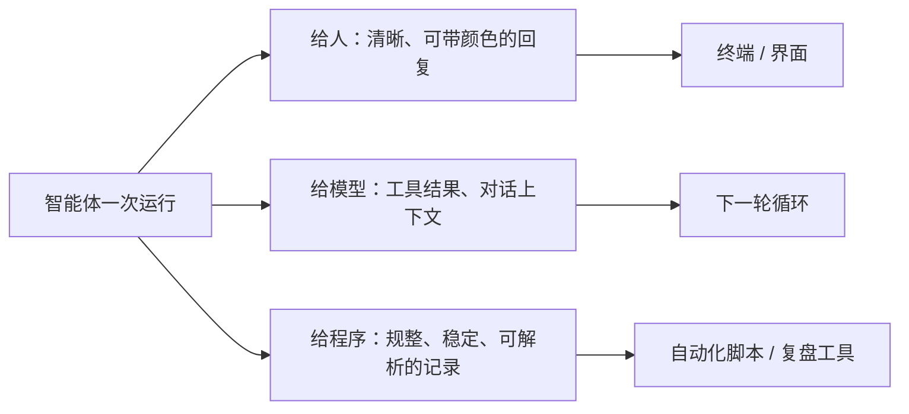

# 第 10 章　输入与输出体验

## 同一句话，三个听众

上一章讲了入口和界面。这一章我们盯住一个更细的问题：智能体「说出来」的话，到底是说给谁听的？

答案出人意料——**同一次运行的输出，其实有三个完全不同的听众**：

1. **你，一个人**。你想看到清晰、好读、甚至带点颜色高亮的回复，知道它干了什么、结果如何。
2. **模型自己**。还记得第 1 章的循环吗？工具的结果要送回给模型当作下一轮的输入。这部分「输出」是给模型读的。
3. **其他程序**。如果智能体被写进了某个自动化脚本，那个脚本需要稳定、规整、机器能解析的输出。

这三个听众的需求完全不同，甚至互相冲突。这一章回答三个问题：

- 为什么输入输出的设计，会影响到智能体的架构，而不只是「界面好不好看」？
- 给人看的、给模型看的、给程序看的输出，为什么必须分开？
- 在这上面，什么该优先做，什么可以缓一缓？

## 为什么「分层」是架构问题

如果把三个听众的输出混成一团，会出什么事？

举个最典型的例子。给你看的输出，常常带「颜色」——终端里那些花花绿绿的高亮，其实是靠一些特殊的控制字符实现的。这些字符你看不见（它们被终端翻译成了颜色），但如果一个程序去读这段输出，就会读到一堆乱七八糟的控制字符，把它的解析彻底搞乱。

所以，**给人看的彩色文本，和给程序读的规整数据，绝对不能走同一个通道。** 这不是「美观」问题，而是「能不能正确解析」的硬问题。一旦混了，依赖输出的脚本就会莫名其妙地崩。

把三个听众的通道分开，就是「输出分层」：

同理，输入也有讲究。上一章已经讲过最重要的一条——把「给程序的开关」从「给模型的任务」里剥离。这本身就是「输入分层」的体现。

## 输入：花样可以很多，核心只有一条

成熟产品的输入方式可以非常丰富（基于公开行为推断）：

- **快捷键**：各种组合键，快速编辑、跳转、操作。
- **Vim 模式**：给习惯了某种编辑器操作的用户，提供熟悉的手感。
- **语音输入**：直接说话，不用打字。
- **斜杠命令**：敲 `/` 调出各种功能。

这些都是体验上的锦上添花。但它们有一条不可动摇的底线：**无论用什么花哨的方式输入，都不能改变任务的本意，也不能绕过安全确认。** 你用语音说「删掉这个文件」，和打字说「删掉这个文件」，都得经过第 4 章那道安全关卡，一视同仁。输入方式只改变「你怎么把意思传进去」，不改变「这个意思要受什么约束」。

一个核心实现，可能这些花哨输入一个都没有，就是老老实实打字。这完全没问题——**把核心的正确性做对，远比堆砌输入花样重要。** 语音、Vim 这类能力，应该排在「循环正确、安全可靠」之后。

## 输出：诱人的陷阱——「机器可读」没那么简单

「给程序看的输出」这条通道，藏着一个特别诱人、也特别容易栽跟头的陷阱。

智能体在运行时，往往会生成一份详细的「运行记录」（第 13 章会专门讲）。这份记录很规整，看起来正好适合给程序读。于是一个很自然的念头冒出来：「既然有了这份规整的记录，干脆就把它当成对外的标准接口，让别的程序都来读它好了！」

**这一步要非常小心。** 一份「内部用来复盘的记录」和一份「对外承诺的稳定接口」，是两码事。一旦你对外宣称「这就是标准接口，你们可以放心依赖」，你就背上了一堆沉重的承诺：

- 格式不能随便改了（别人的程序依赖着它）。
- 得有清晰的版本管理。
- 得保证向后兼容（升级了不能让老用户的脚本崩）。
- 得明确每个字段的含义、错误怎么编码、绝不能夹带敏感信息……

这些承诺，是一份「内部记录」原本不需要背的。所以一个诚实的智能体会区分：**「我有一份内部运行记录」是一回事，「我提供一个稳定的对外接口」是另一回事，绝不把前者吹成后者。** 如果将来真要提供机器接口，那就正经设计一套有版本、有兼容承诺的格式，而不是把内部记录顺手「假装」成接口。

## 一条红线,再说一遍

无论哪个通道的输出——给人的、给模型的、给程序的——都有一条共同的红线，这条线第 6 章讲过，这里必须重申：

**任何输出都绝不能泄露密钥、令牌、密码这类敏感信息。**

给你看的回复里不能有，发给模型的上下文里不能有，给程序的记录里更不能有。因为输出会被显示、会被存储、会被别的程序读取——任何一个环节泄露,都是事故。这条红线在第 13 章还会以「脱敏」的形式再次出现。

## 本章小结

- 智能体的输出有三个听众——人、模型、其他程序——需求各不相同，必须分层，否则给人看的彩色文本会污染给程序读的数据通道，这是硬性的架构问题而非美观问题。
- 输入方式可以很丰富（快捷键、Vim、语音、斜杠命令），但底线是：再花哨的输入也不能改变任务本意、不能绕过安全确认。核心正确性优先于输入花样。
- 一个诱人的陷阱：别把「内部运行记录」直接当成「对外稳定接口」——后者背着版本、兼容、字段约定等沉重承诺。
- 一条红线贯穿所有输出通道：绝不泄露密钥等敏感信息。

人机交互讲到这里，还差一块拼图：智能体怎么帮你处理代码的提交、对接 Git 和 GitHub。这是开发者每天都在做的事，也是智能体最需要「谨慎」的地方之一。下一章见。
