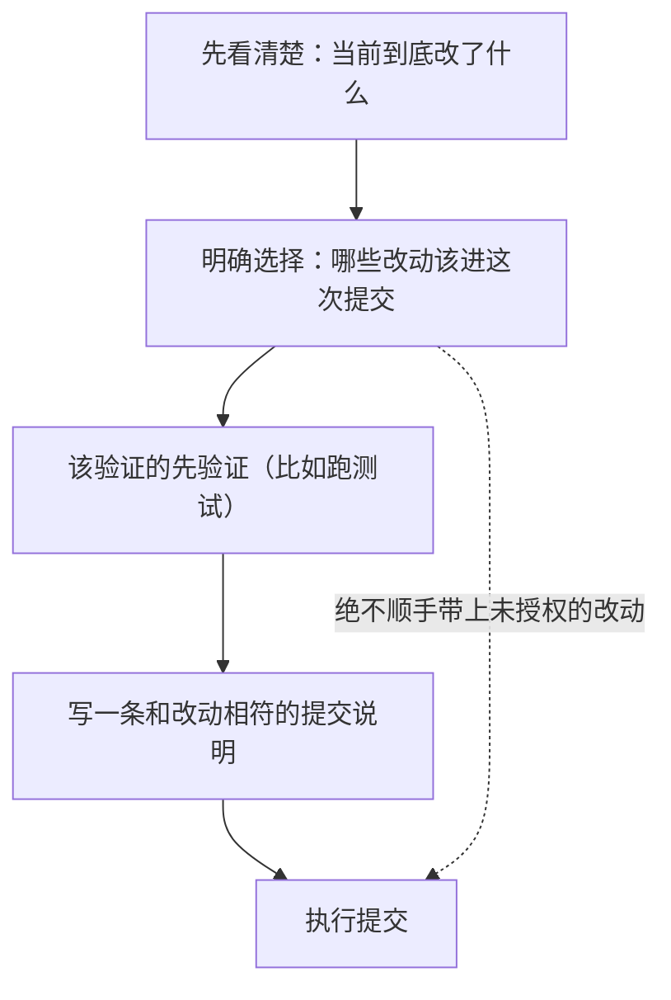

# 第 11 章　Git 与 GitHub 工作流

## 当智能体碰你的版本历史

对程序员来说，代码不是写完就算了。还要提交（commit）、要审查（review）、要开分支、要发起合并请求（PR）、要和同事协作。这套围绕代码的协作流程，大多建立在 Git 和 GitHub 这样的工具上。

一个真正好用的编程智能体，自然会想帮你分担这些活儿：「帮我把刚才的改动提交了」「帮我看看这个改动有没有问题」「帮我开个 PR」。但这件事有个特殊之处——**它直接动你的版本历史和远程协作，而这些东西一旦搞错，代价很大，甚至无法挽回。**

所以这一章的关键词，是上一章末尾就预告过的两个字：**谨慎**。本章回答三个问题：

- 为什么 Git 操作需要比普通命令更严格的边界？
- 帮你提交代码时，智能体该守哪些规矩？
- 哪些 Git/GitHub 能力是「锦上添花」，哪些边界是「碰都不能碰」？

## 为什么 Git 格外危险

普通命令出了错，影响往往局限在本地，重来一遍就好。但 Git 操作的风险，量级完全不同：

- **提交了不该提交的东西**：比如把你还没写完的、或者根本不想公开的改动，一起打包提交了。
- **覆盖或丢失了别人的工作**：某些强制性的 Git 操作，会直接抹掉协作者的提交。
- **推到了错误的地方**：把代码推送到错误的分支或仓库。
- **把没验证的改动说成「已完成」**：测试都没跑，就生成一句「功能已实现」的提交说明，误导所有人。

这些错误，有的能补救，有的——比如覆盖了别人没备份的工作——是真的找不回来了。正因为风险这么高，智能体在 Git 面前必须格外保守。

## 帮你提交时,该守的规矩

「帮我提交代码」是最常见的请求。一个负责任的智能体，会在这件事上守住几条规矩：

- **先看清楚再动手**：基于真实的「当前改了什么」来操作，而不是凭记忆或猜测。Git 的状态必须来自真实查询，不能靠脑补。
- **明确提交范围**：哪些文件该进这次提交，是一条需要明确划定的边界。绝不能因为图省事，把一股脑所有改动（包括你正在改的、不想提交的）全打包进去。
- **提交说明要诚实**：说明必须和实际改动相符。尤其不能在测试没跑、或者跑失败的情况下，写一句「已验证通过」来粉饰。
- **不擅自做危险动作**：不主动推送、不主动发布、不在没得到明确指令时做那些会覆盖历史的操作。

这些规矩背后是同一个精神：**Git 操作的每一步,都要建立在「真实状态 + 你的明确意图」之上,而不是智能体的自作主张。**

## 审查代码:先挑毛病,再说好话

智能体还能帮你做代码审查（review）——在改动合入之前，帮你看看有没有问题。

这里有个值得一提的小设计：好的审查，应该**先按严重程度列出问题**——有没有 bug、有没有风险、有没有破坏原有功能、缺不缺测试——**然后再给总结**，而不是反过来先夸一通「这个改动整体不错」，把真正要命的问题埋在末尾。审查的价值在于挑出毛病，所以毛病要排在最显眼的位置。

类似地，如果智能体要帮你处理 PR、检查持续集成（CI）的状态，那些状态必须来自**真实的查询结果**，而不能靠猜——「我觉得 CI 应该过了」是绝对不能接受的。

## 一个关于「冲突」的具体约定

代码协作中常遇到「冲突」——你和别人改了同一处，系统不知道该听谁的，需要人来裁决。解决冲突有不同的方式，会产生不同形态的历史记录。

这里有一个具体而重要的约定：**如果目标是保持一条整洁的线性历史，那么解决冲突时，应该用「变基」（rebase）的方式逐个处理冲突，而不是图省事地制造一个「合并提交」（merge commit）。** 这两种方式结果不同：前者历史干净，后者会多出一个分叉合并的节点。该用哪种，取决于团队的约定，但智能体不该擅自选那个「省事但弄脏历史」的做法。

这个例子想说明的是：Git 工作流里有大量这样的「细节约定」，它们看似琐碎，却直接影响协作质量。智能体帮忙时，必须尊重这些约定，而不是用最省事的方式蒙混过关。

## 锦上添花 vs 碰都不能碰

最后做个区分。

**锦上添花的能力**（成熟产品可能提供，基于公开行为推断）：内置的提交命令、PR 命令、分支管理、甚至安装一个 GitHub 应用来自动回应 PR 评论。这些能让协作更顺畅，是产品力的体现。

**碰都不能碰的边界**（无论简单还是复杂的实现，都必须守住）：

- 不在未经确认时执行会覆盖历史、会丢失工作的危险操作。
- 不自动推送、不自动发布。
- 不把「本地能跑某个 Git 命令」夸大成「我有完整的 GitHub 协作产品能力」。
- 不用一句漂亮的文字，去替代真实的执行证据——没真发布就别说已发布，没真通过就别说已通过。

这条「碰都不能碰」的清单，和第 4 章的安全护栏一脉相承：**面对高风险、不可逆的操作，宁可保守到「多问一句」，也不要激进到「先斩后奏」。**

## 本章小结

- Git 操作直接动版本历史和远程协作，错误代价极高甚至不可逆，所以智能体在这里必须格外保守。
- 帮你提交代码的规矩：基于真实状态而非猜测、明确划定提交范围、提交说明诚实相符、不擅自做危险动作。
- 审查代码应先列问题再做总结；PR 和 CI 状态必须来自真实查询；解决冲突要尊重团队的历史整洁约定，不图省事。
- 区分「锦上添花」（提交命令、PR 自动化）和「碰都不能碰」（不擅自覆盖历史、不自动推送、不夸大能力、不用文字替代真实证据）——后者与第 4 章的安全精神一脉相承。

第四部分到此结束。你已经了解了和智能体打交道的方方面面。第五部分，我们走进幕后——它的配置和状态从哪来、存在哪，以及出了问题怎么复盘。下一章先看「状态与配置」。
