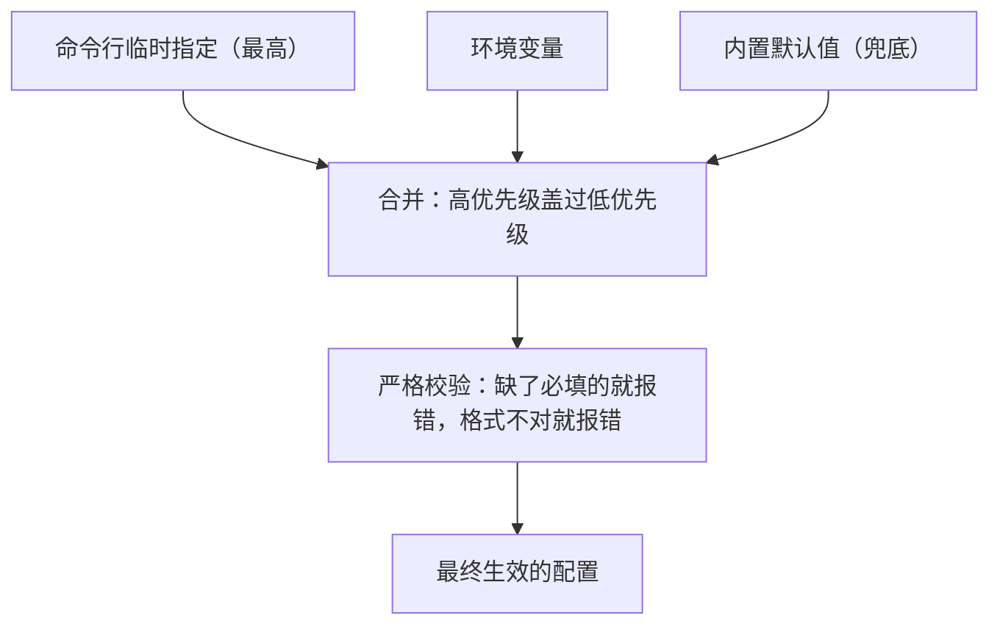

# 第 12 章　状态、记忆与配置治理

## 智能体的「记性」和「设置」

前面我们一直在讲智能体「做什么」。这一章换个角度，问一个更基础的问题：它运行时需要的那些**信息**——用哪个模型、密钥是什么、最多转多少轮、当前任务进行到哪了——都从哪来、存在哪、又怎么管？

这些信息可以分成两大类，生命周期完全不同：

- **配置**：智能体启动时就定下来的设置，比如用哪个模型、密钥、各种参数。一次任务从头到尾基本不变。
- **状态**：任务进行过程中不断变化的信息，比如当前的对话历史、待办清单、重试记录。任务一结束就清空。

理清这两者，是这一章的目标。本章回答三个问题：

- 配置和状态，为什么要分清楚？
- 配置为什么需要「明确的来源优先级」和「严格的校验」？
- 哪些是真正的「记忆」，哪些只是「临时状态」——这条线为什么不能模糊？

## 配置：从哪来，谁说了算

配置往往有多个来源。同一个设置，可能在好几个地方都能指定：

- 你启动时直接在命令行里给的（临时、最优先）。
- 写在环境变量里的（半固定）。
- 程序内置的默认值（兜底）。

当同一个设置在多个地方都有值时，**听谁的？** 这就需要一套明确的「优先级」规则。一个清晰的约定是：**命令行 > 环境变量 > 默认值**——你临时在命令行里指定的，盖过环境变量；都没指定，才用默认值。

这套优先级必须**稳定且可预测**——用户得能确信「我在命令行写的，一定会生效」。

除了优先级，配置还要**严格校验**。这里有一个体现设计态度的细节：有些配置是**必填**的，比如「用哪个模型」「密钥是什么」。对于这种，一个负责任的智能体会**坚决要求你提供，缺了就直接报错退出**，而**绝不偷偷塞一个默认模型**给你。

为什么这么「轴」？因为「偷偷用个默认值」看起来贴心，实则危险：你可能在毫不知情的情况下，用了一个你根本没打算用的模型，跑出一堆莫名其妙的结果，还查不出原因。**明确地报错，远比悄悄地兜底更负责任。** 同理，像「最多转多少轮」这种数字配置，也必须校验它是个合理的正整数，而不是接受任何乱七八糟的输入。

每新增一个配置项，都应该把这四件事一次性考虑周全：它的优先级怎么排、从环境变量怎么读、非法值怎么报错、默认值是什么。

## 状态：任务的「草稿纸」

状态是任务进行中的临时信息。一次任务运行时，智能体手里攥着这么几张「草稿纸」：

- **对话历史**（第 3 章）：当前这次任务的全部往来。
- **待办清单**：当前的任务规划进展。
- **重试记录**（第 4 章）：改完文件跑测试，失败了正在重试的状态。
- **运行记录队列**（第 13 章）：这次运行产生的各种事件。

这些草稿纸有一个共同点：**它们都是「一次性」的，任务结束就作废。** 它们记录的是「这次任务干到哪了」，而不是「跨越多次任务积累下来的知识」。这个区别，引出了下一节那条至关重要的界线。

## 一条不能模糊的界线：临时状态 ≠ 长期记忆

第 3 章已经立下那条原则——**真实发生过的事（铁证）的地位，永远高于任何对信息的加工（二手转述）**。这一章只补一个本章特有的视角：从「状态治理」的角度看，前面列的那些草稿纸，没有一张配得上「长期记忆」这个名头。

「待办清单」是规划草稿、「对话摘要」是压缩历史的产物（第 3 章）、「运行记录」是复盘日志——它们全是**临时状态**，任务结束即作废。真正的长期记忆，是那种能跨越多次任务、持久保存、下次接着用的知识；而一个核心实现通常**根本没有**这种能力，也不该假装有。一旦把临时状态错当成长期记忆，智能体就可能把失真的摘要当成铁打的事实去汇报、把临时待办当成「已完成的工作」去声称——这正是第 3 章那条界线要防的事。

成熟产品确实在探索真正的长期记忆，但这是一套牵扯到「信息存哪、怎么更新删除、可信度如何、升级时旧数据怎么迁移」的复杂系统（升级迁移是本章新增的治理视角）。在没把这些问题想透之前，硬给智能体安一个「长期记忆」的名头，只会让它变得不可靠。**诚实地承认「我只记得这次任务」，好过虚假地宣称「我什么都记得」。**

## 密钥：一条老红线的再次现身

配置里几乎一定包含敏感信息——尤其是访问模型用的密钥。这条红线第 6 章已完整论述过，这里只需重申一次：**密钥这类敏感信息，绝不能写进文档、不能进入发给模型的内容、不能出现在运行记录里。** 它只能安静地待在配置/密钥层，由需要它的地方在内部取用。下一章讲运行记录时，我们会看到为此专门设计的「脱敏」机制——在任何信息被记录下来之前，自动把疑似密钥的部分抹掉。

## 本章小结

- 智能体的信息分两类：配置（启动时定下、基本不变）和状态（任务中变化、结束即清空），二者生命周期不同，要分清。
- 配置需要明确的来源优先级（命令行 > 环境变量 > 默认值）和严格校验；必填项缺失就坚决报错，绝不偷偷塞默认值——明确报错比悄悄兜底更负责任。
- 临时状态（待办、摘要、运行记录）绝不能被当成长期记忆；真实发生的事永远高于对信息的加工，诚实承认「只记得这次任务」好过虚假宣称「什么都记得」。
- 密钥等敏感信息只待在密钥层，绝不进文档、不进对话、不进记录——这条红线贯穿全书。

配置和状态讲清楚了。但智能体跑起来之后，万一表现不对、或者你想知道它到底干了什么——怎么办？这就要靠「看得见」的能力。下一章，可观测、评估与追踪。
