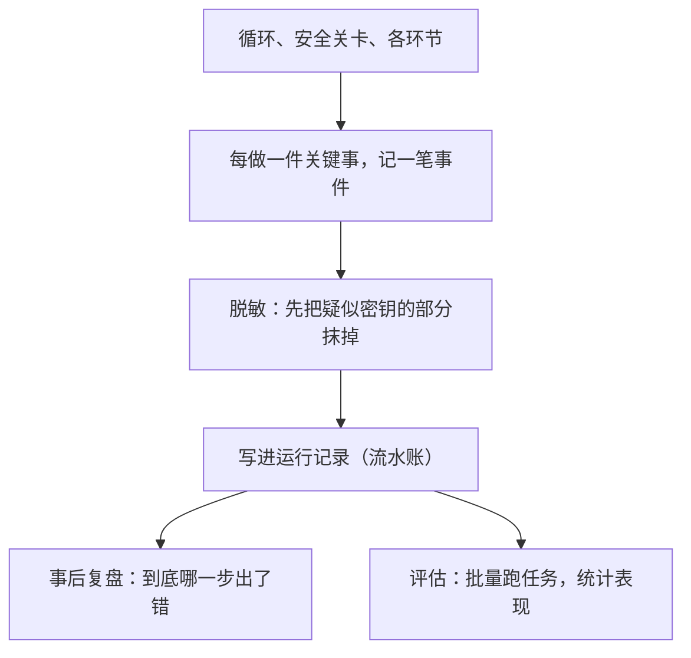

# 第 13 章　可观测、评估与追踪

## 只看结果是不够的

假设你让智能体修一个 bug，最后它说「修好了」，但你一跑，发现根本没修好。问题出在哪？

如果你只能看到「修好了」这个最终结果，你将束手无策——你不知道它中间读了哪些文件、是不是搜错了关键词、哪一步判断失误了。整个过程像一个黑箱，结果不对，你却无从下手。

这就是为什么智能体需要**可观测性**（observability）：把它运行过程中的每一个关键动作都记录下来，让这个黑箱变透明。这一章回答三个问题：

- 为什么光看最终答案不够，还要记录中间过程？
- 这些记录里，什么该记、什么坚决不能记？
- 怎么用这些记录去「评估」一个智能体到底好不好？

## 把过程变透明:事件流

可观测性的核心思路很简单：智能体每做一件关键的事，就「记一笔」。这些「笔」连起来，就是一条**事件流**——一份按时间顺序排列的、它干了什么的完整流水账。

典型的事件包括：

- 任务开始了、你提交了什么。
- 每一次问模型（发了什么）、模型回了什么。
- 每一次工具调用前、调用后（用了哪个工具、什么结果）。
- 每一次权限确认、每一次测试验证。
- 任务怎么结束的。

有了这条事件流，前面那个「说修好了其实没修好」的问题就有救了：你可以翻开记录，一步步看它的判断过程，定位到底哪一步错了。这就是「可观测」的价值——**让结果可以被追溯到过程。**

## 红线:什么坚决不能记

记录得越详细，复盘越有用。但这里有一个必须时刻绷紧的红线，前面几章已经反复出现——**记录绝不能包含敏感信息。**

想想看：事件流里要记「每一次问模型发了什么」。而发给模型的请求里，可能夹带着密钥、令牌之类的东西。如果原封不动记下来，这份本用于复盘的记录，就变成了一个泄露密钥的大窟窿。运行记录通常还会被存成文件、可能被分享、被传到别的系统——任何一环泄露，都是事故。

所以一个负责任的智能体，会在记录之前加一道**脱敏**工序：自动扫描即将记录的内容，把那些看起来像密钥、令牌、密码、授权信息的部分，统统替换成无害的占位符。无论是字段名里带着「密钥」「密码」字样的，还是内容里长得像密钥的字符串，都抹掉。此外，过长的内容会被截断（既省空间，也减少意外泄露面）。

这道脱敏工序意味着：**事件流可以记录「摘要」——干了什么、大致结果如何——但绝不记录完整的敏感原文。** 这是「看得见」和「保安全」之间的平衡，缺一不可。

## 一个聪明的设计:观察者不该影响被观察者

可观测性还有一个微妙但重要的设计原则：**记录这件事本身，不该影响智能体的成败。**

打个比方：一个摄像师在拍纪录片，他的职责是「记录」正在发生的事，而不是「干预」事件的走向。如果摄像机坏了，纪录片可能拍不全，但被拍摄的事件该怎么发展还怎么发展。

智能体的记录系统也该如此。记录是「旁路」的——它在一边默默观察、默默写流水账。万一记录环节本身出了问题（比如写文件失败了），它顶多在角落里报个错，**绝不能因此把正在干活的智能体搞崩。** 任务的成败，由任务本身决定，而不是由「记录得顺不顺利」决定。

（顺带一提，有一种叫「钩子」的机制，允许在某些事件发生时触发额外的动作。一个稳健的默认设定是：这些钩子也只是「旁观」，不改变智能体的成败——除非你明确地、谨慎地为它设计了「叫停」的语义。让旁观者保持旁观，是这里的智慧。）

## 怎么知道它「好不好」:评估

有了事件流，我们还能做一件更厉害的事——**评估**（evaluation，业内常简称 eval）：系统地衡量一个智能体到底表现如何。

光凭「感觉它还不错」是不靠谱的。严肃的评估，是准备一批有标准答案的任务，让智能体反复去做，然后从事件流里统计出客观指标：成功率多高？平均转了多少轮？调用了多少次工具？验证跑了几次？这样，当你改动了智能体的某个设计，就能对比改动前后的指标，确认「这次改动到底是变好了还是变坏了」。

但评估有一个极其重要、也极容易被夸大的陷阱，必须讲清楚。

评估任务有两种。一种用**模拟的、假的**模型（响应是预先编好的），它的作用是检验「智能体这套管道通不通」——流程跑得顺、事件记得对、统计算得准。另一种才用**真实的**模型，检验「它解决真实问题的能力」。

陷阱在于：**用模拟模型跑出来的「成功率」，绝不能拿来吹嘘成智能体的真实能力。** 模拟模型的回答是编好的，它「成功」只能说明管道没堵，跟模型聪不聪明、能不能真修好 bug，毫无关系。把「管道通畅率」包装成「真实能力」，是一种误导。一个诚实的评估，会清清楚楚地区分这两者：**「平台链路健康」是一回事，「真实模型能力」是另一回事。**

同样要诚实的是：搭一套基础的评估系统是一回事，运营一个能反映「长期质量趋势」的成熟平台、积累出可信的历史数据，是另一回事，后者要重得多。不能把前者说成后者。

## 本章小结

- 只看最终结果无法定位问题，所以要把运行过程记成一条「事件流」，让结果可以追溯到过程。
- 一条红线：记录前必须脱敏，把疑似密钥、密码、令牌的内容抹掉；事件流只记摘要，绝不记敏感原文。
- 记录系统应是「旁路」的——像摄像师只记录不干预，记录环节自身出问题也不能搞崩正在干活的智能体。
- 评估能客观衡量智能体表现，但必须诚实区分「用模拟模型验证管道通畅」和「用真实模型验证真实能力」，绝不把前者的成功率吹成后者。

第五部分到此结束。我们已经把智能体的内核、扩展、交互、幕后都拆遍了。最后一部分只有一章，回答一个「向外」的问题：这个一直跑在你终端里的智能体，怎么变成能接到编辑器、能被远程驱动的服务？
