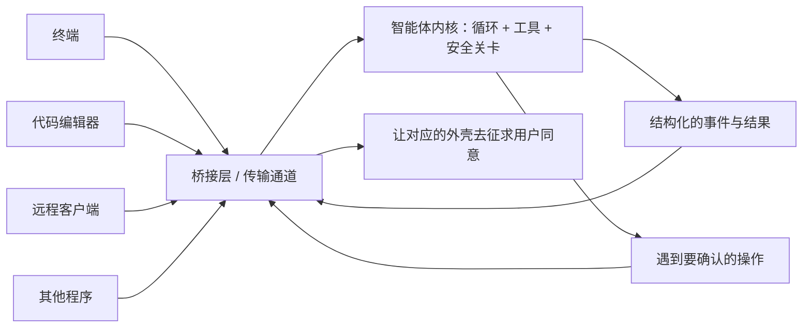

# 第 14 章　IDE、远程与服务端桥接

## 从「终端里的程序」到「随处可用的服务」

这本书从头到尾，我们想象的智能体都跑在一个地方——你面前的终端。你在那里输入，它在那里执行，结果显示在那里。

但你很快会希望它出现在更多地方：

- 在你的**代码编辑器**里——它能看到你正打开的文件、你选中的那段代码，确认权限时直接在编辑器里弹窗。
- 在**远端的服务器**上——你在本地发指令，活儿在一台远程机器上干，因为代码或环境在那边。
- 被**另一个程序**调用——把智能体当成一项服务，嵌进更大的系统里。

要让同一个智能体能在这些不同的地方运行，就需要一个**桥接层**（bridge）。这是全书最后一章，回答三个问题：

- 一个终端程序，为什么会需要桥接层这种东西？
- 桥接会给前面讲的那些机制（权限、消息、会话）带来什么新挑战？
- 为什么说「保持内核与界面解耦」是为未来留的最好的后路？

## 桥接层在做什么:把「运行」和「在哪运行」分开

桥接层的核心思想，是把两件事**拆开**：

- **运行智能体**：前面十三章讲的那套循环、工具、安全关卡——这是「内核」。
- **在哪里、被谁驱动**：终端？编辑器？远程客户端？另一个程序？——这是「外壳」。

一旦拆开，同一个内核就能被各种各样的外壳驱动。终端是一种外壳，编辑器是另一种，远程客户端是第三种。内核不关心是谁在驱动它，它只管「收到任务、跑循环、产出结果」。

注意图里那条「权限确认」的回路：内核遇到需要确认的操作时，不知道、也不必知道用户在哪——它只是发出「我需要一个确认」的请求，由桥接层负责把这个请求送到正确的外壳（终端、编辑器、远程客户端），拿到答复再送回来。

## 桥接带来的新挑战

把智能体从「本地终端」扩展到「编辑器/远程」，会让前面几章的一些机制面临新问题。

**权限确认在哪发生？** 第 4 章里，确认是在终端弹 y/n。但现在用户可能在编辑器里、在远程客户端那头。那个 y/n 提示，要能跨越这段距离送到用户面前，再把答复送回来。如果用户半天不回应，超时了怎么办？这些都是本地场景不存在的新问题。

**远程的输入可信吗？** 当任务和文件在远端、指令从本地来，一个尖锐的问题冒出来了：远程客户端传过来的文件路径，可信吗？还记得第 4 章的路径边界检查吗——在远程场景下，这道检查更加不能松懈，因为输入来自「别处」。

**密钥存在哪、谁拥有工作目录？** 远程执行意味着要重新审视：访问凭证存在哪一端？哪一端真正拥有那个工作目录和操作权限？这些在单机时不言自明的事，跨机器后都得重新想清楚。

**断线了怎么办？** 网络会断。连接断的瞬间，正在执行的工具该停还是该继续？会话状态怎么在重连后恢复？这些可靠性问题，是本地进程里根本不会遇到的。

这些挑战的共同点是：**桥接层的难点，不在于模型有多聪明，而在于会话边界、传输可靠性和权限归属。** 模型还是那个模型，难的是怎么让它在一个分布式的、跨设备的环境里，依然安全可控地运行。

## 一条贯穿始终的底线:安全关卡不能搬家

面对这么多新挑战，有一条底线绝对不能动摇，它直接呼应第 4 章和第 9 章：

**无论外壳怎么变、用户在哪、权限确认绕了多远的路，真正的执行边界——那道安全关卡——永远留在内核里，不能搬到外壳去。**

为什么要强调这点？因为桥接场景下有一个危险的诱惑：既然编辑器/远程客户端已经做了权限确认的界面，那干脆让它们直接决定要不要执行、甚至直接执行，不就省事了吗？

绝对不行。一旦把执行的决定权交给外壳，第 4 章建立的所有护栏就被架空了——一个被攻破或有 bug 的外壳，就能绕过所有安全检查。正确的做法始终是：**外壳负责「把用户的确认意见收集上来」，但「最终放不放行、怎么执行」永远由内核的安全关卡说了算。** 权限确认的界面可以搬到任何地方，但权限判断的代码必须焊死在内核里。

## 为未来留后路:解耦

这一章，也是为整本书收个尾。一个有趣的事实是：即便一个智能体**现在**只跑在本地终端、压根没有编辑器或远程能力，它依然可以为将来留好后路。方法就是一个词——**解耦**。

具体来说：

- **让内核不依赖任何特定外壳**。循环、工具、安全关卡这些核心逻辑，不应该写死「我是给终端用的」。这样将来接编辑器、接远程，内核可以原样复用。
- **把权限确认设计成一个「可替换的回路」**。今天它接到终端的 y/n，明天就能接到编辑器的弹窗——只要内核的安全关卡始终是最终裁决者。
- **让输出用结构化的格式**（第 10 章），为将来对接别的程序留出空间。

这就是一种「克制的远见」：**不必现在就实现远程桥接这套重型机制，但要把内核设计得足够干净、足够解耦，让未来想加的时候加得上。** 这恰恰是全书反复传递的智慧——不为不存在的需求过度设计，但也不把路堵死。该有的边界守住，该留的接口留好，剩下的，等真正需要时再说。

值得最后提醒一句：在真正补上认证、信任、断线恢复这些机制之前，**别把一个本地的会话编排，夸大成「支持远程会话、编辑器连接」**。诚实地描述自己的能力边界——这正是第 4 章就立下、贯穿全书的态度。

## 本章小结

- 桥接层的核心思想是把「运行智能体的内核」和「在哪运行、被谁驱动的外壳」拆开，让同一个内核能被终端、编辑器、远程客户端、其他程序共同驱动。
- 桥接带来一系列本地场景没有的新挑战：权限确认要跨距离传递、远程输入的可信度、密钥与工作目录的归属、断线恢复——难点不在模型，而在会话边界、传输可靠性和权限归属。
- 一条铁底线：无论外壳怎么变，真正的执行边界（安全关卡）永远留在内核，外壳只负责收集确认意见，绝不能代为执行。
- 即便现在只跑在本地，也应通过「解耦」为未来留后路：内核不绑定外壳、权限确认设计成可替换回路、输出结构化——这是「克制的远见」。

到这里，全书十四章的拆解就全部完成了。接下来的结语，我们把散落在各章的那条主线收拢起来，看看 Claude Code 究竟教会了我们哪些可以带走的设计原则。
