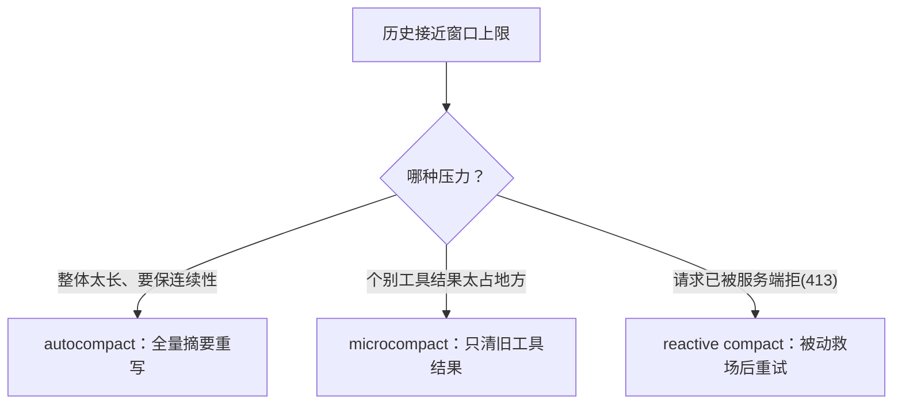

# 第 3 章　上下文工程与记忆系统

> 对应《拆解 Claude Code》第 3、12 章。

## 前情提要

科普书里说过：模型没有真正的记忆，它每轮看见的，是智能体重新组织后发给它的一段上下文；上下文工程的关键不是"尽量多塞"，而是给不同来源的信息排序、压缩、保真，并保护 tool use / tool result 的协议配对。

这一章把"压缩"这件事彻底打开。你会看到：生产级系统里压缩**不是一种操作，而是三种**——自动压缩（autocompact）、微压缩（microcompact）、响应式压缩（reactive compact），各自触发条件、作用对象、代价完全不同；触发阈值是一组精心标定的、和模型上下文窗口挂钩的常量；压缩摘要本身有一套九段式结构；而"相关记忆"则是一个藏在模型流式输出背后的预取（prefetch）。

## 本章要钻多深

- 压缩的触发阈值是怎么从模型上下文窗口反推出来的？为什么要留这么多 buffer？
- 三种压缩（auto / micro / reactive）分别解决什么问题，作用对象有何不同？
- 压缩摘要的九段式结构为什么这样设计？`<analysis>` 草稿块为什么要在落地前剥掉？
- 「相关记忆」如何做成预取，藏进模型流式输出的等待时间里？

## 阈值不是拍脑袋：从上下文窗口反推

科普书说"历史超过某个阈值就压缩"。那个阈值在生产级里不是一个魔法数字，而是从模型上下文窗口**层层减去 buffer** 反推出来的。

第一步，算"有效上下文窗口"——上下文窗口要预留一块给压缩摘要本身的输出（推断，常量为真实标定值）：

```typescript
// 阐释性重构——表达阈值推导，非逐字源码
const MAX_OUTPUT_TOKENS_FOR_SUMMARY = 20_000

function getEffectiveContextWindowSize(model: string): number {
  // 给"生成摘要"这一步预留输出空间：摘要也要占 token
  const reservedForSummary = Math.min(getMaxOutputTokens(model), MAX_OUTPUT_TOKENS_FOR_SUMMARY)
  const contextWindow = getContextWindowForModel(model)
  return contextWindow - reservedForSummary
}
```

第二步，从有效窗口再减去一个 buffer，得到"自动压缩阈值"：

```typescript
// 阐释性重构
const AUTOCOMPACT_BUFFER_TOKENS = 13_000      // 自动压缩留的安全余量
const WARNING_THRESHOLD_BUFFER_TOKENS = 20_000 // 提前提醒用户的余量
const MANUAL_COMPACT_BUFFER_TOKENS = 3_000     // 手动压缩的最后余量

function getAutoCompactThreshold(model: string): number {
  return getEffectiveContextWindowSize(model) - AUTOCOMPACT_BUFFER_TOKENS
}
```

这套层层递减的 buffer，构成了一个**预警梯度**——同一段历史随着变长，会依次越过几条线：

```typescript
// 阐释性重构——一次性算出当前用量踩在哪条线上
function calculateTokenWarningState(tokenUsage: number, model: string) {
  const threshold = getAutoCompactThreshold(model)
  const effectiveWindow = getEffectiveContextWindowSize(model)
  return {
    percentLeft: Math.max(0, Math.round(((threshold - tokenUsage) / threshold) * 100)),
    isAboveWarningThreshold:     tokenUsage >= threshold - WARNING_THRESHOLD_BUFFER_TOKENS, // 该提醒了
    isAboveAutoCompactThreshold: tokenUsage >= threshold,                                   // 该自动压缩了
    isAtBlockingLimit:           tokenUsage >= effectiveWindow - MANUAL_COMPACT_BUFFER_TOKENS, // 再不压就要撞墙
  }
}
```

为什么要这么多层 buffer？因为**压缩本身要消耗 token**（要把历史发给模型让它写摘要，摘要也要占输出空间），而且 token 计数是估算、不精确。如果等到"正好用满窗口"才压缩，那一刻可能已经发不出"请帮我压缩"这个请求了。这些 buffer 是给"压缩这个动作本身"留的施工空间。回想第 1 章那个 `prompt_too_long` 终止原因——这套阈值梯度，就是在它真正发生之前层层设防。

还有一个细节值得点出：**压缩失败有熔断器**。源码里有一条注释（推断转述）记录了一个真实教训：曾有上千个会话因为上下文不可恢复地超限，反复重试自动压缩、每次都失败，全球每天浪费约 25 万次 API 调用。于是加了"连续失败 3 次就停止重试"的熔断。这呼应第 1 章的原则：**任何自动恢复路径都必须有计数闸门，否则"自动恢复"会变成"无限烧钱"。**

## 三种压缩，三种刀法

科普书把压缩讲成一件事：把早期历史总结成摘要。生产级里这其实是**三把不同的刀**，解决不同场景。



**autocompact（自动压缩）** 是科普书讲的那种：历史整体接近阈值，把早期对话喂给模型生成一份结构化摘要，用"系统提示词 + 摘要 + 保留的近期消息"替换原历史。它保连续性，但代价最大（要一次额外的模型调用）。

**microcompact（微压缩）** 是一把更精细的刀。它不重写整段历史，只**挑出那些又大又旧的工具结果**，把内容清掉、留个占位符。它只作用于一个白名单内的工具——读文件、shell、grep/glob、网页抓取、编辑写入这类**结果体积大**的工具（推断）：

```typescript
// 阐释性重构——只有这些工具的旧结果才值得微压缩
const COMPACTABLE_TOOLS = new Set([
  FILE_READ, FILE_EDIT, FILE_WRITE, GREP, GLOB, WEB_SEARCH, WEB_FETCH, ...SHELL_TOOLS,
])
const CLEARED_PLACEHOLDER = '[Old tool result content cleared]'
```

为什么需要 microcompact？因为一次"读了一个一万行的文件"可能单条就吃掉巨量 token，但它的内容在十轮之后早就用不上了。与其触发昂贵的全量 autocompact，不如外科手术式地把这一条的内容换成占位符——任务连续性几乎无损，token 立竿见影地降下来。这是 autocompact 之前的"轻量级泄压阀"。

**reactive compact（响应式压缩）** 是最后的安全网。前两种是"主动预防"（用量到阈值就压），它是"被动救场"：当一个请求**已经发出去、被服务端以"上下文过长（HTTP 413）"拒绝**时，临时触发一次压缩，然后重试。这正是第 1 章那个 `reactive_compact_retry` 的 `transition` 原因——一个"看似该失败"的请求，被压缩救回来续跑。

把三者放一起看，是一个**纵深防御**的结构：microcompact 当轻量泄压阀，autocompact 当主力，reactive compact 当兜底救场。三道防线，对应不同的代价和触发时机。

## 压缩摘要的九段式结构

科普书说压缩时要叮嘱模型"别编造完成的工作"。生产级的摘要 prompt 远不止一句叮嘱——它规定了一套**九段式结构**，强制模型把可继续工作所需的一切都覆盖到（推断，段落标题为真实结构）：

```text
1. Primary Request and Intent   —— 用户的全部明确请求与意图
2. Key Technical Concepts        —— 涉及的技术概念、框架
3. Files and Code Sections       —— 查看/修改/创建的具体文件与代码段，附关键代码片段，并说明为何重要
4. Errors and fixes              —— 遇到的错误及修复
5. Problem Solving               —— 已解决的问题与进行中的排查
6. All user messages             —— 所有非工具结果的用户消息（保留意图原貌）
7. Pending Tasks                 —— 明确被要求但尚未做的任务
8. Current Work                  —— 紧接摘要前正在做的事，附文件名与代码片段
9. Optional Next Step            —— 下一步，且必须与最近的明确请求直接对齐
```

这套结构的设计意图很清楚：**压缩的目标不是"缩短",而是"无损地交接一次任务"**。每一段都对应"接手者要继续工作必须知道的一类信息"。第 8 段"Current Work"和第 9 段"Optional Next Step"尤其关键，它们保证压缩后模型不会忘记自己刚才干到哪、下一步该干什么。

第 9 段还藏着一条防跑偏的约束（推断转述）：下一步**必须**与用户最近的明确请求直接对齐；如果上一个任务已经完成，除非新步骤明确符合用户请求，否则不要自作主张去做"旁支的"或"很久以前就完成了的"任务。这是在防止压缩摘要变成模型"夹带私货重启任务"的入口。

还有一个精巧的工程细节：摘要 prompt 要求模型先写一个 `<analysis>` 块**当草稿纸**，把分析过程铺开，再写最终的 `<summary>` 块。而落地进上下文时，`<analysis>` 草稿会被**剥掉**，只留 `<summary>`：

```typescript
// 阐释性重构
function formatCompactSummary(modelOutput: string): string {
  // <analysis> 是给模型组织思路的草稿纸，不进入后续上下文
  return extractBlock(modelOutput, 'summary')
}
```

这是"让模型先想后写"和"上下文保持精简"两个目标的调和——给模型思考空间，但不让思考过程占用宝贵的窗口。

此外还有**全量摘要**和**部分摘要**两套 prompt：当较早的消息已经被保留、只需要总结"近期那一段"时，用部分摘要 prompt（"earlier messages 保持原样、不需要总结"）。这避免了对已经稳定的历史反复重写。

## 相关记忆：藏在流式输出背后的预取

科普书第 12 章说长期记忆只能是"候选上下文"，不能覆盖工具结果。深度层要看的是它在**性能**上怎么做到不拖慢主路径。

答案是预取（prefetch）。源码快照里，相关记忆的检索在主循环**进入时就启动**，但它返回一个"待定句柄"，并不阻塞模型请求（推断）：

```typescript
// 阐释性重构——记忆预取藏在模型流式输出与工具执行的等待时间里
using pendingMemoryPrefetch = startRelevantMemoryPrefetch(state.messages, state.toolUseContext)

while (true) {
  const pendingSkillPrefetch = skillPrefetch?.start(messages)   // 技能发现同样预取
  const modelStream = callModel(buildMessages(state))            // 模型开始流式吐字

  // 模型流式输出、工具执行这段时间里，记忆/技能检索在后台并行推进
  // 等到真正需要注入时才 consume，成功且有用就注入，否则不阻塞主线
  const memoryAttachments = await pendingMemoryPrefetch.consumeIfUseful()
}
```

这里的工程判断很硬核：如果每轮都**同步**检索记忆，主路径延迟会被白白拖慢（而源码注释提到，绝大多数情况下检索其实什么都没找到）；如果完全不检索，又失去长期上下文价值。预取把检索**藏进模型流式输出和工具执行的等待时间里**——这段时间本来就在等 I/O，正好用来做检索。成功了就注入，没找到或无关就悄悄丢弃，主线一秒都不等。

`using` 关键字（TypeScript 的显式资源管理）也用得讲究：它保证无论循环从哪条路径退出，预取句柄都会被正确释放，不会泄漏到下一轮——避免"上一轮的预取结果污染下一轮"。

而注入时的边界，和科普书一致但更精确：记忆进入 prompt 时应携带**来源、时间、关联理由**，并在措辞上表述为"可能相关"而非"事实"。它是候选，地位低于真实工具结果。

## 最小可行实现参照

本仓库的最小实现只做一种压缩——autocompact 的简化版，不做 micro/reactive，也没有记忆系统。但它把 autocompact 的骨架做对了（真实代码）：

```typescript
// src/context/compressor.ts（真实代码，节选）
async compress(history: MessageHistory): Promise<MessageHistory> {
  const messages = history.getMessages();
  const systemMessage = messages[0]?.role === "system" ? messages[0] : undefined;
  const conversationalMessages =
    systemMessage === undefined ? messages : messages.slice(1);
  const preservedTail = takeLastN(conversationalMessages, this.config.preserveLastN);
  const messagesToCompress = conversationalMessages.slice(
    0, conversationalMessages.length - preservedTail.length
  );
  if (messagesToCompress.length === 0) return new MessageHistory(messages);

  const summary = await this.client.chat(
    buildCompressionSystemPrompt(this.config.maxTokens),
    buildCompressionUserMessage(messagesToCompress)
  );
  return new MessageHistory([
    ...(systemMessage === undefined ? [] : [systemMessage]),
    { role: "assistant", content: `Context summary:\n${summary}` },
    ...preservedTail,
  ]);
}
```

把它和生产级对照，差距一目了然：

| 维度 | 最小实现 | 生产级（推断） |
| --- | --- | --- |
| 压缩种类 | 1 种（全量摘要） | 3 种（auto / micro / reactive） |
| 触发阈值 | 固定常量（80k）| 从模型窗口反推 + 多层 buffer |
| 摘要结构 | 一句"别编造" + 自由格式 | 九段式 + `<analysis>` 草稿剥离 |
| 失败处理 | 无（异常外抛）| 连续失败 3 次熔断 |
| 记忆系统 | 无 | 流式背后的预取 + 来源治理 |
| 部分摘要 | 无 | 有（只总结近期段）|

最小实现的阈值是写死的 `compressionThreshold = 80000`，而生产级是 `contextWindow − 摘要预留 − buffer` 动态算出来的。最小实现压缩失败就直接抛异常，生产级有熔断器。但最重要的那条——压缩 prompt 里"不要编造完成工作或不存在能力"——两者一字不差地共享，因为这是压缩**保真**的底线。

## 边界与权衡

- **压缩的本质是有损交接，不是无损存储**。九段式结构再周全，也是"重新表述"，必然丢信息。所以生产级宁可多保留近期原始消息（保连续性），也不激进缩短——省 token 是次要目标，可继续性才是主目标。
- **microcompact 的白名单是个权衡**。只清"结果体积大"的工具，意味着要维护这个白名单；漏掉一个高产出工具，它的旧结果就会一直占着窗口。
- **预取是并发问题**。它把上下文构造从"同步拼装"变成"异步取用"，必须有清晰的 dispose / consume 语义（`using` 就是为此），否则会出现跨轮污染。
- **三种压缩的协同需要测试覆盖**。auto / micro / reactive 触发条件有重叠区，什么时候用哪种、会不会互相干扰，是个不小的测试矩阵——这又回到第 1 章："多一条恢复路径，多一组要测的状态。"

## 本章小结

- 压缩阈值不是魔法数字，而是从模型上下文窗口减去"摘要预留 + 多层 buffer"反推出来的；多层 buffer 是给"压缩动作本身"留的施工空间，并配有连续失败熔断器。
- 压缩是三把刀：microcompact 外科手术式清理大体积旧工具结果（轻量泄压阀），autocompact 全量摘要重写（主力），reactive compact 在请求被 413 拒绝后被动救场（兜底），构成纵深防御。
- 压缩摘要用九段式结构强制"无损交接一次任务"，`<analysis>` 草稿块让模型先想后写、落地前剥离；"下一步"段有防跑偏约束。
- 相关记忆做成预取，藏在模型流式输出和工具执行的等待时间里，不阻塞主线；注入时只作候选上下文，地位低于工具结果。

下一章进入全书最硬核的部分：Bash 安全。我们会看到"允许模型跑命令"为什么是一个需要 shell 解析器、AST、方言知识和规则遮蔽检测的完整工程，而不是一组正则。
