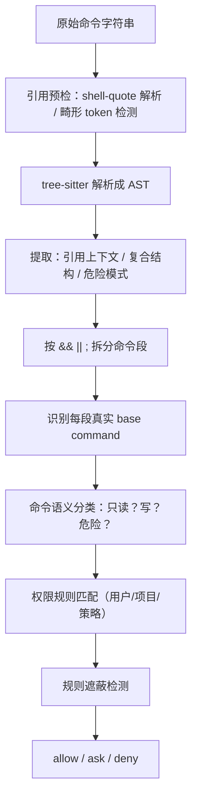

# 第 4 章　Bash 安全与权限分层

> 对应《拆解 Claude Code》第 4 章。

**独立阅读建议**：本章可独立阅读，是全册最硬核的一章，记住「安全必须写进执行前的必经路径」即可。
**联读建议**：与第 6 章（插件路径穿越校验顺序）、第 7、8 章（`bubble` 权限冒泡到子 Agent / 远程）连读，权限边界的延伸最完整。

## 前情提要

科普书第 4 章讲过：安全不能靠提示词叮嘱，必须写进工具执行前的必经路径；路径边界、危险命令和用户确认分别防不同风险；基础命令黑名单不能被说成完整沙箱。

这一章钻到全书最硬的地方：**「允许模型跑命令」为什么是一个需要 shell 解析器、抽象语法树、引用上下文分析、方言知识和规则遮蔽检测的完整工程，而不是一组正则。** 这是 coding agent 里最危险、也最值得重金投入的区域——因为命令几乎无所不能，而 shell 是一门有转义、有展开、有方言的真正语言。攻击者不会老实写 `curl http://evil.com`，他们会找解析器和规则之间的缝。

## 本章要钻多深

- 为什么正则黑名单从根上就不够？shell 的哪些特性能把「无害文本」在执行前变成危险动作？
- 生产级用 tree-sitter 把命令解析成 AST 后，到底提取了哪些信息？引用上下文为什么是核心？
- 权限规则之间会「互相遮蔽」——一条宽泛的 allow 怎么让一条具体的 deny 永远不生效？系统怎么检测这种情况？
- 权限模式是一组交互契约，`plan` / `bypassPermissions` / `bubble` 各自的代码级语义是什么？

## 术语起步

- **AST（抽象语法树）**：tree-sitter 把命令解析成的语法结构，让安全检查看穿表面字符串。
- **引用上下文（quoteContext）**：同一段 `$()` 在单引号里无害、在双引号里会执行，需按引号层级判断。
- **规则遮蔽（shadowing）**：一条宽泛的 allow 让一条更具体的 deny 永不命中，制造虚假安全感。
- **权限模式**：`default` / `acceptEdits` / `bypassPermissions` / `plan` / `bubble` 等交互契约，不是布尔开关。
- **准入控制 ≠ 沙箱**：解析流水线只决定「放不放行」，命令一旦放行能做什么取决于进程权限。

## 正则黑名单：为什么从根上不够

最小实现从危险命令正则起步，这能挡住最显眼的风险（真实代码）：

> 证据标签：本章 `// src/...` 路径标注的代码块是 **[本仓库真实代码]**；讲 Claude Code 快照的 tree-sitter 分析、Zsh 危险集合、权限模式等是 **[快照推断]**；归纳出来的类型签名是 **[阐释性重构]**。下面这段属于 **[本仓库真实代码]**。

```typescript
// src/permissions/rules.ts（真实代码，节选）
export const DANGEROUS_COMMAND_RULES: readonly CommandSafetyRule[] = [
  {
    id: "recursive-delete",
    reason: "Blocked: destructive file deletion (rm -rf)",
    pattern: /(?:^|[\s;&|()])rm\s+(?:-[^\s;&|()]*[rR][^\s;&|()]*)(?:\s|$)/,
  },
  {
    id: "external-network-request",
    reason: "Blocked: external network request (curl/wget)",
    pattern:
      /(?:^|[\s;&|()])(?:curl|wget)\s+(?:(?:-[^\s;&|()]+|--[^\s;&|()]+)\s+)*https?:\/\//,
  },
  // force-push / protected-path-write / sudo / chmod-777 ...
];
```

问题在于：正则匹配的是**字符串的表面形态**，而 shell 在执行前会对这个字符串做大量**重写**。几个例子，都能让上面的正则失效：

- `c""url http://evil.com` —— 中间插一对空引号，`curl` 这个词被打断，正则匹配不到，但 shell 拼接后照样执行 curl。
- `$(echo cu)rl ...` —— 用命令替换拼出 `curl`。
- `IFS=x; curl${IFS}http://...` —— 用变量展开绕过空格匹配。
- `=curl evil.com` —— Zsh 下词首 `=curl` 展开成 `$(which curl)` 的结果。

**核心矛盾：正则看到的是「写出来的命令」,shell 执行的是「展开后的命令」,两者不是一回事。** 任何只看表面字符串的检查，都会被「能改变命令含义的语言特性」绕过。所以生产级安全必须先把命令**解析成结构**，理解它真正会执行什么。

## 生产级链路：从字符串到 AST 到决策

生产级 Bash 安全是一条多级流水线，每一级解决一类不同的问题：



最关键的一级是 **tree-sitter 解析**。tree-sitter 是一个增量解析器，能把 bash 命令解析成真正的语法树。基于这棵树，系统提取出一个结构化的分析结果（推断，字段为快照中可见的命名）：

```typescript
// 阐释性重构——tree-sitter 分析产出的结构，非逐字源码
type TreeSitterAnalysis = {
  quoteContext: {
    withDoubleQuotes: string        // 去掉单引号内容（双引号内容保留）后的命令
    fullyUnquoted: string           // 去掉所有引号内容后的命令
    unquotedKeepQuoteChars: string  // 同上但保留引号字符本身
  }
  compoundStructure: {
    hasCompoundOperators: boolean   // 是否有顶层 && || ;
    hasPipeline: boolean            // 是否有管道
    hasSubshell: boolean            // 是否有子 shell ( ... )
    hasCommandGroup: boolean        // 是否有命令组 { ... }
    operators: string[]
    segments: string[]              // 按复合操作符拆出的各命令段
  }
  hasActualOperatorNodes: boolean   // ; 是真操作符，还是被转义的 \; 字面量？
  dangerousPatterns: {
    hasCommandSubstitution: boolean // $() 或反引号（且在会让它生效的引号外）
    hasProcessSubstitution: boolean // <() 或 >()
    hasParameterExpansion: boolean  // ${...}
    hasHeredoc: boolean
    hasComment: boolean
  }
}
```

为什么这个结构能解决正则解决不了的问题？看几个字段：

**引用上下文（quoteContext）是核心中的核心。** 同一个 `$()`，写在单引号里是无害的字面字符串，写在双引号里却会真的执行。所以分析要同时产出「去掉单引号后」和「去掉所有引号后」的多个版本——危险模式检查跑在**正确的引用层级**上，才不会把 `echo '$(rm -rf /)'`（单引号里的字面量，无害）误判为命令替换。这正是 `dangerousPatterns.hasCommandSubstitution` 注释里强调的「outside quotes that would make it safe」。

**`hasActualOperatorNodes` 解决一个极细的歧义**：`find . -exec rm {} \;` 里的 `\;` 是 `find` 的参数分隔符（被转义的字面分号），不是命令分隔符。正则会把它误当成「两条命令」，而 AST 能分清——这个分号在语法树里是不是一个真正的操作符节点。

一个最小例子能看清「正则误判 vs AST 判定」的差别：

```text
命令： find . -exec rm {} \;

正则视角（看表面字符）：
  看到 "rm" + 看到 ";" → 误判为「先 find，再单独执行 rm」→ 命中 rm 删除规则

AST 视角（看语法树）：
  command "find"
    └─ args: [".", "-exec", "rm", "{}", ";"]   ← ";" 是 find 的参数（literal），
                                                  hasActualOperatorNodes = false
  → 整条只是一个 find 命令，";" 不是命令分隔符 → 按 find 的语义判定，而非误拆成 rm
```

同样一串字符，正则把 `\;` 当成命令边界、AST 把它认成 `find` 的参数终止符——这就是「理解结构」比「匹配字符」强在哪里。

**复合结构（compoundStructure）让规则能逐段判断。** `git status && rm -rf /` 必须被拆成两段，分别判断——而不是把整串当一个命令。`segments` 字段就是干这个的。

有了 AST，再回头看正则绕过的那些例子：`c""url` 的引号被解析掉后，base command 暴露为 `curl`；`$(echo cu)rl` 的命令替换被 `hasCommandSubstitution` 捕获并拦截；`=curl` 被识别为 Zsh equals 展开。**理解结构，才能看穿表面。**

引用预检还有一层：在 tree-sitter 之前，先用 shell-quote 类工具做「畸形 token 检测」——如果命令连合法 token 都分不出来（畸形引号、解析器已知 bug），直接保守拒绝，**绝不「解析失败就放行」**。这是安全工程的铁律：无法理解的输入，按危险处理。

## Zsh 方言：解析器之外的攻击面

即使有了 AST，还有一类风险来自 **shell 方言**。源码快照里有一段很有代表性的注释，讲 Zsh `=cmd` 展开（推断转述）：在 Zsh 里，词首的 `=curl` 会展开成 `$(which curl)` 的结果，例如 `/usr/bin/curl`。如果权限规则写的是 `Bash(curl:*)` deny，而解析器看到的 base command 是 `=curl`，普通的「base == curl」检查就会失效。

所以这类**能改变命令名含义的语言特性本身**被列入危险模式（推断）：

```typescript
// 阐释性重构——把"能改写命令名的语言特性"列为危险
const dangerousShellPatterns = [
  { pattern: /<\(/, reason: 'process substitution <()' },
  { pattern: /=\(/, reason: 'Zsh process substitution =()' },
  { pattern: /(?:^|[\s;&|])=[a-zA-Z_]/, reason: 'Zsh equals expansion (=cmd)' },
  { pattern: /\$\(/, reason: '$() command substitution' },
  { pattern: /\$\{/, reason: '${} parameter substitution' },
]
```

还有一类是 **Zsh 模块**。某些模块加载后提供文件 I/O、网络、伪终端、内建删除/移动能力——即使命令里没有 `rm`、`curl`，也能通过模块能力做到等效的事。这类 base command 被单独列为危险集合（推断转述）：

```typescript
// 阐释性重构
const zshDangerousCommands = new Set([
  'zmodload',  // 网关：加载 mapfile/system/zpty/net/tcp/files 等危险模块
  'emulate',   // emulate -c 是 eval 等价物
  'sysopen', 'sysread', 'syswrite', 'sysseek',  // zsh/system：细粒度文件 I/O
  'zpty', 'ztcp', 'zsocket',                     // 伪终端 / TCP 连接 / socket
  'zf_rm', 'zf_mv', 'zf_ln', 'zf_chmod',         // zsh/files：绕过二进制检查的内建命令
])
```

防守思路是「入口封堵 + 纵深防御」：`zmodload` 是绝大多数模块能力的网关，必须挡；模块提供的内建命令也单独挡一遍，防止模块被预加载或入口被绕过。这呼应一个原则——**安全不能只看「危险命令名」,还要看「能凭空造出危险能力的语言机制」。**

## 规则遮蔽：一条 allow 如何让 deny 永不生效

权限规则来自多个来源——用户设置、项目设置、本地设置、命令行、策略、会话级。当它们叠加时，会出现一个隐蔽的 bug：**一条宽泛的规则会「遮蔽」一条更具体的规则，让后者永远不被命中。**

举例：用户写了 `Bash(git:*)` allow（允许所有 git 命令），又写了 `Bash(git push:*)` ask（push 要确认）。但因为前者更宽、且被先匹配，后者那条「push 要确认」**永远不会触发**——它被遮蔽了。用户以为自己设了护栏，实际没有。

生产级系统有专门的「不可达规则检测」（推断，类型为快照中可见的命名）：

```typescript
// 阐释性重构——检测被遮蔽、永不生效的规则
type ShadowType = 'ask' | 'deny'

type UnreachableRule = {
  rule: PermissionRule
  shadowedBy: PermissionRule   // 是哪条更宽的规则遮蔽了它
  shadowType: ShadowType
}

type ShadowResult =
  | { shadowed: false }
  | { shadowed: true; shadowedBy: PermissionRule; shadowType: ShadowType }
```

检测到遮蔽后，系统还会**生成修复建议**——告诉用户「你这条规则被那条遮蔽了，要让它生效该怎么改」。这是一个容易被忽视、但对安全至关重要的设计：**安全规则的危险，不只在「写错了」,更在「写了却没生效而你以为生效了」。** 一个静默失效的 deny 规则，比没有规则更危险，因为它制造了虚假的安全感。

（细节：检测时会区分规则来源是否「共享」——沙箱内自动放行的命令，对具体的 Bash allow 规则有特殊处理，避免误报。）

## 命令分类：这是只读还是会写

规则匹配之前，还要回答一个问题：这条命令**会做什么**？`git status` 是只读的，可以宽松；`git push` 会改远程，必须谨慎。这由命令语义分类器负责（推断，类型为快照中可见的命名）：

```typescript
// 阐释性重构
type ClassifierBehavior = 'deny' | 'ask' | 'allow'
type ClassifierResult = {
  behavior: ClassifierBehavior
  reason: string
}

async function classifyBashCommand(command: string, context): Promise<ClassifierResult>
```

分类不是只看 base command 名——它要结合参数、子命令、AST 结构综合判断。`git` 本身无所谓好坏，`git status` 和 `git push --force` 是天壤之别。分类器的输出再喂给规则匹配，最终得出 allow / ask / deny。

## 权限模式：一组交互契约

科普书把权限简化成「读自动放行、写和命令要确认」。生产级有一组**外部模式**和几个**内部模式**，它们不是开关，而是不同的交互契约（推断，模式名为快照中可见的命名）：

```typescript
// 阐释性重构——权限模式是交互契约，不是布尔开关
type PermissionMode =
  | 'default'           // 按规则判断，需要时询问
  | 'acceptEdits'       // 自动接受编辑类操作，但命令仍可能要确认
  | 'bypassPermissions' // 跳过人工确认——但不跳过解析、安全规则、路径边界
  | 'dontAsk'           // 不弹确认，拿不准时保守拒绝
  | 'plan'              // 规划模式：不允许实际修改
  | 'auto'              // 内部模式，可能由分类器接管
  | 'bubble'            // 子任务/远程场景，权限请求向上冒泡
```

几个模式的代码级语义值得单独点出：

- **`plan`** 不是「提醒模型别改文件」。它必须在**工具执行边界上硬拒绝写入类动作**——否则所谓「计划模式」只是一句 UI 文案，模型一旦无视它就能照样改文件。`plan` 模式的正确实现是代码级的写入禁止。
- **`bypassPermissions`** 是最危险的模式，必须精确界定它跳过什么：它跳过**人工确认**这一步，但**绝不跳过** shell 解析、危险模式检测、路径边界、参数校验。「不问你」不等于「不检查」——这和科普书里 auto-approve 的边界完全一致，只是这里是一整套模式体系里的一员。
- **`bubble`** 用于子任务和远程场景：子 Agent 或远程会话遇到要确认的操作时，自己没有 UI，于是把权限请求「冒泡」给上层有 UI 的一方。这直接连到第 7 章（多 Agent 权限同步）和第 8 章（远程权限回调）。

模式还能动态迁移——例如用户在一次确认里选了「以后都允许」，模式或规则会随之更新并可能持久化到不同来源（会话级、项目级、用户级）。这套「模式 + 规则来源 + 持久化目标」的组合，正是前面「规则遮蔽」问题的土壤。

## 最小可行实现参照

本仓库的最小实现把安全集中在 `Harness.preExecute()`，这是**正确的边界位置**——尽管它内部还只是正则（真实代码）：

```typescript
// src/harness.ts（真实代码，节选）
async preExecute(tool: ToolDefinition, input: Record<string, unknown>): Promise<HarnessDecision> {
  const safety = checkToolSafety(tool, input, { workingDirectory: this.config.workingDirectory });
  if (!safety.proceed) return safety;            // 先做代码级安全

  const permission = await this.permissionCheck(tool, input, { autoApprove: this.config.autoApprove });
  if (!permission.approved) {
    return { proceed: false, reason: `[permission denied] ${permission.reason}` };
  }
  return { proceed: true };                       // 安全通过 + 权限通过，才执行
}
```

路径边界也独立成纯函数，拒绝绝对路径和 `..` 逃逸（真实代码）：

```typescript
// src/permissions/sandbox.ts（真实代码，节选）
export function checkPathInSandbox(workingDirectory: string, inputPath: unknown): SandboxDecision {
  if (typeof inputPath !== "string" || inputPath.trim() === "")
    return { allowed: false, reason: "path must be a non-empty string" };
  if (path.isAbsolute(inputPath))
    return { allowed: false, reason: "absolute paths are not allowed; use a path inside the working directory" };
  const root = path.resolve(workingDirectory);
  const resolvedPath = path.resolve(root, inputPath);
  const relativePath = path.relative(root, resolvedPath);
  if (relativePath === ".." || relativePath.startsWith(`..${path.sep}`))
    return { allowed: false, reason: "path escapes the working directory" };
  return { allowed: true, resolvedPath, relativePath };
}
```

对照表，能精确看到「教学级」到「生产级」的升级路径：

| 维度 | 最小实现 | 生产级（推断） |
| --- | --- | --- |
| 命令理解 | 表面字符串正则 | tree-sitter AST + 引用上下文 |
| 引号处理 | 无（正则被引号绕过）| 多层 unquote，按引用层级判断 |
| 复合命令 | 不拆分 | 按 `&& \|\| ;` 拆段逐段判断 |
| 方言 | 无 | Zsh equals 展开、模块封堵 |
| 规则来源 | 单一黑名单 | 多来源 + 遮蔽检测 + 修复建议 |
| 命令分类 | 二元（危险/不危险）| allow / ask / deny + 语义分类器 |
| 权限模式 | autoApprove 一个布尔 | 5 外部 + 2 内部模式 |
| 解析失败 | N/A | 保守拒绝，绝不放行 |

最重要的是：**这两者的边界位置完全相同**——安全都发生在工具执行前、集中在唯一入口。最小实现要升级到生产级，**只需要替换 `checkToolSafety()` 的内部实现**（正则换成 AST 流水线），不需要移动这道边界。架构对了，深度可以后补；架构错了（比如让工具自己检查自己），再强的解析器也补不回来。

## 边界与权衡

- **AST 解析提高安全性，但引入新风险**：解析器与真实 shell 的行为差异、跨平台方言差异、性能开销。它必须被设计成「无法解析时保守拒绝」，而不是「解析失败就放行」——后者会把解析器的每个 bug 都变成安全漏洞。
- **多来源规则 + 遮蔽检测是个组合爆炸**。来源越多、模式越多，规则之间的相互作用越复杂。遮蔽检测本身就是为应对这种复杂度而生，但它也增加了系统的认知负担。
- **没有真正的内核级隔离，这一切仍是「准入控制」而非「沙箱」**。tree-sitter 流水线再强，也只是在「放不放行」上做文章；命令一旦放行执行，它能做什么取决于进程权限。真正的沙箱（容器、seccomp、命名空间）是另一个层次的工程。科普书那句「基础检查不能吹成完整沙箱」，在生产级依然成立——只是这里的「基础检查」已经相当不基础了。

## 本章小结

- 正则黑名单从根上不够，因为它看的是命令的表面字符串，而 shell 执行前会通过引号、命令替换、变量展开、方言特性把字符串重写成完全不同的东西。
- 生产级先用 tree-sitter 把命令解析成 AST，提取引用上下文、复合结构、危险模式——引用上下文是核心，它让危险检查跑在正确的引号层级上，看穿表面绕过。
- 权限规则来自多来源，会互相遮蔽让具体规则静默失效；专门的不可达规则检测 + 修复建议应对这一点，因为「写了却没生效」比「没写」更危险。
- 权限模式是一组交互契约：`plan` 要代码级禁止写入，`bypassPermissions` 只跳过人工确认绝不跳过检查，`bubble` 把权限请求冒泡给有 UI 的上层。
- 最小实现的正则虽弱，但把安全集中在 Harness 执行前入口的架构是对的；升级只需替换检查内部，不需移动边界。

下一章离开本地，进入外部协议——MCP、LSP、OAuth 的连接生命周期、认证状态机、错误分类与 elicitation。
