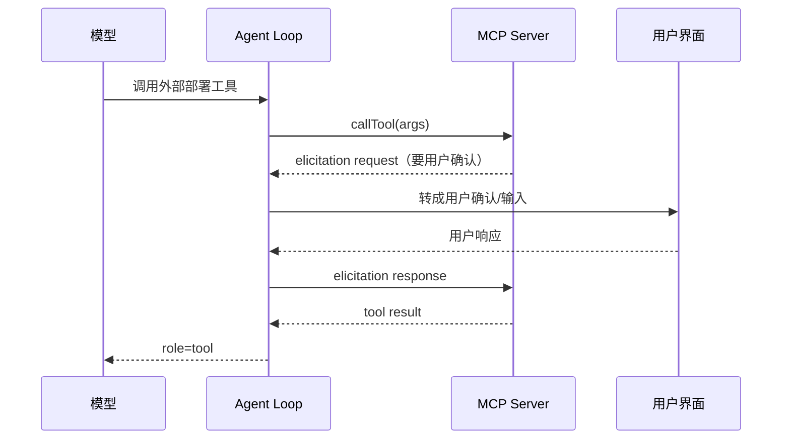

# 第 5 章　外部协议：MCP / LSP / OAuth

> 对应《拆解 Claude Code》第 6 章。

**独立阅读建议**：本章可独立阅读，把 MCP/LSP/OAuth 都理解成「有连接、认证、错误、生命周期的外部服务」即可。
**联读建议**：与第 2 章（工具归一化）、第 4 章（elicitation 与本地权限的异同）、第 8 章（远程权限同样冒泡）连读。

## 前情提要

科普书第 6 章讲过：MCP 是外部工具服务器的通用插座，LSP 提供代码语义能力，OAuth 负责安全授权；它们的共同点是都有连接状态、认证状态、错误状态和生命周期，因此应该归服务层管理，而不是散落在工具实现里。

这一章看服务层真正复杂在哪里。重点不是「调用一个外部工具」，而是支撑这次调用的一整套基础设施：多种传输、退避重试的精确数学、按查询来源区分的重试策略、认证状态机，以及一个容易被低估的能力——外部服务器反过来向用户「提问」（elicitation）。

## 本章要钻多深

- 退避重试的延迟到底怎么算？为什么需要 jitter？`Retry-After` 头如何凌驾于退避公式之上？
- 为什么「该不该重试」取决于**这次请求是谁发起的**（前台用户 vs 后台摘要）？
- 多种 MCP 传输（stdio / SSE / HTTP / SDK control / in-process）的差异如何被一个连接管理器吸收？
- elicitation 为什么让外部服务器变成一个能「反问用户」的参与方，它和第 4 章的权限确认有何异同？

## 术语起步

- **指数退避 + jitter**：重试延迟按 `2^n` 增长并加随机抖动，防止并发客户端「惊群」同时重试。
- **`Retry-After`**：服务端下发的「X 秒后再来」指令，凌驾于本地退避公式之上。
- **querySource（请求来源）**：标识请求是前台（用户在等）还是后台（标题/分类器），决定该不该重试。
- **MCP 传输**：`stdio` / `sse` / `http` / `sdk` / `in-process` 五种底层连接方式，生命周期语义各异。
- **elicitation**：外部服务在工具执行过程中反过来向用户补问信息的机制（详见本章相应小节）。

## 重试不是 `for` 循环加 `sleep`

科普书说「网络抖动可以重试」。生产级的重试是一套精心标定的退避数学。先看延迟怎么算（推断，常量与公式为快照中可见的命名）：

> 证据标签：本章讲 Claude Code 快照外部协议的常量、集合、结构均为 **[快照推断]**；归纳出来的类型签名是 **[阐释性重构]**；本章不含本仓库真实代码（最小实现没有 MCP/LSP/OAuth）。下面这段属于 **[快照推断]**。

```typescript
// 阐释性重构——退避延迟的精确计算，非逐字源码
const BASE_DELAY_MS = 500

function getRetryDelay(attempt: number, retryAfterHeader?: string | null, maxDelayMs = 32_000): number {
  // 1. 服务端的 Retry-After 头是"指令",凌驾于本地退避公式之上
  if (retryAfterHeader) {
    const seconds = parseInt(retryAfterHeader, 10)
    if (!isNaN(seconds)) return seconds * 1000
  }
  // 2. 指数退避：500ms, 1s, 2s, 4s... 但封顶 32s
  const baseDelay = Math.min(BASE_DELAY_MS * Math.pow(2, attempt - 1), maxDelayMs)
  // 3. 加 0~25% 的随机抖动，打散并发客户端的重试时刻
  const jitter = Math.random() * 0.25 * baseDelay
  return baseDelay + jitter
}
```

三个设计点，每个都有现实理由：

- **指数退避 + 封顶**：第 n 次重试等 `500ms × 2^(n-1)`，但不超过 32 秒。指数增长给恢复留时间，封顶防止等待无限拉长。
- **jitter（抖动）是必须的，不是可选的**。如果一百个客户端同时被限流、又同时按相同公式退避，它们会在同一时刻一起重试，制造「惊群」——把刚恢复的服务再次打垮。加 0~25% 随机抖动，把重试时刻打散开。这是分布式系统的常识，但很多手写重试会漏掉它。
- **`Retry-After` 头凌驾一切**。如果服务端明确说「X 秒后再来」，那就听它的，绕过本地退避公式。服务端比客户端更清楚自己什么时候能恢复。

## 谁在等结果，决定要不要重试

这是生产级重试里最反直觉、也最体现工程判断的一点：**同样是限流错误（429/529），该不该重试，取决于这次请求是谁发起的。**

源码里维护了一个「前台来源」集合——只有用户**正在阻塞等待结果**的请求才在容量过载时重试（推断，来源标识为快照中可见的命名）：

```typescript
// 阐释性重构——只有用户在等的请求，才值得在过载时重试
const FOREGROUND_529_RETRY_SOURCES = new Set([
  'repl_main_thread',   // 用户在终端等回答
  'sdk',                // SDK 调用方在等
  'agent:default',      // 子 Agent 在干用户交代的活
  'compact',            // 压缩失败会卡死主流程，必须重试
  'verification_agent', // 编辑后验证
  // ...
])

function shouldRetry529(querySource): boolean {
  return querySource === undefined || FOREGROUND_529_RETRY_SOURCES.has(querySource)
}
```

背后的算账（源码注释，推断转述）：在容量级联故障期间，每一次重试都是对网关 3 到 10 倍的放大压力。而像「生成对话标题」「提示建议」「分类器」这类**后台请求**，用户根本看不到它们成功与否——让它们在过载时立刻放弃，既不影响用户体验，又避免给濒临崩溃的服务雪上加霜。**前台请求值得为用户重试，后台请求应该体面地立刻认输。** 新增的请求来源默认不重试，只有确认「用户在等」才加进白名单。

这是一个把「系统全局健康」放进单次重试决策的例子。一个只看「错误码是不是 429」的重试器，做不到这种区分。

## MCP：用统一连接吸收传输差异

科普书说 MCP 是「通用插座」。它的「通用」，体现在一个连接管理器要吸收**五种**底层传输的差异（推断，传输类型为快照中可见的命名）：

```typescript
// 阐释性重构——一个连接抽象，吸收多种传输
type McpTransportType = 'stdio' | 'sse' | 'http' | 'sdk' | 'in-process'

type McpConnection = {
  serverName: string
  transport: McpTransportType
  authState: 'ready' | 'auth-required' | 'expired' | 'failed'
  capabilities: {
    tools: McpToolSchema[]
    resources?: ResourceSchema[]
    prompts?: PromptSchema[]
  }
}
```

这五种传输的连接语义截然不同：

- **stdio**：把 MCP server 作为子进程启动，通过标准输入输出通信。连接 = 进程存活；断线 = 进程退出。
- **SSE / HTTP**：通过网络连远程 server。要处理网络抖动、超时、认证头、会话过期。
- **SDK control**：通过 SDK 的控制通道，常用于编辑器集成。
- **in-process**：同进程内，无网络无序列化开销，用于内置或测试。

连接管理器的真正复杂度不在 `listTools()`，而在**生命周期**：启动、初始化握手、能力发现、调用、断开、重连、token 过期处理、错误归类。把这条注释（推断）记住——「GET 请求被排除在超时之外，因为对 MCP 传输而言它们是 server 向客户端推消息的长连接」——你就明白为什么不能用一个笼统的「连接失败」概念糊住所有传输：长连接的 GET 和普通的 POST，超时语义根本不同。

外部 server 暴露的工具 schema，还要被**归一化**成第 2 章那个统一的 Tool 接口，三个关键点：名称带上 server 来源前缀（避免不同 server 同名工具冲突）；输入 schema 可能直接是 JSON Schema 而非本地 Zod（对应第 2 章 Tool 接口里的 `inputJSONSchema` 字段）；外部错误要转成模型可消费的 tool result，而不能让 MCP 客户端的异常直接冲破 Agent Loop。

## OAuth：认证是一台状态机

科普书说 OAuth「安全地拿 token」。深度层要看的是：**认证失败不是一种错误，而是好几种，每种的恢复路径不同。** 服务层把外部错误分成一个判别联合（推断，结构为基于快照归纳的形态）：

```typescript
// 阐释性重构——错误分类决定恢复策略
type ServiceError =
  | { kind: 'network'; retryable: true }                          // 抖动：退避重试
  | { kind: 'auth-required'; retryable: false; authUrl: string }  // 首次授权缺失：引导用户授权
  | { kind: 'token-expired'; retryable: true }                    // token 过期：刷新后重试
  | { kind: 'protocol'; retryable: false; message: string }       // 协议错误：报错，重试无意义
  | { kind: 'tool-error'; retryable: false; content: ToolResult } // 工具本身报错：转给模型
```

这个分类是恢复逻辑的地图：

- `network` → 走前面那套指数退避。
- `token-expired` → 静默刷新 token，重试，用户无感。
- `auth-required` → **不能盲目重试**。重试一万次都没用，因为根本没授权。要把「需要授权」这件事和授权 URL 交给上层（UI 或 SDK 客户端）处理。
- `protocol` / `tool-error` → 不可重试，但处理方式不同：协议错误是基础设施问题，工具错误要转成 tool result 喂回模型（呼应第 2 章「错误也是答复」）。

**OAuth 的价值不是「拿到 token」,而是把授权状态做成一台可恢复的状态机**——知道现在是「没授权」「授权过期了」还是「授权好了只是网络抖了一下」，并对每种状态走不同的路。

还有一条贯穿全书的红线在这里尤其硬：**token 不能进入模型上下文、trace 或错误消息。** 认证材料属于服务层，不属于消息历史。错误分类里 `auth-required` 携带的是 `authUrl`（一个可以公开的授权入口），而不是任何凭证。

## Elicitation：外部服务器反过来问用户

先把术语钉死：**elicitation 指外部服务在工具执行过程中反过来向用户补问信息的机制，不等同于本地权限确认**——后者是本地工具触发的「要不要让你做这件事」，前者是外部 server 触发的「我需要你补充信息/拍板」。

这是科普书没展开、但极能体现「服务层复杂度会外溢」的能力。MCP 允许 server 在执行工具的**过程中**，反过来向客户端发起一个请求，要更多信息——这叫 elicitation。比如一个部署工具执行到一半，问：「确认发布到 production 吗？」



elicitation 的响应有几种语义化的动作（推断，动作语义为真实设计）：`accept`（用户提供了信息）、`decline`（拒绝）、`cancel`（取消）。源码里还有一个微妙的细节注释（推断转述）：对于「基于错误的重试型 elicitation」（一种特殊错误码触发的），`accept` 是个 no-op——因为那种情况下没有真正要用户填的信息，只是要用户决定「重试还是放弃」。

它和第 4 章的权限确认**很像但来源不同**：权限确认是本地工具触发的「要不要让你做这件事」，elicitation 是外部 server 触发的「我需要你补充信息/拍板」。关键的工程要求是：**elicitation 必须并入 Agent 统一的事件和权限模型**，而不能让外部 server 开一条绕过本地治理的旁路。否则一个外部工具就能绕开第 4 章所有护栏，直接和用户交互、诱导用户授权危险操作。它和第 4 章的 `bubble` 权限模式、第 8 章的远程权限回调，是同一个「请求要冒泡给有 UI 的一方」思想的不同实例。

## LSP：语义服务不是搜索工具

LSP 的特殊性在于它提供**代码结构语义**，不是文本匹配。它能精确回答：某个符号定义在哪、哪些地方引用了这个函数、当前文件有哪些诊断、某个位置可用哪些重构。这是 grep 给不了的——grep 只懂字符，LSP 懂语法树和类型。

把 LSP 包装成工具时有个陷阱要避开：**不要让模型把 LSP 结果当「绝对真理」。** 语言服务器依赖项目配置、索引状态、当前打开的文件状态，结果可能过期或不完整（索引还没建好、某个文件没被纳入项目）。所以 LSP 的 tool result 应该带上文件路径、位置、诊断来源和时效信息，让模型在必要时能回到文件读取去验证——这和第 3 章「记忆是候选、工具结果是事实」是同一种保真姿态。

## 最小可行实现参照

本仓库的最小实现**没有** MCP / LSP / OAuth——它只有一个 OpenAI 兼容的 LLM 客户端，连重试都没有。这本身就是一个诚实的对照：服务层是把 coding agent 从「本地玩具」推向「生态产品」的分界线，而最小实现明确停在分界线的本地一侧。

但它有一处和本章直接呼应的设计：模型 API 调用失败时，错误被显式抛出并携带可诊断信息，而不是吞掉。这正是本章错误分类的最朴素形态——先把错误**如实暴露**，才谈得上分类和恢复。从这里到生产级，缺的是：错误分类判别联合、退避重试 + jitter、按来源区分重试策略、连接生命周期管理。架构上要补的是一个独立的「服务层」，而不是在 LLM 客户端里堆 `if (err.status === 429)`。

| 维度 | 最小实现 | 生产级（推断） |
| --- | --- | --- |
| 外部协议 | 仅 LLM HTTP | MCP（5 传输）/ LSP / OAuth |
| 重试 | 无 | 指数退避 + jitter + Retry-After |
| 重试策略 | 无 | 按 querySource 区分前台/后台 |
| 错误处理 | 显式抛出 | 五类判别联合 + 分路恢复 |
| 认证 | 静态 API key | OAuth 状态机（授权/刷新/过期）|
| 反向交互 | 无 | elicitation 并入统一事件模型 |

## 边界与权衡

- **外部工具扩展能力，也扩展攻击面**。所有 MCP-backed 工具仍要回到第 2 章的工具协议和第 4 章的权限边界——外部来源不是绕过本地治理的理由。
- **传输越多，测试矩阵越大**。stdio 的「进程退出」、SSE 的「长连接中断」、HTTP 的「会话过期」语义各不相同，不能用一个「连接失败」概念覆盖。
- **重试策略是把双刃剑**。重试提高成功率，但在容量级联故障时，激进重试会放大故障。「按来源区分 + jitter + 服务端 Retry-After 优先」这套组合，本质是在「为用户争取成功」和「不拖垮系统」之间走钢丝。
- **elicitation 把外部交互拉进本地**。它让外部 server 能反问用户，这很强大，但也意味着外部 server 的行为会直接影响用户。必须把它当作和本地权限同级的治理对象。

## 本章小结

- 重试是精确的退避数学：指数退避 + 封顶 + 必须的 jitter（防惊群），且服务端 `Retry-After` 头凌驾于本地公式。
- 该不该重试取决于请求来源——前台（用户在等）值得为用户重试，后台（标题/分类器）应立刻认输，避免在过载时放大故障。
- MCP 连接管理器吸收 stdio/SSE/HTTP/SDK/in-process 五种传输的生命周期差异，外部工具归一化成统一 Tool 接口并带来源前缀。
- OAuth 是认证状态机，错误分五类各走各的恢复路径；token 永不进上下文/trace。
- elicitation 让外部 server 反问用户，必须并入统一权限/事件模型，否则成为绕过本地治理的旁路。

下一章看扩展治理：Skill 怎么从文件系统变成可发现能力，插件怎么在赋予执行能力之前完成校验、信任和出口隔离。
