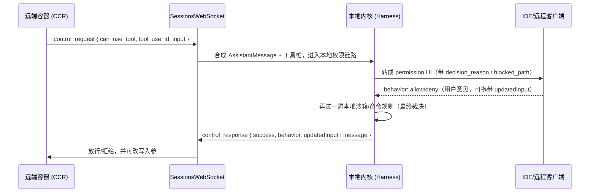

# 第 8 章　桥接、远程与服务端协议

> 对应《拆解 Claude Code》第 14 章。

## 前情提要

科普书第 14 章给了一个干净的画面：把"运行智能体的内核"和"在哪运行、被谁驱动的外壳"拆开。终端、IDE、远程客户端、SDK 都只是外壳；真正执行工具、做权限裁决的内核不能搬家。

那一章停在结构示意。本章要钻进 `src/bridge/`（约 30 个文件）、`src/remote/` 和 `src/server/` 的真实实现，看这层"会话协议"到底由哪些消息组成、JWT 携带什么、断线后队列怎么处理、远程权限请求怎么在内核里落地、SDK 消费者拿到的是什么结构。你会发现：桥接层的复杂度几乎全部来自"网络不可靠 + 安全裁决不能外包"这两条约束的乘积。

## 本章要钻多深

- bridge 在线上到底发哪些消息？`control_request` / `control_response` 这套控制平面和会话内容流（assistant / tool_result）是什么关系？
- 远程权限请求落到内核时，本地根本没有真实的 assistant message——内核怎么补一个"合成"上下文，又怎么保证最终裁决仍在本地？
- 会话级 token 怎么发、怎么刷新、过期前多久续？一个纯观看客户端和一个能回复权限的客户端，差别落在协议哪一层？
- 断线时：缓存的事件去哪了？重连从哪续？正在跑的工具继续还是中止？为什么这些必须是显式策略而不是隐式默认？

## Bridge 是控制平面 + 内容流，不是 UI 适配器

桥接层不是"把终端输出换成编辑器面板"。它定义了一套跨宿主的会话线协议，并且明确分成**两个平面**：

- **内容流**：会话里真实发生的消息——`user` / `assistant` / `result` / `system` / `tool_progress`，本质是 SDK message 的判别联合。
- **控制平面**：协调会话生命周期与回合的带外指令——`control_request` / `control_response` / `control_cancel_request`。权限请求就走在控制平面上。

真实源码用一组类型守卫把两者区分开（`src/bridge/bridgeMessaging.ts`、`src/remote/SessionsWebSocket.ts`）：

```typescript
// 阐释性重构——入站消息的判别与路由，非逐字源码
type SessionsMessage =
  | SDKMessage                 // 内容流：type = 'user' | 'assistant' | 'result' | 'system' | ...
  | SDKControlRequest          // 控制平面：{ type: 'control_request'; request_id; request: { subtype } }
  | SDKControlResponse         // 控制平面回执：{ type: 'control_response'; response: { subtype: 'success'|'error'; request_id } }
  | SDKControlCancelRequest    // 控制平面撤销：服务端取消一个挂起的 control_request

// 入站只校验 type 是字符串就放行——不做硬编码白名单。
// 注释里给了理由（推断转述）：后端可能在客户端升级之前就开始发新消息类型，
// 写死 allowlist 会"静默丢弃"未来的消息，反而更危险。下游适配器再决定怎么处理未知类型。
function isSessionsMessage(v: unknown): v is SessionsMessage {
  return typeof v === 'object' && v !== null && 'type' in v && typeof v.type === 'string'
}
```

控制平面的 `subtype` 是真实的协议字面量（`src/entrypoints/sdk/controlSchemas.ts`，Zod schema）：`initialize`、`set_model`、`set_max_thinking_tokens`、`set_permission_mode`、`interrupt`、`can_use_tool`……内核只认识这些抽象指令；外壳负责把它们渲染成终端行、IDE 面板、SDK 回调或远程 UI。

有一个反直觉但极关键的约束写在注释里（推断转述）：**收到 `control_request` 必须及时回 `control_response`，否则服务端约 10–14 秒后判超时并杀掉 WebSocket。** 这逼出了一种"宁可回错也不能不回"的设计——遇到不认识的 subtype，也要回一个 `subtype: 'error'` 的 control_response，而不是沉默：

```typescript
// 阐释性重构——未知/不支持的控制请求也必须回执，非逐字源码
default:
  response = {
    type: 'control_response',
    response: { subtype: 'error', request_id, error: `unhandled subtype: ${request.subtype}` },
  }
```

还有一个体现"外壳能力分级"的细节：**outbound-only 模式**。某些客户端只允许内核向外推消息、不允许它接受入站控制（例如 SDK 的 `/bridge` 子路径）。这种模式下，除了 `initialize` 之外的所有可变请求（`interrupt` / `set_model` / `set_permission_mode` …）都回 error——但 `initialize` 必须照常回 success，否则服务端直接掐连接。注释（推断转述）点破了动机：宁可让客户端看到一个明确的"本会话只读"错误，也不能回一个"假成功"——假成功会让前端以为操作生效了，而本地其实什么都没做。

## 远程权限：合成上下文进、用户意见出、本地裁决留在内核

这是整章最容易做错、也最能体现"安全关卡不能搬家"（呼应第 4 章）的地方。

远程模式下有个尴尬现实：工具其实是在远端容器（CCR）里跑的，本地内核**没有**触发这次工具调用的真实 assistant message。但本地权限链路（`ToolUseConfirm`）又要求一个 `AssistantMessage`。源码的解法是显式**合成**一个（`src/remote/remotePermissionBridge.ts`）：

```typescript
// 阐释性重构——为远程权限请求合成一条 assistant 上下文，非逐字源码
function createSyntheticAssistantMessage(req: SDKControlPermissionRequest, requestId: string): AssistantMessage {
  return {
    type: 'assistant',
    uuid: randomUUID(),
    message: {
      id: `remote-${requestId}`,                       // 标记来源是远程，不是本地推理
      role: 'assistant',
      content: [{ type: 'tool_use', id: req.tool_use_id, name: req.tool_name, input: req.input }],
      // usage 全部填 0：这次推理不在本地发生，没有本地 token 账可记（呼应第 9 章成本归属）
      usage: { input_tokens: 0, output_tokens: 0, cache_creation_input_tokens: 0, cache_read_input_tokens: 0 },
    } as AssistantMessage['message'],
  }
}
```

还有一个补丁式细节：远端可能用到本地根本没加载的工具（比如某些 MCP 工具）。这时 `createToolStub(toolName)` 造一个最小工具桩，`needsPermissions: () => true`、`isReadOnly: () => false`——也就是说，**对不认识的工具，默认按"需要确认、可能有副作用"处理**，把它路由到兜底权限请求。这是一条贯穿全书的保守姿态：未知 = 需要人来拍板。

`can_use_tool` 请求和它的回复，字段都是真实的（`controlSchemas.ts` + `src/bridge/bridgePermissionCallbacks.ts`）：

```typescript
// 阐释性重构——权限请求/回复的真实字段，非逐字源码
type CanUseToolRequest = {
  subtype: 'can_use_tool'
  tool_name: string
  input: Record<string, unknown>
  tool_use_id: string
  permission_suggestions?: PermissionUpdate[]  // 内核建议的"以后也允许"规则更新
  blocked_path?: string                        // 命中沙箱边界时，是哪条路径被挡
  decision_reason?: string                     // 为什么需要确认（喂给 UI 展示）
  title?: string; display_name?: string; description?: string; agent_id?: string
}

type BridgePermissionResponse = {
  behavior: 'allow' | 'deny'
  updatedInput?: Record<string, unknown>       // 允许时，可改写工具入参（人工修订后再执行）
  updatedPermissions?: PermissionUpdate[]       // "本次允许"还是"以后都允许"
  message?: string                              // 拒绝时的理由，回灌给模型
}
```

注意校验方式——源码用类型守卫 `isBridgePermissionResponse` 检查 `behavior` 判别字段，而**不是**用 `as` 强转。这是对"来自网络的、不可信的"数据该有的态度：远程发来的任何东西都要先验证再当成结构化对象使。

时序图把"远程收集、本地裁决"画清楚：



四个不可妥协的点：

1. 客户端给的 `behavior` 是**用户意见**，不是**执行授权令牌**。它进来后仍要过本地沙箱与命令规则（第 4 章），一个被攻破或有 bug 的前端不能绕过这一关。
2. 服务端可以发 `control_cancel_request` 撤销一个还挂着的权限请求——内核要能把对应 UI 弹窗优雅地撤掉，并从 `pendingPermissionRequests` 里移除（`RemoteSessionManager` 维护了这张表）。
3. `updatedInput` 让"允许"可以是"允许，但用我改过的参数"——人工修订与放行是同一个动作的两半。
4. 这和第 5 章的 MCP elicitation 是同一个"请求要冒泡给有 UI 的一方"思想的不同实例：权限是本地工具触发，elicitation 是外部 server 触发，远程权限是远端容器触发——但它们都必须并入**同一套**事件与裁决模型，不能各开旁路。

## 认证：会话级 JWT、scope 分级、与可信设备

远程 bridge 要回答"谁在连、能干什么"。源码里认证不是一个 token，而是**分层**的。

最外层是 `WorkSecret`——服务端下发的、base64url 编码的一段 JSON，描述"这次工作要在什么环境、用什么 token、连哪个 ingress"（`src/bridge/types.ts` + `workSecret.ts`）：

```typescript
// 阐释性重构——WorkSecret 的真实形态，非逐字源码
type WorkSecret = {
  version: number                       // 解码时校验 version === 1，不认的版本直接抛错
  session_ingress_token: string         // 会话级 ingress 凭证（JWT），非空才合法
  api_base_url: string
  sources: Array<{ type: string; git_info?: { repo: string; ref?: string; token?: string } }>
  auth: Array<{ type: string; token: string }>
  environment_variables?: Record<string, string> | null
}
```

`session_ingress_token` 本身是 JWT。源码里有个**只解码不验签**的工具 `decodeJwtPayload`，专门用来读 `exp` 等 claim 决定何时刷新——它会先剥掉 `sk-ant-si-` 这个"session-ingress"前缀再 base64url 解 payload（`jwtUtils.ts`）。这里要划清边界：客户端解码 JWT 只是为了**调度刷新**，签名校验永远是服务端的事。

token 刷新被做成一台带"代际计数器"的小调度器（`createTokenRefreshScheduler`，真实常量）：

- 过期前 `5 分钟`（`TOKEN_REFRESH_BUFFER_MS`）就触发刷新，不等到真过期。
- 刷新成功后再排一个 `30 分钟`（`FALLBACK_REFRESH_INTERVAL_MS`）的后续刷新——长会话不能只刷一次。
- 连续失败上限 `3 次`（`MAX_REFRESH_FAILURES`），超了就停，不无脑重试。
- **代际计数器**：每次 `schedule`/`cancel` 都把 generation 加一；异步刷新返回后先比对 generation，发现自己已被取代就主动退出。这是处理"刷新还在飞、会话已被重排或取消"竞态的标准手法——避免留下幽灵定时器去刷一个已经不存在的会话。

scope 分级在协议里体现为**能力差异而非单一万能 token**。最直接的例子是 `RemoteSessionConfig.viewerOnly`（`RemoteSessionManager.ts`）：一个纯观看客户端，`Ctrl+C`/`Esc` 不会向远端发 `interrupt`，60 秒断线超时被禁用，会话标题也永不被它改写。换句话说，"能读事件"和"能控制会话"是两种不同的授权面——这正是科普书强调的"远程控制一旦没有 scope，就退化成拿到 token 就能做一切"。

更高一层还有**可信设备**（`trustedDevice.ts`）：bridge 会话在服务端是 `SecurityTier=ELEVATED`，CLI 侧会带上 `X-Trusted-Device-Token`（持久、90 天滚动、存在系统钥匙串）。它的注册被服务端限制在"登录后 10 分钟内"完成，且用两个独立开关分阶段灰度（先让 CLI 开始发 header、服务端仍 no-op，再翻服务端）。这条线和全书的红线一致：**凭证属于安全层，不进消息历史、不进 trace、不进错误文本。**

## 断线恢复：flush gate、重连预算与会话状态机

本地终端里 stdout 写出去就是写出去了；远程不是。连接会断、事件会滞留、工具可能还在跑。源码把这件事拆成几块各自显式处理。

**Flush gate**（`src/bridge/flushGate.ts`）解决的是"初始历史回放"与"新消息"抢道的问题。会话刚起时，历史消息要用**一次** HTTP POST 整体刷给服务端；这段时间里新产生的消息必须排队，否则会和历史消息交错到达：

```typescript
// 阐释性重构——FlushGate 的四个动作语义，非逐字源码
class FlushGate<T> {
  start(): void              // 进入刷写：enqueue() 开始缓存
  enqueue(...items: T[]): boolean  // 刷写中→缓存并返回 true；否则返回 false（调用方直接发）
  end(): T[]                 // 结束刷写：返回缓存项交给调用方排空
  drop(): number             // 永久关闭传输：丢弃缓存
  deactivate(): void         // 传输被替换：清 active 标志但保留缓存，由新传输去排空
}
```

`drop` 与 `deactivate` 的区别是点睛之笔：**永久关闭**才丢数据；**只是换了根传输管子**，缓存要留给新管子排空——区分"会话结束了"和"链路换了"，是断线恢复正确性的核心。

**重连预算**在 `SessionsWebSocket` 里是一组真实常量与分类：

```typescript
// 阐释性重构——WebSocket 重连策略，非逐字源码
const RECONNECT_DELAY_MS = 2000
const MAX_RECONNECT_ATTEMPTS = 5
const PING_INTERVAL_MS = 30000               // 30s 心跳 ping，探活
const MAX_SESSION_NOT_FOUND_RETRIES = 3
const PERMANENT_CLOSE_CODES = new Set([4003]) // unauthorized：立刻放弃，不重连

function onClose(code: number) {
  if (PERMANENT_CLOSE_CODES.has(code)) return giveUp()      // 鉴权失败重连无意义
  if (code === 4001) return retryWithLinearBackoff()        // session not found：压缩期间可能是瞬态
  if (wasConnected && attempts < MAX_RECONNECT_ATTEMPTS) return scheduleReconnect()
  return giveUp()
}
```

关键判断不是"断了就重连"，而是**按 close code 分类**：`4003`（未授权）是永久错误，立刻放弃；而 `4001`（session not found）注释里说明（推断转述）在服务端做压缩（compaction）时可能短暂出现——CLI worker 忙于压缩 API、暂时不发事件，服务端误判会话过期——所以给它有限次数的线性退避重试，让客户端有机会自愈。这是"同一个断开，原因不同、恢复路径就不同"的又一例（呼应第 5 章的错误分类）。

**重复投递去抖**：传输切换可能让服务端按旧的 seq-num 游标重放历史，造成消息重复。`bridgeMessaging.ts` 用一个定容环形集合 `BoundedUUIDSet` 做兜底——分别记 `recentPostedUUIDs`（自己发出去的回声）和 `recentInboundUUIDs`（已转发过的入站），命中就丢。它是 O(capacity) 常量内存的二级安全网，主去重仍靠外部的写入序号。

把这些拼起来，远程会话其实在跑一台状态机。`src/server/types.ts` 给出了直连模式的真实状态枚举：

```typescript
// 阐释性重构——直连会话状态机，状态名为真实值
type SessionState = 'starting' | 'running' | 'detached' | 'stopping' | 'stopped'
//                                            ↑ detached：客户端断了，但会话还活着
```

`detached` 这个状态回答了本章最难的问题——**断线时正在跑的工具继续还是中止？** 源码的答案不是隐式默认，而是做成显式策略：会话可以进入 `detached`（脱离客户端继续跑），配合 `idleTimeoutMs`（0 表示永不过期）和 `SessionIndexEntry` 持久化到 `~/.claude/server-sessions.json`，让会话能跨服务端重启 `--resume`。"断线后工具是否继续"没有唯一正确答案：对长时间只读分析，继续更好；对正在改文件的操作，继续可能让用户失控。成熟实现的标志，是把它**升格为一个可配置的会话状态**，而不是埋在某个 `if` 里。

## SDK adapter：人类输出不是协议

SDK 消费者要的是稳定结构，不是 TUI 的彩色文本。`src/remote/sdkMessageAdapter.ts` 的 `convertSDKMessage` 把线上的 `SDKMessage` 判别联合翻译成内部渲染类型，返回一个三态结果：

```typescript
// 阐释性重构——SDK 消息适配的判别返回，非逐字源码
type ConvertedMessage =
  | { type: 'message'; message: Message }
  | { type: 'stream_event'; event: StreamEvent }
  | { type: 'ignored' }

function convertSDKMessage(msg: SDKMessage): ConvertedMessage {
  switch (msg.type) {
    case 'assistant':      return asMessage(...)
    case 'stream_event':   return asStreamEvent(...)              // 流式增量
    case 'result':         return msg.subtype === 'success' ? ignored() : asError(...) // 成功结果是噪音，只显示错误
    case 'system':         return bySubtype(msg)                  // init / status / compact_boundary
    case 'tool_progress':  return asMessage(...)
    case 'auth_status':
    case 'tool_use_summary':
    case 'rate_limit_event': return ignored()                     // SDK-only，不进 REPL 展示
    default:               return ignored()                       // 未知类型：记日志后忽略，绝不崩
  }
}
```

三个值得记住的判断：

- **成功的 `result` 被当噪音忽略**，只有错误结果才转成可见消息——注释（推断转述）说多轮会话里 `isLoading=false` 已经是"完成"的足够信号，再刷一条"成功"反而吵。
- **未知消息类型不崩、只记日志后忽略**。和入站校验同一个哲学：后端可能先于客户端发新类型，优雅降级比严格拒绝更稳。
- **适配是单向、有损、且语义化的**：把 `compact_boundary` 映射成"对话已压缩"的系统提示、把 `tool_progress` 映射成"工具运行了 N 秒"，丢掉它消费不了的细节。这正是科普书第 10 章"输出分层"的硬约束——Bridge/SDK 层**不能**复用 TUI 文本当协议，否则颜色、换行、语言文案都会变成兼容负担。

## 多传输：WebSocket / 直连 NDJSON / 子进程 stdio

同一套会话语义，落在三种传输上，断线语义截然不同：

- **CCR WebSocket**（`SessionsWebSocket`）：连 `wss://…/v1/sessions/ws/{id}/subscribe`，Header 里带 `Bearer` token 和 `anthropic-version`；读走 WS、写用户消息走 HTTP POST（`RemoteSessionManager` 是"WS 读 + POST 写"的混合）。断线 = WS close code，按上一节分类重连。
- **直连**（`DirectConnectManager`）：一条 WebSocket 上跑 **NDJSON**——按 `\n` 切行、逐行 `jsonParse`，并过滤掉 `keep_alive`、`streamlined_text`、`post_turn_summary` 这类纯传输噪音。适合本地/自托管 server。
- **子进程 stdio**（`sessionRunner.ts`）：bridge 把真正的 CC 作为子进程拉起（`--print --sdk-url … --input-format stream-json --output-format stream-json --replay-user-messages`），通过 stdin/stdout 收发 NDJSON。这里断线 = **进程退出**，`SessionDoneStatus` 直接由退出信号决定：`SIGTERM/SIGINT → interrupted`、`code 0 → completed`、其余 `→ failed`。

`sessionRunner` 还藏着两个真实细节值得点出：一是**环境隔离**——spawn 子进程时显式把 bridge 自己的 `CLAUDE_CODE_OAUTH_TOKEN` 抹掉，改注入 `CLAUDE_CODE_SESSION_ACCESS_TOKEN`，让子进程用会话级 token 而不是 bridge 的 OAuth token 去推理；二是**热刷 token**——token 刷新后通过 stdin 写一条 `update_environment_variables` 消息进子进程，让它在下次请求时取到新 token，无需重启。

## 最小可行实现参照

诚实地说：**本仓库没有 bridge，没有 remote transport，没有任何会话线协议。** `runAgentSession()` 只在本地进程内跑（`src/session.ts`），CLI 与 TUI 是仅有的两个外壳，都在同一个内存空间里直接调用内核。本章这些远程能力，对本仓库而言是**设计草案 / 本地边界**，不是已实现能力。

但有意思的是，几处既有的解耦结构，恰好就是"未来要长出 bridge"的底座：

```typescript
// src/harness.ts（真实代码，节选）——权限检查是可注入的依赖
export type PermissionChecker = (
  tool: ToolDefinition,
  input: Record<string, unknown>,
  options: { autoApprove?: boolean }
) => Promise<PermissionDecision>;

export interface HarnessConfig {
  // ...
  permissionCheck?: PermissionChecker;   // ← 未来 bridge 的"远程收集"就接在这里
}
```

```tsx
// src/tui/app.tsx（真实代码，节选）——TUI 只收集 y/n，不执行工具
interface PermissionPrompt {
  toolName: string;
  message: string;
  resolve(decision: PermissionDecision): void;  // 把"用户意见"resolve 回内核，由 Harness 裁决
}
```

四块可复用底座，与本章的远程结构一一对位：

| 本章的远程结构 | 本仓库已有的对位底座 | 缺什么才能变成 bridge |
| --- | --- | --- |
| 远程权限"收集/裁决"分离 | `Harness.permissionCheck` 可注入 + TUI 只 `resolve` 意见 | 把 `PermissionChecker` 接到一条会跨网络往返的实现 |
| 会话内容流 + 控制平面 | `runAgentLoop` 与 UI 解耦、`RunAgentSessionOptions.runner` 可替换 | 一套 inbound/outbound 判别联合 + 线协议序列化 |
| 事件流可被远端订阅 | observability 事件带 `runId`/`parentId`/schemaVersion（第 9 章） | event offset + 重连续传 + flush gate |
| 会话级认证与刷新 | 无（仅静态 `ARK_API_KEY`） | JWT claims、scope 分级、刷新调度器、可信设备 |

换句话说：本仓库把"内核不依赖具体外壳"这条最难的架构纪律已经守住了——`Harness` 不关心权限意见从终端还是从 WebSocket 来，`runAgentLoop` 不关心结果被谁渲染。这是搭 bridge 的**前提**。但前提不是 bridge：真正的远程能力还缺消息协议、传输层、认证与刷新、断线恢复、权限往返超时、SDK schema 这一整套。把它们硬塞进 `runAgentSession` 是错的方向；正确方向是在外面包一层独立的桥接层，让内核继续对传输无知。

## 边界与权衡

- **安全裁决绝不外包**。远程客户端只能给"用户意见"，最终的沙箱与命令规则裁决永远在内核里再跑一遍。这是远程化最容易被偷的工——也是绝不能偷的工。
- **优雅降级 > 严格拒绝**。入站消息只校验 `type` 是字符串、未知类型记日志后忽略，是为了让"后端先于客户端升级"成为非致命事件。代价是协议契约更松，需要靠下游适配器和测试补强。
- **断线语义是策略，不是默认**。WS 的 close code、直连的 NDJSON 中断、子进程的退出信号，是三种不同的"断"；"工具继续还是中止"必须做成显式的 `detached` 状态 + 超时 + 持久化，而不是某个隐式分支。
- **凭证分层、永不入流**。WorkSecret、session-ingress JWT、可信设备 token 分属不同层，且都不进消息历史 / trace / 错误文本——这条红线在远程场景比本地更硬，因为攻击面更大。
- **适配有损是特性不是缺陷**。SDK adapter 主动丢弃它消费不了的细节、把成功结果当噪音忽略——稳定的结构化契约比"完整透传"更重要。

## 本章小结

- Bridge 是**控制平面 + 内容流**的双平面会话协议，不是 UI 适配器；`control_request` 必须及时回执（否则 ~10–14s 被掐连接），未知 subtype 也要回 `error`。
- 远程权限走"合成上下文进、用户意见出、本地裁决留在内核"：内核为远端工具调用合成 assistant message 与工具桩，客户端给的 `behavior` 要再过一遍本地沙箱与命令规则。
- 认证是分层的：WorkSecret → session-ingress JWT（只解码不验签用于调度刷新）→ scope/viewerOnly 分级 → 可信设备 token；刷新调度器用代际计数器处理并发竞态，凭证永不入流。
- 断线恢复由 flush gate（区分 drop 与 deactivate）、按 close code 分类的重连预算（4003 永久放弃、4001 瞬态重试）、UUID 环形去抖、以及显式的 `detached` 会话状态共同构成。
- SDK adapter 单向、有损、语义化地把 `SDKMessage` 翻译成结构化类型，未知类型优雅降级——人类可读的 TUI 文本绝不能当协议。

桥接层把会话推向远端，也把"谁在花钱、花在哪、值不值"这个问题放大了——远端容器跑的推理、token 刷新、子进程的生命周期，都需要被如实记账与观测。下一章进入第 9 章：可观测、成本与遥测。
