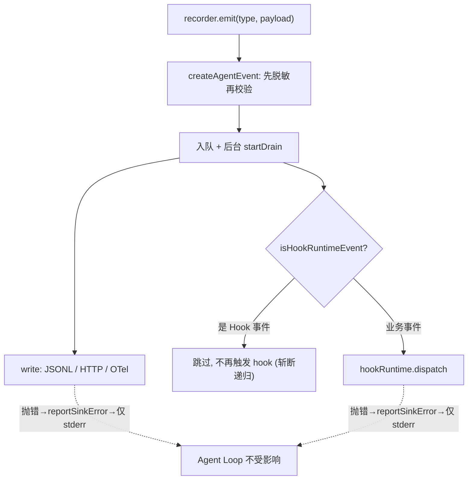

# 第 9 章　可观测、成本与遥测

> 对应《拆解 Claude Code》第 13 章。

## 前情提要

科普书第 13 章讲过四个判断：只看最终回答不够，必须留下中间过程；记录前要脱敏；观测系统默认不应改变 Agent 成败；模拟 eval 只能验证管道，不能吹成真实能力。这些判断都对，但它们停在"应该怎样"。

这一章要钻进"具体怎样"。可观测在生产级系统里不是一根日志管子，而是**至少四套互相独立又互相喂养的子系统**：有 schema 的事件流（运行事实）、成本/usage 会计（钱和 token 的账）、analytics 事件（产品运营信号）、OTel/BigQuery 遥测（跨会话聚合）。它们解决的问题不同、脱敏边界不同、可信度也不同，混为一谈就会出现"看板很漂亮但每个数字都不能信"的灾难。

本仓库的 coding-agent 在可观测这一块有**少见的成熟实现**——事件 schema、中心化脱敏、JSONL/HTTP/OTel 三种 sink、hook 旁路、trace 驱动的 eval 全都是真实可运行的代码。所以本章会大量逐字引用本仓库代码，再用 Claude Code 源码作"生产级会多做什么"的对照。

## 本章要钻多深

- 事件 schema 凭什么是"运行事实的最小单位"？它和自由文本日志的本质区别在哪一行代码上？
- 脱敏到底发生在哪一层？为什么必须在事件创建中心做，而不能让每个 sink 自己选？Claude Code 那个吓人的类型名 `AnalyticsMetadata_I_VERIFIED_THIS_IS_NOT_CODE_OR_FILEPATHS` 在防什么？
- 成本追踪难在哪？为什么 input/output/cache 四类 token、fallback、子 Agent 归属、流式 abort 会让"usage 求和"彻底失效？
- Hook 默认是旁路还是控制面？想让它阻断主流程，要付出什么代价？
- Eval 为什么要消费 trace 而不是自己埋点？普通 session 和 eval 怎么共享同一事实来源？

## 事件 schema：运行事实的最小单位

可观测系统的地基不是"打印了什么字符串"，而是"每个关键边界点都有一条带类型、带身份、带时间的结构化事实"。coding-agent 把这件事压成一个数组和一个接口：

```typescript
// src/observability/events.ts（真实代码，节选）
export const AGENT_EVENT_TYPES = [
  "SessionStart",
  "UserPromptSubmit",
  "LLMRequest",
  "LLMResponse",
  "PreToolUse",
  "PostToolUse",
  "PermissionRequest",
  "VerificationStart",
  "VerificationEnd",
  "Stop",
  "SessionEnd",
  "EvalTaskStart",
  "EvalTaskEnd",
  "HookStart",
  "HookEnd",
  "HookFailure",
] as const;

export interface AgentEvent {
  schemaVersion: 1;
  id: string;
  runId: string;
  parentId?: string;
  timestamp: string;
  type: AgentEventType;
  payload: Record<string, unknown>;
}
```

这 16 个类型不是随手枚举，而是把整条生命周期的边界都钉死了：会话开/关、用户输入、LLM 请求/响应、工具调用前/后、权限请求、自验证开/结束、停止、eval 任务、hook 开/结束/失败。每一条都对应第 1-8 章讲过的一个真实控制点——`PreToolUse/PostToolUse` 对应工具调度，`PermissionRequest` 对应第 5 章的权限闸门，`VerificationStart/VerificationEnd` 对应第 7 章的编辑后验证，`Stop` 对应第 1 章的终止状态机。

为什么说它是"最小单位"？看 `AgentEvent` 接口的六个必填字段：

- `schemaVersion`：被钉成字面量 `1`，意味着任何消费方（trace-reader、OTel sink、未来的分析脚本）都能在解析第一步就拒绝不兼容的版本，而不是默默错位。
- `id` / `runId` / `parentId`：身份与谱系。`runId` 把一次运行的所有事件串起来；`parentId` 让子 Agent、子任务能挂回父事件——这是成本归属和 trace 树形结构的前提。
- `timestamp`：ISO 字符串，可排序、可算时延。
- `type` + `payload`：类型决定语义，payload 装细节。

对比一句 `console.log("calling tool read_file")`：日志行没有版本、没有谱系、没法可靠 join、解析全靠正则。事件 schema 把"运行过程"从一堆需要人肉解读的文本，变成了一张可以被程序消费的事实表。后面的 eval 指标、OTel span、成本会计，全都建立在"事件是结构化事实"这个前提上。

Claude Code 生产级有更多事件维度（token/cost、tool summary、analytics、remote session、teammate），但原则完全一致：事件要有版本、有 session 身份、有时间、有类型、有脱敏后的 payload。区别只是"事实的颗粒度"，不是"要不要事实"。

## 脱敏：先处理，再写入，且只在中心做一次

科普书说"记录前要脱敏"。生产级的关键不在"脱敏"这个动作，而在**它发生在哪一层**。coding-agent 的答案是：脱敏是事件创建的中心化步骤，发生在任何 sink 看到事件之前。

```typescript
// src/observability/events.ts（真实代码，节选）
const SENSITIVE_KEY_PATTERN =
  /(^|_|\b)(ark_api_key|api[-_]?key|authorization|token|password|secret|credential|env)($|_|\b)/i;

export function createAgentEvent(
  runId: string,
  type: AgentEventType,
  payload: Record<string, unknown> = {},
  options: CreateAgentEventOptions = {}
): AgentEvent {
  const event: AgentEvent = {
    schemaVersion: 1,
    id: options.id ?? randomUUID(),
    runId,
    timestamp: options.timestamp ?? new Date().toISOString(),
    type,
    payload: redactEventPayload(payload),
  };
  if (options.parentId !== undefined) {
    event.parentId = options.parentId;
  }
  validateAgentEvent(event);
  return event;
}
```

顺序是死的：**先 `redactEventPayload`，再 `validateAgentEvent`，最后才返回事件**。`EventRecorder.emit()` 调用的就是这个 `createAgentEvent`，所以队列里、写进 JSONL 的、发给 HTTP 的、转成 OTel span 的，**全都是已脱敏的同一个对象**。没有任何一个 sink 有机会拿到原始 payload，也就没有任何一个 sink"忘记脱敏"的可能。

脱敏本身是分层的。键名命中敏感模式直接替换：

```typescript
// src/observability/events.ts（真实代码，节选）
function redactRecord(record: Record<string, unknown>): Record<string, unknown> {
  const redacted: Record<string, unknown> = {};
  for (const [key, value] of Object.entries(record)) {
    if (SENSITIVE_KEY_PATTERN.test(key)) {
      redacted[key] = "[redacted]";
      continue;
    }
    redacted[key] = redactValue(value);
  }
  return redacted;
}

function redactString(value: string): string {
  return value
    .replace(/Bearer\s+[A-Za-z0-9._~+/=-]+/gi, "Bearer [redacted]")
    .replace(/(ARK_API_KEY|api[-_]?key|token|password|secret)=\S+/gi, "$1=[redacted]");
}
```

键名层挡住 `ark_api_key`、`authorization`、`token` 这类字段；值层再用正则擦掉混在自由文本里的 `Bearer xxx` 和 `KEY=xxx`；外加 `MAX_SUMMARY_CHARS = 500` 的截断，控制体积也顺手压缩了"一整段 prompt 被原样记下来"的风险。这正好兜住了项目 AGENTS.md 那条硬约束：observability event 禁止记录 `ARK_API_KEY`、Authorization、token、password、secret 或真实凭证。

Claude Code 把同样的担忧推到了**类型系统层面**。它的 analytics 入口 `logEvent(eventName, metadata)` 故意只接受 `{ [key: string]: boolean | number | undefined }`——**根本不收 string**。要往里塞字符串，开发者必须显式断言成一个名字长得吓人的类型：

```typescript
// 阐释性重构——表达 analytics 的脱敏类型边界，非逐字源码
// 这个类型实际是 never，永远拿不到值，纯粹用来强制开发者"签字画押"
export type AnalyticsMetadata_I_VERIFIED_THIS_IS_NOT_CODE_OR_FILEPATHS = never

logEvent('tengu_unknown_model_cost', {
  // 想记字符串？必须显式断言，等于在 code review 里留下一句
  // "我已确认这不是代码、不是文件路径"
  model: model as AnalyticsMetadata_I_VERIFIED_THIS_IS_NOT_CODE_OR_FILEPATHS,
})
```

这个设计的精妙在于：它把"别把代码、文件路径、PII 写进 analytics"从一句口头规范，变成了**编译期障碍**。你不"签字"就过不了类型检查。源码注释（推断转述）写得很直白：故意不收 string，就是为了防止有人随手把代码片段或文件路径 log 出去。

它还有更细的分层。MCP 工具名 `mcp__<server>__<tool>` 会暴露用户私有配置，被归为"中等 PII"，所以默认被 `sanitizeToolNameForAnalytics` 抹成 `'mcp_tool'`，只有官方注册表里的、或本地 agent 模式下的才放行（推断）。文件扩展名超过 10 个字符就当成可能是 hash 文件名，替换成 `'other'`。还有一套 `_PROTO_*` 前缀的约定：带这个前缀的 PII 字段只允许流向有访问控制的 BigQuery 特权列，在发往 Datadog 这类通用后端前会被 `stripProtoFields` 统一剥掉——一处守卫挡住所有非特权 sink，避免"每个 sink 各自过滤、漏一个就泄漏"。

两份代码的共同信念是同一句话：**脱敏不能依赖每个写入点的自觉，必须做成一个绕不过去的中心步骤**——coding-agent 用 `createAgentEvent` 的固定顺序，Claude Code 用 `never` 类型 + 中心 `stripProtoFields`。

## 成本追踪：难点是归属与完整性，不是 usage 求和

科普书把成本讲成"把 usage 累加起来"。真到生产级，这个朴素模型在四个地方崩掉。先看 Claude Code 真实的单次计价逻辑（这部分是它少有的、几乎可以直读的纯函数）：

```typescript
// 阐释性重构——表达定价结构，贴合 src/utils/modelCost.ts 真实逻辑
type ModelCosts = {
  inputTokens: number          // 每 Mtok 美元
  outputTokens: number
  promptCacheWriteTokens: number
  promptCacheReadTokens: number
  webSearchRequests: number    // 每次请求美元
}

// Sonnet 档：$3 输入 / $15 输出 per Mtok（真实常量）
const COST_TIER_3_15 = {
  inputTokens: 3, outputTokens: 15,
  promptCacheWriteTokens: 3.75, promptCacheReadTokens: 0.3,
  webSearchRequests: 0.01,
}

function tokensToUSDCost(c: ModelCosts, usage: Usage): number {
  return (usage.input_tokens / 1e6) * c.inputTokens
    + (usage.output_tokens / 1e6) * c.outputTokens
    + ((usage.cache_read_input_tokens ?? 0) / 1e6) * c.promptCacheReadTokens
    + ((usage.cache_creation_input_tokens ?? 0) / 1e6) * c.promptCacheWriteTokens
    + (usage.server_tool_use?.web_search_requests ?? 0) * c.webSearchRequests
}
```

**难点一：token 有四类，且单价天差地别。** 注意 cache read 是 $0.3、cache write 是 $3.75，相差 12.5 倍；输入 $3、输出 $15，相差 5 倍。把它们简单加成"总 token"再乘一个均价，算出来的钱可以错出一个数量级。缓存读多了反而便宜，但只有分开计价才看得见这个事实。

**难点二：一个任务可能用了多个模型。** Claude Code 的成本状态不是一个总数，而是一张 `{ [modelName]: ModelUsage }` 的表，每个模型分别累加 input/output/cacheRead/cacheCreation/webSearch/costUSD（真实结构）。展示时按 canonical 短名归并。fallback（主模型不可用降级到备用模型）后，同一任务的成本天然落在两个模型条目上，而不会被糊成一笔。还有一段真实逻辑专门处理"未知模型"：定价表查不到就 `logEvent('tengu_unknown_model_cost', ...)` 并置 `hasUnknownModelCost`，UI 上显式标注"costs may be inaccurate due to usage of unknown models"——**宁可承认算不准，也不假装精确**。

**难点三：子 Agent 的 token 算谁头上。** Claude Code 的 `addToTotalSessionCost` 里藏着一段递归：主模型用量算完后，它遍历 `getAdvisorUsage(usage)`，对每个 advisor（辅助模型）单独计价、单独发一条 `tengu_advisor_tool_token_usage` 事件，再**递归调用自己**把 advisor 成本累加进总额（真实逻辑）。也就是说成本既被"归属"到具体子调用（独立事件），又被"汇总"进总账（递归累加）。这正是 `AgentEvent.parentId` 字段存在的意义：没有谱系，子 Agent 的开销要么丢了、要么算重。analytics 的 `EventMetadata` 里专门有 `agentId / parentSessionId / agentType: 'teammate' | 'subagent' | 'standalone'`（真实字段），就是为了让服务端能按谱系归集成本。

**难点四：流式中途 abort，usage 完不完整？** 成本会计依赖模型返回的最终 usage。如果流式响应被用户打断或网络中断，最后那个携带完整 usage 的事件可能根本没来。Claude Code 的 OTel 侧专门有"孤儿 span 清理"——一个 30 分钟 TTL 的后台定时器，把那些"开了却没等到 end"的 span 强制结束并 flush 已记录的属性（真实逻辑）。在 coding-agent 里，对应的兜底是 `OtelTraceSink.closeOpenSpans()`：关闭时把所有还开着的 llm/tool/verification/hook/session span 逐个 `end()`，保证 abort 不会留下永远悬空的 span。

coding-agent 自身没有完整的美元计价实现，但它把"成本会计依赖结构化事实"的地基铺好了：`LLMResponse` 事件带 `turn`，OTel sink 按 turn 把 usage 挂到对应的 `coding_agent.llm_request` span 上，谱系靠 `runId`/`parentId` 串联。要补一层 `cost-tracker`，只需消费这些已有事件，而不必另起一套埋点。这正是下一节"trace 驱动"的同一个原则。

把它和生产级对照，缺口一目了然：

| 维度 | coding-agent 最小实现 | Claude Code 生产级（推断） |
| --- | --- | --- |
| token 分类 | 事件可带，无计价 | input/output/cacheRead/cacheWrite 四类分别计价 |
| 多模型 | 无 | 按模型分表累加，fallback 天然分离 |
| 未知模型 | 无 | 查不到则降级定价 + 显式"可能不准"标注 |
| 子 Agent 归属 | parentId 字段就位 | advisor 递归计价 + 独立事件 + 谱系字段 |
| abort 完整性 | closeOpenSpans 兜底 | 30 分钟 TTL 孤儿 span 清理 |
| 跨会话持久 | 单次 JSONL | 写入 project config，resume 时按 sessionId 还原 |

## Hook：默认旁路，要阻断就得付出显式状态的代价

Hook 是可观测系统里最容易"越界"的部分——它本来是来"看"的，但很容易被写成"管"的。coding-agent 给的默认答案非常明确：**hook 是旁路，默认不改变 Agent 成败**。这条边界落在 `EventRecorder` 的两个真实细节上。

第一，hook 跑在事件 drain 的后台循环里，且**hook 自身的事件不会再触发 hook**：

```typescript
// src/observability/recorder.ts（真实代码，节选）
private async drainLoop(): Promise<void> {
  while (this.queue.length > 0) {
    const event = this.queue.shift();
    if (event === undefined) continue;
    await this.write(event);
    if (!isHookRuntimeEvent(event.type)) {
      try {
        await this.hookRuntime?.dispatch(event);
      } catch (cause) {
        this.reportSinkError("hook", cause);
      }
    }
  }
}

function isHookRuntimeEvent(type: AgentEventType): boolean {
  return type === "HookStart" || type === "HookEnd" || type === "HookFailure";
}
```

`isHookRuntimeEvent` 的存在是为了**斩断递归**：hook 执行会发出 `HookStart/HookEnd/HookFailure`，如果这些事件再去 dispatch hook，就会无限套娃。这里直接跳过，是把"观测 hook 的事件"和"被观测的业务事件"分开的关键一行。

第二，`emit()` 同步入队后立刻返回，drain 在后台异步进行；任何 sink 或 hook 抛错都被 `reportSinkError` 接住，**只写一行 stderr，绝不向上抛**：

```typescript
// src/observability/recorder.ts（真实代码，节选）
emit(type, payload = {}, options = {}): AgentEvent {
  const event = createAgentEvent(this.runId, type, payload, options);
  this.queue.push(event);
  this.startDrain();   // 后台 drain，不阻塞调用方
  return event;
}

private reportSinkError(action: string, cause: unknown): void {
  const message = cause instanceof Error ? cause.message : String(cause);
  this.stderr.write(`[observability] sink ${action} failed: ${message}\n`);
}
```

合起来看，这套结构保证了一件事：观测管道挂了，Agent 不挂。HTTP sink 超时、hook 命令崩溃、OTel endpoint 连不上——这些都只会在 stderr 留一行，不会让正在跑的任务失败。这正是科普书那句"观测系统默认不应改变 Agent 成败"的代码级落地。



那"阻断型 hook"怎么办？答案是：**它根本不该走旁路，必须升级成第 1 章那种显式状态转移。** Claude Code 的 `handleStopHooks` 就是活样本（真实逻辑）：Stop hook 不是悄悄改个返回值，而是产出结构化结果 `{ blockingErrors, preventContinuation }`，当 hook 要阻止继续时，它显式 `yield` 一条 `hook_stopped_continuation` 附件、把 `stopReason` 设成类似 "Stop hook prevented continuation" 的明确原因，再返回 `preventContinuation: true` 让上层 query loop 真正停下。abort 信号命中时还会单独 `logEvent('tengu_pre_stop_hooks_cancelled', ...)`。

对照 coding-agent 的旁路 hook，差别是本质的：旁路 hook 发的是 `HookEnd` / `HookFailure`，是"发生了什么"的观测事实；阻断 hook 发的是 `preventContinuation` / `stop_hook_blocking`，是"主流程怎么走"的控制信号，必须进入第 1 章那个 Terminal/Continue 状态机被显式记录。**一个 hook 想要改变 Agent 的命运，就必须把这个决定写进状态机，让它可见、可测、可追责**——没有这层显式状态，就不准让 hook 碰主流程。

## Trace → Eval：让运行事实变成质量指标

eval 最常见的错误，是在 runner 内部重新埋一套计数器：跑任务时数一遍 turn、数一遍 tool call、数一遍权限拒绝。这等于把同一件事记两遍，而且两套数据迟早会对不上。coding-agent 的做法是：**eval 消费 trace，不自己埋点**。普通 CLI session 和 eval session 落的是同一份 JSONL，trace-reader 只是事后把它读成指标。

```typescript
// src/evals/trace-reader.ts（真实代码，节选）
export function summarizeTraceEvents(events: AgentEvent[]): TraceSummary {
  const runId = events[0]?.runId;
  let turnsUsed = 0;
  const toolCalls: string[] = [];
  let permissionDeniedCount = 0;
  let verificationRuns = 0;
  let stopSuccess: boolean | undefined;

  for (const event of events) {
    if (event.runId !== runId) {
      throw new Error("trace contains multiple runIds");
    }
    switch (event.type) {
      case "LLMResponse":
        turnsUsed = Math.max(turnsUsed, numberPayload(event, "turn") ?? 0);
        break;
      case "PreToolUse": {
        const toolName = stringPayload(event, "toolName");
        if (toolName !== undefined) toolCalls.push(toolName);
        break;
      }
      case "PermissionRequest":
        if (booleanPayload(event, "approved") === false) permissionDeniedCount += 1;
        break;
      case "VerificationEnd":
        verificationRuns += 1;
        break;
      case "Stop":
        stopSuccess = booleanPayload(event, "success");
        break;
      // ...
    }
  }
  if (stopSuccess === undefined) {
    throw new Error("trace is missing Stop event");
  }
  // ...
}
```

几个真实细节值得点出：

- **解析即校验。** trace-reader 读每一行都调 `validateAgentEvent`，schema 不对、缺 `Stop` 事件、`runId` 不一致都直接抛错。trace 不是"尽量解析"的文本，而是"必须自洽"的事实记录。
- **runId 一致性检查。** 一份 trace 混进了别的 run 的事件就报错——这保证成本归属和指标统计不会跨 run 串味。
- **职责切分得很干净。** trace-reader 只回答"过程指标"：用了几轮、调了哪些工具、被拒了几次权限、跑了几次验证、最后停在什么状态。它**不回答"任务做对没有"**。

"任务做对没有"由 runner 和 baseline 负责。runner 跑完真实 Agent loop、落 trace、读 trace、判定 `passed`；`baseline.ts` 再把本次结果和基线对比，做回归门禁（真实逻辑）：

```typescript
// src/evals/baseline.ts（真实代码，节选）
export const DEFAULT_THRESHOLDS: EvalThresholds = {
  maxAverageTurnsIncreaseRatio: 0.25,   // 平均轮数涨超 25% 就算回归
  maxAverageToolCallsIncreaseRatio: 0.25,
  maxFlakyRate: 0.1,
  minFeedbackSuccessRate: 0.95,
};
```

注意它检查的指标——平均轮数、平均工具调用数、抖动率——**全都来自 trace-reader 从事件里数出来的过程数据**。指标和门禁不是两套独立系统，而是同一份事实的两次读取。"是否完成"（runner）和"过程是否退化"（trace + baseline）分开，报告才不会自相矛盾：一个任务可以"做对了但变慢了"，也可以"凑巧通过但全靠运气"，这两种退化只有靠过程指标才看得见。

Claude Code 没有这套面向开源的 eval runner，但它有一个同构的设计模式叫"forked agent 复用 cache"：`AgentSummary` 每 30 秒 fork 一次子 Agent 的对话生成进度摘要，靠发送**完全相同的 cache-key 参数**（system、tools、model、消息前缀、thinking 配置）来共享主线程的 prompt 缓存，连 `maxOutputTokens` 都不敢设，怕破坏 cache 命中（真实注释转述）。`toolUseSummary` 则用 Haiku 把一批工具调用压成一句 git-commit 式的标签。这些都是"在不重跑、不重埋的前提下，从既有事实派生新视图"的同一种思路。

## 最小可行实现参照

可观测是本仓库少数"实现得相当完整"的子系统，值得逐个看真实落点。

**事件创建 → 录制 → 多 sink 扇出**，整条链路都在 `src/observability/` 下：`events.ts` 负责 schema + 中心脱敏 + 校验；`recorder.ts` 负责同步入队、后台 drain、错误隔离；`sinks.ts` 提供两种基础 sink；`otel.ts` 提供分层 span 的 OTel sink；`hooks.ts` 提供 hook 运行时。

两种基础 sink 的真实实现（`src/observability/sinks.ts`）：`LocalJsonlSink` 每条事件 append 一行 JSON 到 `${runId}.jsonl`——这是**事实源**，可复现、可离线分析、是 eval 的输入；`HttpFeedbackSink` 按 `batchSize` 攒批、`postJson` 带 `AbortController` 超时上报——这是**产品反馈通道**。两者实现同一个 `EventSink` 接口（`write` / 可选 `flush` / 可选 `close`），所以 recorder 对它们一视同仁。

OTel sink（`src/observability/otel.ts`）把扁平事件流**重建成 span 树**：`SessionStart` 开一个 `coding_agent.session` 根 span，`LLMRequest`/`PreToolUse`/`VerificationStart`/`HookStart` 各开子 span，对应的 End 事件把它们关掉。它用 `Map<turn, span>`、`Map<hookId, span>` 和数组栈来配对开/关，配不上对就降级成 session 上的一个 span event。`eventAttributes` 把 payload 摊平成 `agent.payload.*` 属性，`isErrorEvent` 把 `success===false`、`passed===false`、`blocked===true`、`approved===false` 统一识别成 span 错误状态。这就是"本地 JSONL 是事实、OTel 是聚合视图"的具体实现——同一批已脱敏事件，喂给不同 sink 得到不同形态。

对照生产级缺口（务必诚实）：

| 能力 | coding-agent 真实实现 | Claude Code 生产级（推断） |
| --- | --- | --- |
| 事件 schema | 16 类型 + 版本 + 谱系 | 更多维度 + proto 化 schema |
| 脱敏 | 键名/值正则 + 截断，中心化 | never 类型签字 + PII 分级 + `_PROTO_` 特权列 |
| sink | JSONL + HTTP + OTel 三种 | + Datadog + BigQuery 1P + Perfetto |
| 成本 | 仅事件结构就位 | 四类 token 计价 + 多模型 + 子 Agent 递归归属 |
| 采样/开关 | 无 | GrowthBook gate + 事件采样 + sink killswitch |
| 遥测开关 | 始终本地写 | feature flag + env 三态 + 订阅类型门禁 |

`src/evals/` 这边：`trace-reader.ts` 读过程指标，`baseline.ts` 做回归门禁，`runner.ts` 编排真实 Agent loop + 落 trace + 判定 + 报告。`npm run eval:mock` 用 mock 模型跑通整条管道——但它**只验证管道健康，不代表模型能力**，这条边界必须写进任何报告，否则 mock 通过率会被误读成真实通过率。

## 边界与权衡

- **事实越全，隐私和体积压力越大。** 所以默认记摘要不记全文（`MAX_SUMMARY_CHARS=500`）、中心脱敏、敏感键直接 `[redacted]`。可观测的体积是会失控的——既要够复盘，又不能把整段 prompt、整个环境变量、用户文件路径原样灌进 trace。
- **本地 JSONL 与外部遥测分工，不可互相取代。** 本地 JSONL 是可复现的事实源，适合调试和 eval；OTel/BigQuery/Datadog 是跨会话聚合，适合产品运营和趋势。但生产级遥测背后有一整套治理（采样、gate、PII 分级、killswitch、订阅门禁），本仓库的最小实现只做了"始终本地写 + 可选上报"，**不要把它描述成成熟的长期趋势平台**。
- **成本必须区分真实 usage 和估算。** 查不到定价就降级估算、并显式标"可能不准"——估算值能用来预警，不能用来精确结算。把估算当结算，是成本看板最常见的谎言。
- **mock eval 的通过率只说明链路健康，不代表模型能力。** 这条边界要写进报告，否则"100% 通过"会被当成"模型很强"。
- **观测和控制的界线要守死。** hook 默认旁路、错误只进 stderr；想阻断主流程，就必须升级成显式 Terminal/Continue 状态。一旦让"观测组件"能悄悄改变成败，整个系统的可追责性就塌了。

## 本章小结

- 可观测的地基是**有版本、有 runId/parentId、有类型的事件 schema**，不是自由文本日志；16 个事件类型把整条生命周期的边界钉成了可被程序消费的事实表。
- **脱敏必须中心化、且发生在写入之前**：coding-agent 用 `createAgentEvent` 固定的"先脱敏再校验"顺序，Claude Code 用 `never` 类型逼开发者签字 + `_PROTO_` 特权列治理，殊途同归——绝不靠每个写入点的自觉。
- **成本追踪的真正难点是归属与完整性**：四类 token 单价差一个数量级、一个任务跨多模型、子 Agent 要靠谱系递归归属、流式 abort 会丢 usage——usage 求和解决不了任何一个。
- **Hook 默认是旁路，错误只写 stderr 不碰主流程**；要阻断就必须升级成第 1 章那种显式状态转移（`preventContinuation` / `stop_hook_*`），让控制决定可见可测。
- **Eval 消费 trace 而非重复埋点**：普通 session 和 eval 共享同一份事实源，runner 答"是否完成"、trace-reader 答"过程指标"、baseline 做回归门禁；mock 只验证管道，不等于真实能力。

至此，从第 1 章的终止状态机，到本章的事件事实流，全书反复落在同三条主线上：**事实高于转述**（结构化事件而非日志、trace 而非重复埋点）、**脱敏与边界先于便利**（中心脱敏、PII 分级、观测不碰控制）、**诚实标注未实现与不确定**（未知模型标"可能不准"、mock 标"只验管道"、本章对生产级缺口逐项交代）。一个值得信任的编程智能体，靠的不是它能做多少惊艳的事，而是它对自己做过什么、没做什么、做得准不准，始终留下可核对、不撒谎的记录。
