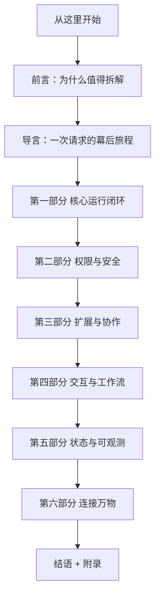

# 拆解 Claude Code

> 一本写给所有人的书：当你对一个 AI 说「帮我修个 bug」，屏幕背后到底发生了什么。

Claude Code 是一个跑在终端里的编程智能体（coding agent）。你用自然语言交给它一个任务，它会自己读文件、改代码、跑命令、跑测试，一步步把事情做完。这本书不教你怎么用它，而是带你拆开外壳，看清它内部是怎样思考、怎样动手、怎样在「足够自动」和「足够安全」之间反复权衡的。

本书面向所有对 AI 编程工具好奇的技术读者。你不需要懂 TypeScript，也不需要读过任何源码。我们用故事和原理讲清楚每一个设计，把工程细节留到需要时再展开。

## 怎么读这本书

如果你是第一次接触智能体，建议从前言和导言读起，再按部分顺序往下。如果你已经熟悉某些概念，也可以直接跳到感兴趣的章节——每一章都尽量自成一体。

## 目录

**卷首**

- [前言：为什么值得拆解 Claude Code](/preface)
- [导言：一次请求的幕后旅程](/introduction)

**第一部分　智能体的心跳：核心运行闭环**

- [第 1 章　为什么一次对话不够](/chapters/01-agentic-loop)
- [第 2 章　工具：让模型动手的协议](/chapters/02-tools)
- [第 3 章　上下文与记忆：让智能体记住与忘记](/chapters/03-context)

**第二部分　信任的边界：权限与安全**

- [第 4 章　权限、沙箱与安全护栏](/chapters/04-permission-safety)

**第三部分　能力的疆域：扩展与协作**

- [第 5 章　Skill：可发现的能力](/chapters/05-skill)
- [第 6 章　连接外部世界：MCP / LSP / API](/chapters/06-service-integrations)
- [第 7 章　插件与扩展治理](/chapters/07-plugin)
- [第 8 章　子智能体与任务编排](/chapters/08-sub-agent)

**第四部分　人机之间：交互与工作流**

- [第 9 章　命令行、终端界面与会话](/chapters/09-cli-tui)
- [第 10 章　输入与输出体验](/chapters/10-input-output)
- [第 11 章　Git 与 GitHub 工作流](/chapters/11-git-github)

**第五部分　看得见、可治理：状态与可观测**

- [第 12 章　状态、记忆与配置治理](/chapters/12-state-config)
- [第 13 章　可观测、评估与追踪](/chapters/13-observability)

**第六部分　连接万物：IDE / 远程 / 服务端**

- [第 14 章　IDE、远程与服务端桥接](/chapters/14-bridge)

**卷尾**

- [结语：从 Claude Code 学到的设计原则](/appendix/conclusion)
- [附录 A　术语表](/appendix/glossary)
- [附录 B　Claude Code 模块地图](/appendix/module-map)
- [附录 C　延伸阅读](/appendix/further-reading)

## 关于书中内容的说明

本书对 Claude Code 内部设计的描述，部分基于对其公开行为与架构形态的研究与推断。凡属推断之处，正文会以「（基于公开行为推断）」标注。本书目标是帮助读者理解一个成熟编程智能体背后的设计思想与权衡，而非提供其官方实现文档。
