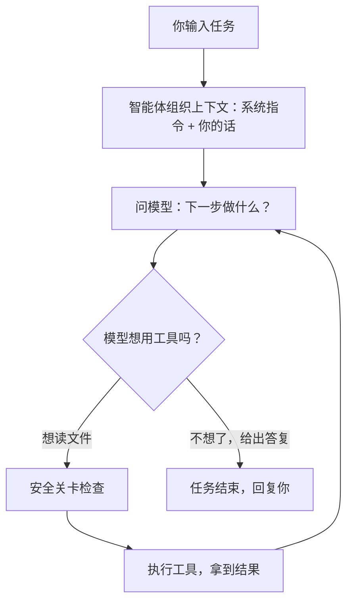

# 导言：一次请求的幕后旅程

在拆开任何一个零件之前，我们先把整台机器运转一遍。这一章用一个具体的场景，把全书的章节串成一条故事线——你现在不必记住每个名词，只要感受这条流水线的形状。

## 场景：帮我修个 bug

假设你在终端里对 Claude Code 说：

> 「登录页面点击提交按钮没反应，帮我看看怎么回事。」

然后按下回车。接下来发生的事，可以拆成下面这几幕。

注意这张图里那个回到「问模型」的箭头——它是整本书最重要的一个细节。智能体不是「问一次模型就完事」，而是**问、做、再问、再做**，循环往复，直到模型认为可以收尾。这个循环就是第 1 章的主题。

## 第一幕：搭好上下文，问出第一个问题

智能体不会把你那句话原封不动丢给模型。它会先准备一份「行前简报」：一段固定的系统指令（告诉模型「先用工具查清楚，别凭空猜」「做危险操作要克制」），加上你刚才说的话，可能还有当前项目的一些背景信息。

这份简报怎么组织、太长了怎么压缩、哪些信息优先级更高——这是第 3 章「上下文与记忆」要讲的。

简报准备好，智能体把它连同「你可以使用这些工具」的清单一起发给模型，问出第一个问题：下一步做什么？

## 第二幕：模型决定动手

模型看完简报，回答：「我想读一下登录页面的代码。」

它不能自己去读文件——模型只是个会思考、会说话的大脑，没有手。它能做的是发出一个**工具调用请求**：「请帮我运行 `read_file`，参数是登录页面那个文件。」

模型能调用哪些工具、这些请求长什么样、结果又怎么送回给模型——这是第 2 章「工具」的主题。

## 第三幕：安全关卡

智能体收到「读文件」的请求后，不会立刻照做。它会先把请求送进一道安全关卡：这个文件路径合法吗？是不是想偷偷读项目外的敏感文件？如果是写文件或者跑命令，还要不要先问问你同不同意？

这道关卡是整个智能体最关键的防线。它的设计理念是：**别指望在简报里叮嘱模型「不要乱来」就够了，必须在代码层面真的把关。** 这是第 4 章「权限、沙箱与安全护栏」的核心。

读文件是安全的，关卡放行。工具执行，把登录页面的代码取回来，作为结果送回给模型。

## 第四幕：循环

现在回到了第一幕那个问题：下一步做什么？只不过这次，模型手里多了登录页面的代码。

它可能会说「我看到提交按钮绑定的处理函数有问题，让我再搜一下这个函数在哪里定义」——于是又一轮工具调用、安全关卡、执行、送回结果。它也可能直接说「我找到问题了，让我改这一行」——这次的请求是写文件，安全关卡可能会先弹出来问你「确定要改吗？」

就这样一轮一轮转下去。每一轮模型都离目标更近一点。直到某一轮，模型不再请求任何工具，而是直接说：「修好了，问题出在事件没有正确绑定，我已经修正并补了一个测试。」

没有新的工具请求，循环就停下来。这是智能体判断「任务完成」的信号——也是第 1 章会反复强调的「停止条件」。

## 这趟旅程的其余部分

上面四幕是主干。围绕它，还有一圈让智能体更强大、更好用的能力，对应本书的其余章节：

- 如果一个内置工具不够用，能不能临时教给它一套新本领？这是第 5 章的 **Skill**。
- 如果它需要连接外部的服务或工具服务器？这是第 6 章的 **MCP / LSP / API**。
- 如果想安装第三方扩展包？这是第 7 章的 **插件**。
- 如果任务太大，能不能拆给几个分身同时干？这是第 8 章的 **子智能体**。
- 你在终端里看到的界面、权限弹窗、快捷键，是第 9、10 章的 **交互体验**。
- 它帮你提交代码、处理 Git，是第 11 章的 **Git 工作流**。
- 它的配置从哪里来、状态存在哪，是第 12 章的 **状态与配置**。
- 出了问题怎么复盘、怎么评估它的表现，是第 13 章的 **可观测与评估**。
- 它怎么从「一个终端程序」变成能接到编辑器、能远程驱动的服务，是第 14 章的 **桥接**。

整本书，就是把这趟旅程的每一站，挨个拆开细看。现在，让我们从最核心的那个循环开始。
