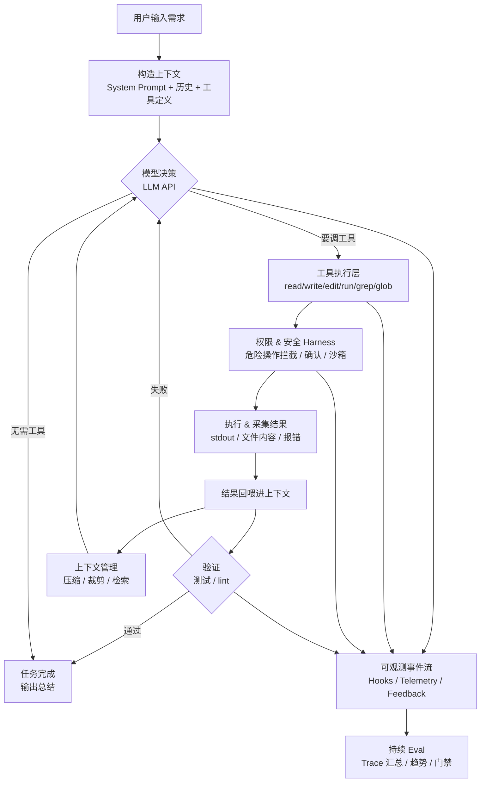

# Q3 Detailed Execution Plan — Minimal Coding Agent

> **项目**：从零用 TypeScript 手写最小 Coding Agent，对标 Claude Code 核心架构
> **技术栈**：TypeScript (ES Modules), 手写 OpenAI 兼容 HTTP 客户端（火山引擎方舟 / Ark），Vitest, Node.js CLI

详细执行计划已按里程碑拆分到 `docs/plan/` 目录：

- [P1: 通主循环 — Agent Loop + 工具调用最小闭环](./plan/p1-agent-loop.md)
- [P2: 立 Harness — 权限安全 + 自验证回路](./plan/p2-harness.md)
- [P3: 强能力 — 上下文管理 + 规划/TODO](./plan/p3-context-planning.md)
- [P4: 可观测与持续评测 — Hooks + Telemetry + Eval](./plan/p4-continuous-evals.md)
- [P5: 成作品 — 开源打磨 + 技术文章](./plan/p5-release-writing.md)
- [P6: 会话持久化与恢复](./plan/p6-session-persistence.md)
- [P7: 文件 Diff 与验证闭环增强](./plan/p7-diff-verification.md)
- [P8: 命令安全与权限规则增强](./plan/p8-command-permissions.md)
- [P9: 工具执行编排升级](./plan/p9-tool-orchestration.md)
- [P10: MCP 与插件式工具扩展](./plan/p10-mcp-plugin-tools.md)
- [P11: 多 Agent 与子任务编排](./plan/p11-multi-agent-orchestration.md)
- [P12: 配置、策略与能力治理](./plan/p12-config-policy-governance.md)
- [P13: REPL/TUI 交互升级](./plan/p13-tui-interaction.md)

## 范围

这是一个用于吃透 Coding Agent 核心原理的学习型开源项目，不是 Cursor 复刻。项目范围固定为 TypeScript CLI Agent：不做 GUI、不做完整多模型适配层、不做插件市场、不做完整远程执行平台。后续学习路线优先推进 Agent runtime 内核：会话恢复、diff/验证、命令权限、工具编排、MCP/插件式扩展、多 Agent 和配置治理；TUI 交互升级后置。

## 核心链路

Claude Code 类 Coding Agent 的核心是一个 Agentic Loop：模型在收集上下文、采取行动、验证结果之间循环，直到任务完成或达到停止条件。



## 核心模块

| # | 模块 | 职责 |
|-|-|-|
| 1 | Agent Loop | 构造消息、调用 LLM、执行工具、回传结果，并决定何时停止 |
| 2 | Tool Layer | 定义和执行 read/write/edit/run/grep/glob/todo 等工具 |
| 3 | Context & History | 组装系统提示词、管理消息历史、处理上下文压缩与裁剪 |
| 4 | Permissions & Safety Harness | 统一编排权限确认、危险命令拦截、沙箱边界和验证触发 |
| 5 | Planning / TODO | 支持任务拆解、TodoWrite 状态追踪和长任务进度管理 |
| 6 | Self-Verification | 编辑后自动运行测试，将失败结果回喂模型并限制重试次数 |
| 7 | Observability & Hooks | 采集生命周期事件，执行可配置 hooks，并把本地 trace 或 HTTP feedback 回流到评测系统 |
| 8 | Continuous Eval | 基于观测 trace 汇总指标、生成趋势报告，并在能力退化时触发门禁 |
| 9 | Session Persistence | 保存和恢复消息历史、TODO、工具摘要、验证摘要和压缩边界 |
| 10 | Diff & Verification | 为编辑生成 diff、检测外部修改冲突，并增强验证失败回传 |
| 11 | Command Permissions | 对命令做语义分类、规则复用、权限提示和危险 prefix 控制 |
| 12 | Tool Orchestration | 并发执行只读工具、串行写入命令、支持中断和大输出落盘 |
| 13 | MCP / Plugin Tools | 从本地 manifest 或最小 MCP adapter 注册外部工具，但执行仍经过 Harness |
| 14 | Multi-Agent Orchestration | 支持受控 explorer、worker、verifier 子任务编排和父子 trace |
| 15 | Config & Policy Governance | 统一配置优先级、workspace trust、能力开关和策略诊断 |
| 16 | TUI Interaction | 提供持续 REPL 工作台、slash command、运行状态、中断和总结展示 |

## 里程碑

- [x] **P1 里程碑**：CLI Agent 能通过 tool_calls 循环读写文件，能自主完成“创建文件并回读验证”。
- [x] **P2 里程碑**：Agent 具备完整 Harness（权限门控 + 安全规则 + 沙箱 + 自验证 + 重试）和 eval 基线数据。
- [x] **P3 里程碑**：Agent 能处理多文件项目（grep/glob 检索 + 上下文压缩 + TodoWrite 规划）和扩展 eval 数据。
- [x] **P4 里程碑**：Agent 具备可观测事件流、可扩展 hook 机制、数据回流能力和基于观测数据的持续 eval 平台。
- [x] **P5 里程碑**：形成可对外发布的开源仓库，并完成技术文章。
- [x] **P6 里程碑**：Agent 具备可落盘、可恢复、可继续执行的本地会话。
- [ ] **P7 里程碑**：文件编辑具备 diff 摘要、冲突检测和更强验证回传。
- [ ] **P8 里程碑**：命令权限系统支持语义分类、session/project 规则和更安全的 prefix 控制。
- [ ] **P9 里程碑**：工具执行支持只读并发、写入串行、中断和大输出 artifact。
- [ ] **P10 里程碑**：Agent 具备学习版 MCP/插件式工具扩展能力，外部工具仍统一经过 Harness。
- [ ] **P11 里程碑**：Agent 支持受控 sub-agent 编排，能区分只读探索、串行写入和验证复查。
- [ ] **P12 里程碑**：Agent 具备统一配置、workspace trust、能力开关和策略诊断框架。
- [ ] **P13 里程碑**：TUI 支持 slash command、运行状态、中断和统一运行总结。

---

## 目标项目结构

```
luka/
├── src/
│   ├── index.ts                  # CLI 入口（readline REPL）
│   ├── agent-loop.ts             # 主 Agentic 循环
│   ├── llm-client.ts             # OpenAI 兼容 HTTP 客户端（Ark chat/completions）
│   ├── config.ts                 # 配置管理（API key、模型、限制）
│   ├── types.ts                  # 共享类型定义
│   ├── logger.ts                 # 日志系统
│   ├── harness.ts                # 统一控制层（权限+安全+验证）
│   ├── tools/
│   │   ├── index.ts              # 工具注册表 & 调度器
│   │   ├── types.ts              # ToolDefinition、ToolResult 接口
│   │   ├── read-file.ts
│   │   ├── write-file.ts
│   │   ├── edit-file.ts
│   │   ├── run-command.ts
│   │   ├── grep.ts
│   │   ├── glob.ts
│   │   └── todo-write.ts
│   ├── context/
│   │   ├── system-prompt.ts      # System Prompt 组装
│   │   ├── message-history.ts    # 消息数组管理
│   │   └── compressor.ts         # 历史压缩/摘要
│   ├── permissions/
│   │   ├── index.ts              # 权限检查入口
│   │   ├── categories.ts         # 工具分类（read/write/dangerous）
│   │   ├── rules.ts              # 拦截规则引擎
│   │   └── sandbox.ts            # 工作目录边界
│   ├── planning/
│   │   ├── todo.ts               # TodoWrite 式状态跟踪
│   │   └── decomposer.ts         # 任务拆解提示词
│   ├── observability/
│   │   ├── events.ts             # 生命周期事件 schema
│   │   ├── hooks.ts              # Hook runtime
│   │   ├── recorder.ts           # EventRecorder
│   │   └── sinks.ts              # 本地 JSONL 与 HTTP feedback sink
│   ├── extensions/               # 计划中：manifest 工具与最小 MCP adapter
│   ├── agents/                   # 计划中：explorer / worker / verifier 子 Agent
│   ├── settings/                 # 计划中：项目配置与诊断
│   ├── policy/                   # 计划中：workspace trust 与能力开关
│   └── verification/
│       ├── test-runner.ts        # 自动跑测试
│       ├── format-results.ts     # 测试结果格式化
│       └── retry-loop.ts         # 失败→重试逻辑
├── tests/
│   ├── tools/
│   ├── permissions/
│   ├── context/
│   ├── planning/
│   ├── verification/
│   └── integration/
├── evals/
│   ├── tasks/                    # Eval 任务定义 (JSON)
│   ├── baselines/                # Eval 基线
│   ├── results/                  # 历史运行结果
│   ├── dashboard/                # 趋势看板数据
│   ├── schema.ts                 # Eval schema 校验
│   ├── trace-reader.ts           # 从观测 JSONL 汇总 eval 指标
│   ├── baseline.ts               # 基线对比与退化门禁
│   ├── runner.ts                 # Eval 执行器
│   └── report.ts                 # 趋势报告生成器
├── package.json
├── tsconfig.json
├── vitest.config.ts
├── LICENSE
├── CONTRIBUTING.md
└── README.md
```

---

## 附录：关键设计决策

| 决策 | 选择 | 理由 |
|------|------|------|
| LLM 提供商 | 火山引擎方舟 (Ark, OpenAI 兼容) | 国内可用、OpenAI 兼容 tool_calls，手写 fetch 客户端零 SDK 依赖 |
| 模块系统 | ES Modules (NodeNext) | 现代标准，支持 top-level await |
| 测试框架 | Vitest | 快、ESM 原生、与 TS 兼容 |
| CLI 交互 | Node readline | 零依赖，学习项目够用 |
| 文件操作 | Node fs/promises | 不需要第三方 fs 库 |
| Glob 实现 | `fast-glob` | 维护良好，处理边缘情况 |
| 权限模型 | 分类制 (read/write/dangerous) | 简单、可扩展，对标 Claude Code 方案 |
| 上下文压缩 | LLM 摘要 | 比简单截断更智能 |
| Token 计数 | 近似计数 (chars/4) | 精确 tokenization 复杂度高，收益不成比例 |
| 重试上限 | 3 次 | 在持久性和成本时延间平衡 |
| Hook 配置 | JSON 配置文件 | 避免为 P4 引入 TOML 依赖，同时保留类似 Codex 生命周期 hook 的扩展点 |
| 观测落盘 | 本地 JSONL | 一行一个事件，便于流式写入、CI artifact 上传和后续 trace 汇总 |
| 数据回流 | 本地 JSONL + 可选 HTTP feedback | 默认不依赖远端服务，需要接平台时通过配置启用 HTTP 回流 |
| 持续 eval | 基于观测 trace 汇总 | 普通 CLI 与 eval 共享同一套事件证据，避免 runner 内重复埋点 |
| 真实 LLM eval | 与 mock eval 分离 | PR 可无密钥校验 hook/trace/report，main 或定时任务有密钥时再运行真实模型 |
| 学习优先级 | Runtime 内核优先，TUI 后置 | 会话恢复、diff、权限、编排、扩展和策略治理更能帮助理解 Coding Agent 框架；TUI 代码量高，但对内核学习收益较低 |
| 插件扩展 | 本地 manifest / 最小 MCP adapter | 只学习工具扩展边界，不实现插件市场、远程注册中心或完整 MCP 生态 |
| 多 Agent | 本地受控 sub-agent | 先学习角色拆分、工具范围和写冲突控制，不实现完整远程 swarm |
| 策略治理 | 项目配置 + workspace trust + capability gate | 学习配置优先级和能力边界，不声明企业级策略平台或完整 OS 级隔离 |

---

## 依赖

```json
{
  "dependencies": {
    "dotenv": "^17.4.2",
    "fast-glob": "^3.3.0"
  },
  "devDependencies": {
    "typescript": "^6.0.3",
    "vitest": "^4.1.8",
    "@types/node": "^25.9.3"
  }
}
```
