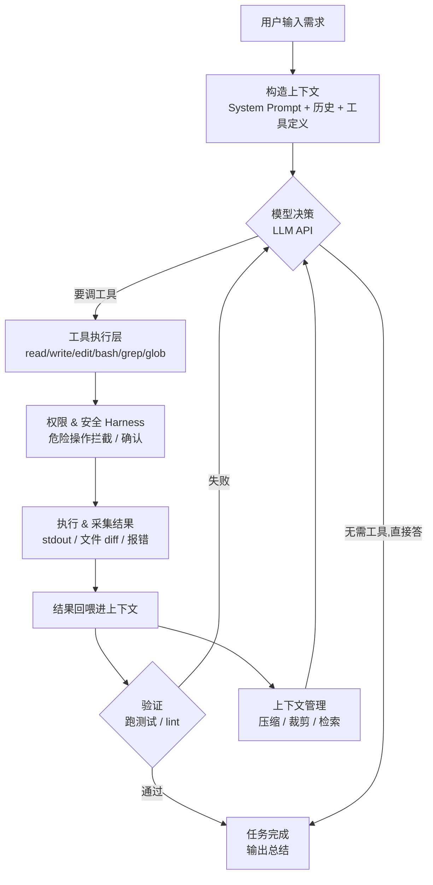

# 从零手写一个 Claude Code：13 周 Q3 转型执行计划（TypeScript · 开源）

> **一句话目标**：用 13 周，从零用 **TypeScript** 手写一个开源的最小 Coding Agent，链路完全对标 **Claude Code 的核心架构**。主攻方向是当前自评为 0、却权重最高的 **Harness Engineering（C3）**；底座是你已满分的**端到端独立交付（B6）**。产出物：一个能跑通「给需求 → 自己读代码 → 改文件 → 跑测试 → 修到通过」闭环的开源 Agent + 一篇讲透原理的技术文章。

## 一、为什么是「手写 Claude Code」这个载体

你不缺工程能力（B 全栈线加权 4.03，全场最高），缺的是把 AI 工程的核心机制**亲手拆开搭一遍**。Coding Agent 是练 C3 的最佳载体——因为代码场景对「输出可控」要求最高：改错代价大、要能编译、要过测试，逼着你必须设计一整套约束-反馈-控制系统。而 Claude Code 是这个品类里架构最清晰、最值得逆向学习的标杆。

- **原理通用、不依赖平台**：Agent Loop、工具调用协议、上下文管理、权限沙箱——这些是教科书级的可带走资产，离开大厂照样值钱。
- **C3 是真正的分水岭**：C AI 工程线加权均值仅 0.80（全场最低），其中权重最高的 C3 为 0。本季**集中只打 C3**，C4（模型微调）推迟到 Q4，避免两头半吊子。
- **开源 + 文章 = 影响力证据**：把 C3 实战变成对外可见的作品，激活 D1（技术布道）的第一块外部证据。

> **范围红线**：这是「吃透原理」的学习型开源项目，不是「Cursor 复刻」。技术栈只用 TypeScript；不做 GUI、不做多模型适配层、不做插件市场。能跑通核心闭环 + 讲清楚原理，远胜于堆一堆半成品功能。

## 二、对标 Claude Code 的核心链路拆解

先把要复刻的目标架构看清楚。Claude Code 的本质是一个 **Agentic Loop**：模型在「收集上下文 → 采取行动 → 验证结果」之间循环，直到任务完成。下面这张图是我们 13 周要逐块搭出来的东西。

对照这张图，Claude Code 核心链路可拆成 **6 个模块**，正好覆盖 13 周：

| # | 模块 | 对应 Claude Code 的什么 | 能力归属 |
|-|-|-|-|
| **①** | Agent Loop 内核 | 收集上下文→行动→验证的主循环；何时调工具、何时停 | C3 核心 |
| **②** | 工具调用层 | read/write/edit/bash/grep/glob 等工具的定义与执行协议 | C3 核心 |
| **③** | 上下文 & 历史管理 | System Prompt 设计、消息历史拼装、超长上下文压缩 | C3 核心 |
| **④** | 权限 & 安全 Harness | 危险命令拦截、写操作确认、沙箱边界——C3 的灵魂 | C3 重头 |
| **⑤** | 规划 & TODO 机制 | 任务拆解、TodoWrite 式状态跟踪、长任务不跑偏 | C3 进阶 |
| **⑥** | 自验证回路 | 写完自动跑测试、失败把报错喂回重试——闭环的胜负手 | C3 重头 |

---

## 三、13 周里程碑路线（四阶段）

整体按每周 8–10 小时设计（工作日晚上 + 周末）。每个阶段末有一个**可 demo 的里程碑**，强制产出能跑的东西，杜绝「只学不产」。

### 阶段总览

| 阶段 | 周次 | 主题 | 阶段交付里程碑 |
|-|-|-|-|
| **P1 通主循环** | W1–W3 | Agent Loop + 工具调用最小闭环 | 能跑通「一句话需求→Agent 读写文件改代码」的命令行 Demo |
| **P2 立 Harness** | W4–W8 | 权限安全 + 自验证回路（C3 主战场） | 带「写前确认 + 危险拦截 + 写完自动跑测试 + 失败重试」的 Agent |
| **P3 强能力** | W9–W11 | 上下文管理 + 规划/TODO + 子任务 | 能处理多文件、长任务、自己拆 TODO 的 Agent v1 |
| **P4 成作品** | W12–W13 | 打磨开源 + 技术文章 | 开源到 GitHub（README+Demo）+ 一篇讲透原理的文章 |

### P1 · 通主循环（W1–W3）

> 目标：把 Agent Loop 这个「黑盒」亲手搭出第一版。这三周结束，你要能对着代码讲清楚：模型是怎么决定调哪个工具的、工具结果怎么回喂、循环什么时候停。

| 周 | 行动项（对应模块） | 本周可交付物 |
|-|-|-|
| **W1** | **立项 + 模块①起步**：建 GitHub 仓库、选定模型 API（Anthropic/OpenAI 任一，能 function calling 即可）、把第二节的 6 模块范围红线写死进 README；跑通最朴素的「单轮 LLM 调用 + 解析 tool_call」 | 空仓库 + README（含架构图与范围红线）+ 能解析一次工具调用的脚本 |
| **W2** | **模块② 工具层**：实现 read_file / write_file / run_command 三个工具的定义（JSON Schema）与执行；先不做权限，只求能调通 | 三个工具的实现 + 单测；能让模型调用并拿到真实结果 |
| **W3** | **模块① 闭合主循环**：把「模型决策→执行工具→结果回喂→再决策」串成 while 循环，定义停止条件（模型不再要求工具调用即结束） | **里程碑：能跑通「给一句话需求，Agent 自己读写文件改代码」的最小 Demo** |

### P2 · 立 Harness（W4–W8）— 计划的核心

> 这 5 周是整个 Q3 的胜负手，也是 C3 从 0 拉到「能用且能讲」的主战场。前 3 周让 Agent「能动」，这 5 周让它「可控」——这才是 Harness Engineering 的本质。其他周可松，这 5 周尽量保投入。

| 周 | 行动项（对应模块） | 本周可交付物 |
|-|-|-|
| **W4** | **模块④ 权限内核**：设计权限模型——区分只读（read/grep）与写操作（write/edit/bash）；写操作前打印 diff 并要求确认（y/n 交互） | 带「写前确认」机制的工具层 v2 |
| **W5** | **模块④ 安全拦截**：实现危险命令黑名单/规则（rm -rf、curl 外网、写敏感路径等）拦截；定义沙箱边界（限制工作目录） | 危险操作拦截规则 + 测试用例（能挡住 N 种危险操作） |
| **W6** | **模块⑥ 自验证回路（上）**：实现「写完代码自动跑测试」——Agent 改完文件后自动执行测试命令，采集结果 | 能自动触发测试并拿到 pass/fail 的回路 v1 |
| **W7** | **模块⑥ 自验证回路（下）**：实现「失败→把报错喂回模型→重试」闭环；设最大重试次数防死循环；锁定一种语言/测试框架（如 Node+Vitest）做验收 | **核心闭环：Agent 能自己修到测试通过**（带重试上限） |
| **W8** | **Harness 加固**：把权限、拦截、自验证整合成统一的控制层；补一套 eval——准备 5–10 个小任务，量化「一次通过率/平均重试次数」 | **里程碑：带完整 Harness（确认+拦截+自验证）的 Agent + 一份 eval 基线数据** |

### P3 · 强能力（W9–W11）

| 周 | 行动项（对应模块） | 本周可交付物 |
|-|-|-|
| **W9** | **模块③ 上下文管理**：解决「代码库塞不进上下文」——实现文件检索（grep/glob 工具）让模型按需读取，而非全量灌入；先用最朴素策略跑通 | 能在多文件项目里按需检索读取的 Agent |
| **W10** | **模块③ 历史压缩**：实现长对话历史的压缩/裁剪（超阈值时摘要旧轮次），避免上下文爆掉 | 带历史压缩的上下文管理层 |
| **W11** | **模块⑤ 规划/TODO**：实现任务拆解与 TodoWrite 式状态跟踪，让 Agent 处理长任务不跑偏；（选做）抽出一个子任务执行的简单 sub-agent | **里程碑：能处理多文件、长任务、自拆 TODO 的 Agent v1** |

### P4 · 成作品（W12–W13）

| 周 | 行动项 | 本周可交付物 |
|-|-|-|
| **W12** | **开源打磨**：补全 README（架构图、快速上手、Demo 录屏/GIF）、清理代码、加 LICENSE；跑一遍 eval 把数据写进 README | 可对外展示的开源仓库（别人能 clone 跑起来） |
| **W13** | **技术文章 + 复盘**：写一篇「从零手写 Claude Code 核心链路」的技术文章（重点讲 Agent Loop 与 Harness 怎么设计的），公开发布；回自评表重新打分 | **里程碑：开源作品 + 公开技术文章 + 新一轮自评** |

---

## 四、Q3 结束时你应该拿到的可带走资产

这些是离开任何大厂平台都带得走的东西——这才是这份计划的真正目的：

- **一个开源的最小 Coding Agent**（GitHub 作品，B6 交付资本被实战激活，且是属于你自己的东西）
- **对 Agent 核心原理的透彻理解**（C3 从 0 → 能用且能讲：Agent Loop、工具协议、上下文管理你都亲手搭过）
- **一套可复用的 Harness 设计方法论**（权限-拦截-自验证，换任何 AI 场景都能套用）
- **一篇公开技术文章**（D1 技术布道的第一块外部可见证据，个人影响力的起点）
- **一份 eval 基线数据**（用数据证明你的 Agent 真的可控，这是大多数人讲不出来的硬货）

## 五、风险与对策

| 风险 | 为什么会发生 | 对策 |
|-|-|-|
| **范围膨胀做不完** | 工程师本能想做大做全、想复刻 Cursor | W1 把 6 模块范围红线写死进 README；只用 TS、不做 GUI/多模型/插件 |
| **退回舒适区刷前端** | 前端是强项，做着顺手 | 本项目纯 CLI、零前端；想美化先把 Harness 做完 |
| **主循环卡在工具协议** | 第一次写 function calling 链路 | W2 先单工具调通再扩；用官方 SDK 的 tool_use 范式，别自己造协议 |
| **自验证回路死循环** | 失败重试没有上限 | W7 强制设最大重试次数 + 锁定单一语言/测试框架做验收 |
| **工作太忙某周断档** | 在职转型的常态 | 每个里程碑都设了「最小闭环」；断档周只保 P2（W4–W8）核心，其余顺延 |

## 六、复盘机制

> 这份计划和你的 **自评表** 是配套的。建议固定节奏复盘，让进展可量化、可调整。

### 每周（5 分钟）

- [ ] 本周「可交付物」是否产出？没产出卡在哪？
- [ ] 这周有没有偷偷退回前端/重构刷舒适区？

### 每阶段末（W3 / W8 / W11 / W13）

- [ ] 里程碑是否达成？没达成则评估是范围问题还是精力问题
- [ ] 是否需要调整下一阶段计划（找我重新排）

### 季度末（W13）

- [ ] 回到自评表，对 C3 / B6 / D1 重新打分
- [ ] 在自评表「复盘日期」列记录本次日期，对比 6 月基线的成长曲线
- [ ] 基于新分数，和我一起制定 Q4 计划（届时再启动 C4 模型微调）

---

> **最后一句**：手写一遍 Claude Code，你收获的不是一个玩具，而是「Agent 到底怎么转起来」的底层直觉——这种直觉，看再多文章都换不来。13 周做的就是这一件事：把黑盒亲手拆开，再亲手装回去。
